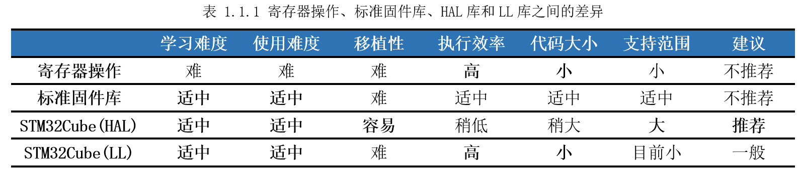

# 1.1 固件库

​	接触过单片机的读者，都应该知道**开发者是通过修改单片机寄存器来实现对单片机的控制**。如果是简单的51单片机，寄存器比较少，一般都是直接操作寄存器控制单片机。对于STM32系列单片机，至少都几百个寄存器，一个一个操作效率太低。于是ST官方就提供了固件库，用户无需再直接操作寄存器，而是使用库里面提供的函数控制外设，极大的提高了开发效率，这也是STM32流行的一个重要因素。

​	STM32先后推出了两套主要固件库：标准外设库（Standard Peripherals
Library）和HAL库（Hardware Abstraction
Layer）。标准外设库是STM32最早发布的固件库，对STM32芯片进行了完整的封装，包含所有外设的性能特征，每个外设驱动都由一组函数组成，这组函数覆盖了该外设所有功能。因为发布比较早，教程比较多，目前仍有不少开发者使用。标准外设库是针对某一系列STM32芯片而设计的，没有可移植性，目前该库已将停止了更新、研发，最近几年发布的新STM32芯片已经不再支持。

​	HAL库是ST公司这几年极力推荐的官方库，目前支持STM32全系产品，可以说HAL库就是用来取代之前的标准外设库的。相比标准外设库，HAL库具有更高的抽象整合水平，API集中关注外设的公共函数功能，使得可以轻松实现从一个STM32产品移植到另一个不同的STM32系列产品。此外还有LL库（Low
Layer），相比其它固件库更接近硬件层，一般和HAL库结合使用，可以看作是HAL库的补充。寄存器操作、标准固件库、HAL库和LL库之间的差异如表1.1.1所示。

​	有了以上对比，相信大家对STM32固件库有了大致的了解。目前ST官方只提供STM32MP157x的HAL库，STM32CubeMX生成的都是基于HAL库工程模板，因此本手册后面将使用HAL讲解M4的开发。但无论使用哪个固件库，最终都是对寄存器进行操作，因此虽然不建议使用寄存器写代码，但还是必须会查手册、看寄存器。

