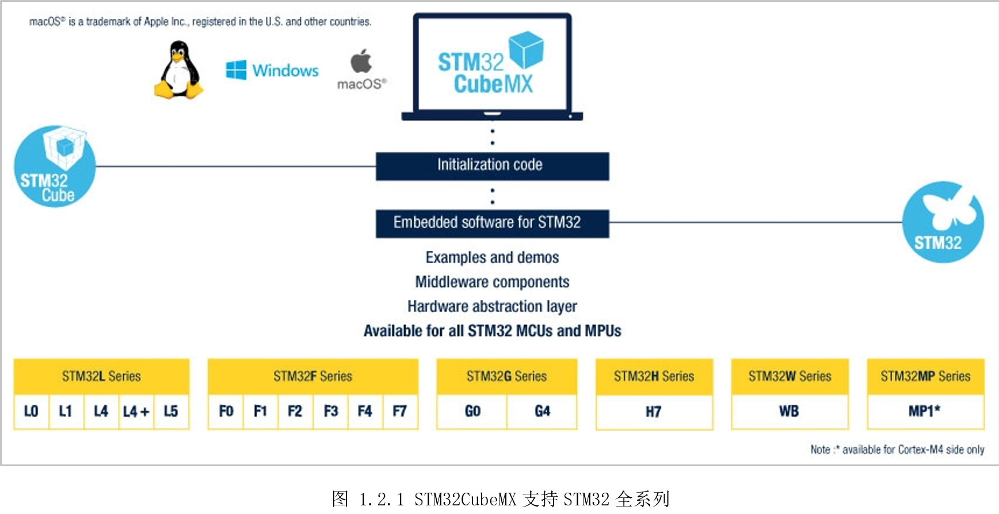

# 1.2 STM32CubeMX

STM32CubeMX是ST意法半导体推出的STM32系列芯片图形可视化配置工具，用户可以通过图形化向导为Cortex-M系列MCU生成初始化代码工程模板，以及为Cortex-A系列MPU生成用于Linux的部分设备树。

对于STM32MP157x，可以为整个系统配置GPIO和时钟，并以交互的方式将外围设备分配给Cortex-M4或Cortex-A7。并且提供一些实用功能，比如DDR配置和调整，使STM32
MPU入门变得更加容易。

STM32CubeMX特性如下：

* 直观的STM32系列MCU和MPU的选型

* 易于使用的丰富图形化用户界面，可以进行以下配置：

\- 自动处理引脚冲突

\- 动态验证Cortex-M内核外围设备和中间件功能的参数约束

\- 动态验证配置的时钟树

\- 查看上电顺序、预测功耗

* 生成适合IAR、Keil和GCC编译器的Cortex-M4初始化C代码工程项目

* 生成适合Linux设备的Cortex-A部分设备树

* 支持Windows、Linux、macOS上独立运行，或者作为Eclipse插件运行

STM32CubeMX支持的STM32如图 1.2.1所示。

