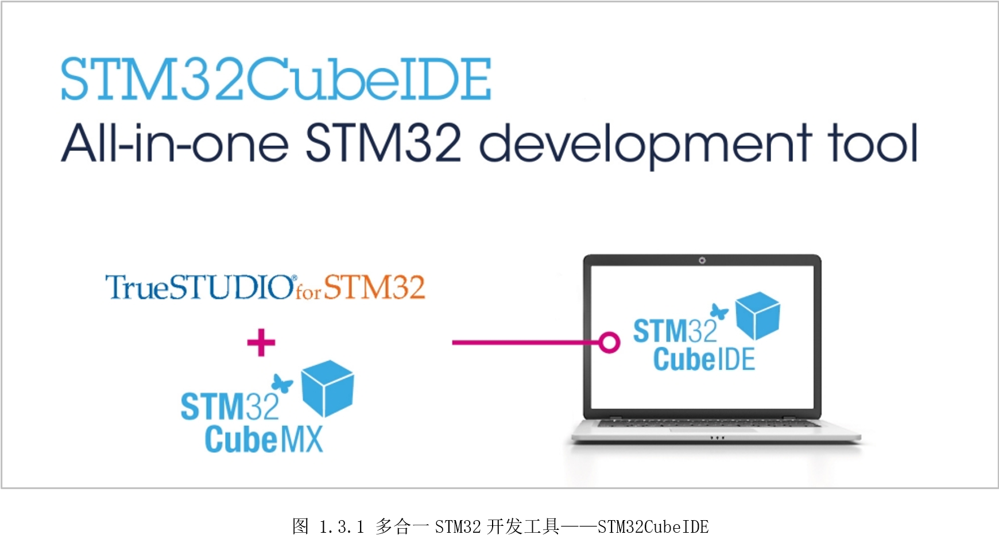

# 1.3 STM32CubeIDE

支持STM32开发的集成开发环境（IDE,Integrated Development
Environment）有很多，国内熟知的有Keil MDK-ARM和IAR
EWAR。这两个IDE都很好用，但它们都是商业软件，免费或评估版要么有器件型号限制，要么有程序容量限制。于是出现了免费的Eclipse+GNU
GCC来搭建STM32开发环境，但搭建过程繁琐、版本差异大导致教程不统一，对新手很不友好。

STM32CubeIDE是ST公司基于Eclipse/CDT框架和GUN
GCC工具链制作的免费IDE，并集成了STM32CubeMX。可以实现STM32系列芯片的外围设备配置、代码生成、代码编辑、代码编译、在线调试，并且支持数百个Eclipse现有插件。**在实际使用体验中，经过数次版本更新，Bug已经比较少了，至少完成本手册内容，是完全没问题的。除此之外，打开软件比较慢，有时候还会卡一下，期待后续版本优化，做到像Keil那么流畅。**

STM32CubeIDE特性如下：

* 集成STM32CubeMX，可提供以下服务:

\- STM32 MCU和MPU的选择

\- 引脚分配、时钟、外围设备和中间件配置

\- 项目创建和初始化代码的生成

* 基于Eclipse/CDT，并支持Eclipse插件，使用ARM GNU C/C++工具链和GDB调试器

* 其他高级调试功能，包括：

\- CPU核心、外设寄存器和内存视图

\- 实时变量观看视图

\- 系统分析和实时跟踪(SWV)

\- CPU故障分析工具

* 支持ST-LINK（STMicroelectronics）和J-Link（SEGGER）调试

* 支持从Atollic TrueSTUDIO和System Workbench for STM32（SW4STM32）导入项目

* 多操作系统支持：Windows、Linux和macOS（仅支持64位版本）

