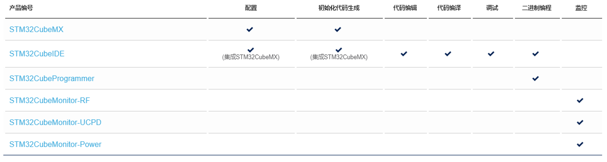

# 1.4 STM32Cube生态

最后再聊一聊STM32Cube生态。ST公司最近几年一直在推STM32Cube，现在基本已经成型，用户可以使用ST公司提供的工具、软件包，快速、高效、免费的完成开发。

STM32Cube生态系统就是**面向STM32系列芯片的完整软件解决方案**。软件解决方案包含软件工具套件和嵌入式软件。

STM32Cube软件工具套件为开发人员提供软件工具，包含:

* STM32CubeMX,
面向所有STM32芯片的配置工具。简单易用的图形用户界面为Cortex-M内核生成初始化C代码，并为Cortex-A内核生成Linux设备树源码。
* STM32CubeIDE, 一个集成开发环境。该IDE基于Eclipse或GNU
C/C++工具链等开源解决方案，包括编译报告功能和高级调试功能。它还集成了其他工具，如STM32CubeMX（本身包含在STM32CubeIDE中）。
* STM32CubeProgrammer,
一种编程工具。它通过多种多样可用的通信媒介（JTAG、SWD、UART、USB
DFU、I2C、SPI、CAN等）为读取、写入和验证设备和外部存储器等操作提供简单易用且高效的环境。
* STM32CubeMonitor系列工具。功能强大的监控工具，可帮助开发人员实时微调其应用程序的行为和性能。

STM32Cube嵌入式软件帮助开发人员加快项目开发，包含:

* STM32Cube MCU和MPU软件包,
专用于每个STM32系列产品，提供操作可用的STM32外设集所需的全部嵌入式软件模块。它们包括驱动程序（HAL、底层等）、中间件，以及各种实际用例中使用的大量示例代码。

* STM32Cube扩展包,
适用于面向应用的解决方案。STM32扩展包来自ST或核准的合作伙伴，通过附加的嵌入式软件模块对STM32Cube
MCU软件包进行补充和扩展，旨在围绕STM32创建广泛的可扩展嵌入式软件产品。

可以看出，ST公司已经针对STM32系列芯片提供了完整解决方案。STM32CubeMX完成芯片配置和工程代码初始化。STM32CubeIDE完成代码编辑、功能实现。STM32CubeProgrammer完成代码烧写。STM32CubeMonitor完成监控、功能验证。

STM32Cube软件工具套件支持功能列表。

STM32Cube嵌入式软件的MCU软件包支持功能列表。

