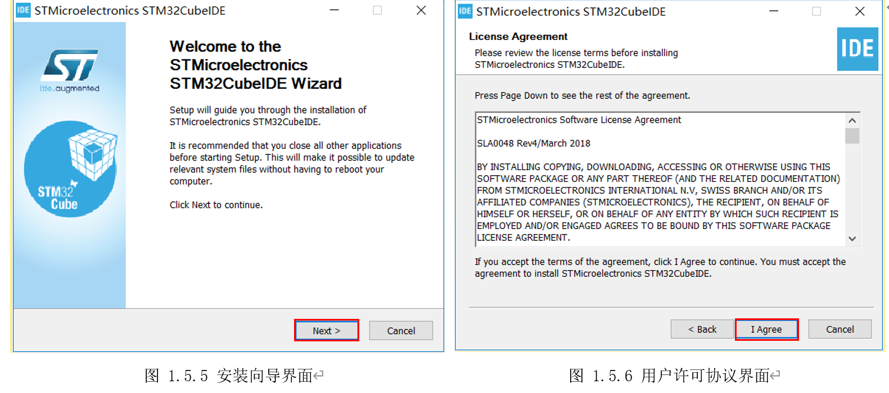
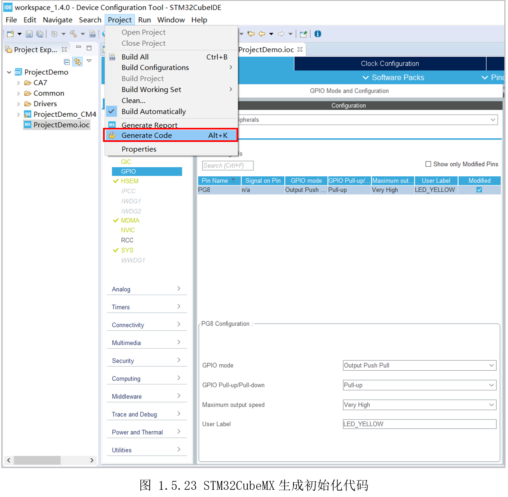

# 1.5 开发流程

## 1.5.1软件安装

了解开发平台后，接着就安装软件。因为STM32CubeIDE集成了STM32CubeMX，同时支持二进制代码烧写，因此M4的开发，只需要安装STM32CubeIDE即可。

* **从官网下载**

读者可以从ST官网下载STM32CubeIDE，但操作流程比较麻烦。因此可以跳过本方法，使用后面的“从网盘下载”方法。

从官方下载，读者首先需要先在ST官网注册一个账户，然后浏览器打开STM32CubeIDE下载页面([https://www.st.com/zh/development-tools/stm32cubeide.html\#get-software](https://www.st.com/zh/development-tools/stm32cubeide.html#get-software))，这里选择Windows为例，默认为当前最新版本1.4.0（2020.08），如图1.5.1所示。


随后在弹出界面选择“接受”许可协议，并填入前面注册的账户信息，如图 1.5.2所示


最后点击“下载”，将会直接下载或收到带有下载链接的邮件，打开邮件下载即可。

* **从网盘下载**

从ST官网下载软件，需要注册比较麻烦，读者可以从百问网的网盘下载。

打开百问网下载中心（<http://download.100ask.net/>），点击左侧的“100ask_stm32mp157_pro开发板”，找到“sdk完整包下载”，里面有百度网盘的链接和密码，如图1.5.3所示。


进入网盘后，可见如图1.5.4所示的目录，其中“10_M4专题”目录就是配套本手册的目录。里面包含三个文件夹，如下：

* “源码”：里面是本手册配套的所有源码；

* “工具”：里面是本手册用到的STM32CubeIDE压缩包；

* “文档：里面是本手册，后面文档更新，勘误将更新本目录；


通过前面任一方式下载到STM32cubeIDE压缩文件包后，解压可得到“en.st-stm32cubeide_1.4.0_7511_20200720_0928_x86_64_exe”,选中它，再鼠标右键选择“以管理员身份运行”（安装文件**不能放在中文路径**，否则提示“NSISError”错误）。

运行程序“en.st-stm32cubeide_1.4.0_7511_20200720_0928_x86_64_exe”，在安装向导界面选择“Next”，如图1.5.5所示。在用户许可协议界面选择“I Agree”，如图 1.5.6所示。



接着选择软件安装路径，如果无特殊需求，默认即可，如图1.5.7所示。然后选择安装组件，默认勾选安装J-Link和ST-Link驱动，如图 1.5.8所示。


随后弹出如图 1.5.9所示的驱动安装提示界面，选择“安装”即可。


待安装进度条完成，如图 1.5.10所示时，点击“Next”。最后在安装完成界面，点击如图1.5.11所示的“Finish”完成安装。


## 1.5.2创建模板

打开安装好的STM32CubeIDE，首先会弹出工作空间设置界面，无特殊需求保持默认即可（如果需要自定义其它目录，**注意路径不要包含中文**），随后点击“Launch”，如图1.5.12所示。


接着依次点击左上角“File”-\>“New” -\>“STM32 Project”来创建STM32工程，如图1.5.13所示。


随后出现STM32CubeMX界面，在左边“芯片选项区”的搜索框里填入“STM32MP157D”，右上方将出现该芯片的特性介绍等资料，右下方出现该芯片的各种封装选型、主要参数，这里选择“TFBGA361”,如图1.5.14所示。


值得一提的是在芯片资料区，读者切换到“Docs &Resources”标签栏，可以直接下到STM32MP157D的数据手册（Datasheet）、参考手册（Referencemanual）、编程手册（Programming manual）等资料，如图 1.5.15所示。

* 数据手册（Datasheet）

包含STM32MP157D的整体功能概述、引脚描述、封装特性等。其中引脚描述部分，有引脚复用查询表格，在原理图设计或编写代码时，可以方便查询使用。

* 参考手册（Reference manual）

包含STM32MP157D的全部资源、寄存器详细说明，多达4000多页。由于一些资源是MCU和MPU共享的，所以无论是MCU编程，还是MPU编程，都要用到该手册。

* 编程手册（Programming manual）

包含STM32MP157D的编程手册和GPU应用手册。编程手册包含一些M4处理器的指令、核心外设详细说明。GPU应用手册包含一些特性介绍、应用编程建议。

最后点击“Next”，完成芯片选择。


紧接着需要在工程设置界面设置工程名字，这里取名为“ProjectDemo”，其它保持默认即可，如图图1.5.16所示。随后点击“Finish”,将出现提示“是否切换到STM32CubeMX关联视图”，如图1.5.17所示，点击“Yes”即可。


随后便会自动下载STM32MP1的HAL固件，如图 1.5.18所示。


待前面STM32MP1的HAL库下载完成后，将自动进入STM32CbueMX界面，在芯片下方的搜索框入“PG8”（即开发板黄色LED所接引脚，后面开发示例再详细讲解），随后在芯片示意图上出现一个闪烁的点，这个点就是代表引脚PG8。然后鼠标左键点击该点，在弹出的功能复用菜单里选择“GPIO_Output”，如图1.5.19所示。


这里需要注意一下，和其它STM32单片机不同，还需要设置“PinReservation”给“Cortex-M4”,**否者STM32CubeMX不会生成GPIO初始化相关代码**。如图1.5.20所示，在刚才选择的引脚上，鼠标右键选择“Pin Reservation”-\>“Cortex-M4”。


随后，再点击左边的“SystemCore”标签，选中“GPIO”，再选中刚才配置的“PG8”，下方将会显示该GPIO的详细配置。这里分别选择“OutputPush Pull”、“Pull-up”、“Very High”，再填入自定义名字“LED_YELLOW”，如图
1.5.21所示。关于这些选项的详细含义，将放在后面的开发示例详细介绍，这里只熟悉操作流程。


为了让外设初始化代码单独生成在“.c/.h”文件中，切换到“ProjectManager”标签，选择“Code Generator”,勾选“Generate peripheral initialization as apair of ‘.c/.h’files per peripheral”，如图 1.5.22所示。


接着点击“Project”，选择“Grenerate Code”产生初始化代码，如图 1.5.23所示。



随后在左边的“ProjectExplorer”工程浏览器找到“main.c”。路径为“ProjectDemo”-\>“ProjectDemo_CM4”-\>“Core”-\>“Src”-\>“main.c”，如图 1.5.24所示。


现在工程模块就创建完了，以后只需先打开工程的保存路径，如前面示例的“C:\\Users\\huang\\STM32CubeIDE\\workspace_1.4.0\\”,再打开对应的项目名文件，如前面的“ProjectDemo”，找到“.project”便可再次打开，如图1.5.25所示。


STM32CubMX生成的工程模板，只是做了一些初始操作。以本模板工程为例，在“main.c”里的主函数里面，依次进行了HAL初始化、系统时钟配置、GPIO初始化，如图1.5.26所示。


将鼠标光标移到“MX_GPIO_Init();”位置，按下“Ctrl”+“鼠标左键”，将跳到函数定义位置。或者在函数上，点击鼠标右键，选择“OpenDeclaration”跳到函数定义位置，如图 1.5.27所示。


可以看到“MX_GPIO_Init()”在“gpio.c”中的内容如下：

```c
static void MX_GPIO_Init(void)
{
  GPIO_InitTypeDef GPIO_InitStruct = {0};

  /* GPIO Ports Clock Enable */
  __HAL_RCC_GPIOG_CLK_ENABLE();

/*Configure GPIO pin : PtPin */
  GPIO_InitStruct.Pin = LED_YELLOW_Pin;
  GPIO_InitStruct.Mode = GPIO_MODE_OUTPUT_PP;
  GPIO_InitStruct.Pull = GPIO_PULLUP;
  GPIO_InitStruct.Speed = GPIO_SPEED_FREQ_VERY_HIGH;
  HAL_GPIO_Init(LED_ YELLOW_GPIO_Port, &GPIO_InitStruct);
}

```


“LED_YELLOW_Pin”:对应STM32CubeMX里“User Label”定义的“LED_YELLOW”,如果跳转到定义位置，可以看到值为“GPIO_PIN_8”。末尾的“LED_YELLOW_GPIO_Port”对应的是“GPIOG”；

“GPIO_MODE_OUTPUT_PP”:对应STM32CubeMX里“GPIO mode”选择的“Output Push Pull”；

“GPIO_PULLUP”:对应STM32CubeMX里“GPIO Pull-up/Pull-down”选择的“Pull-up”；

“GPIO_SPEED_FREQ_VERY_HIGH”: 对应STM32CubeMX里“Maximum output speed”选择的“Very High”；

可以看到“MX_GPIO_Init()”的内容基本就是在STM32CubeMX设置的内容，但仅仅是做了相关的初始化配置，具体的控制逻辑，还需要自己使用HAL库编写。

## 1.5.3使用HAL库

这里假设需要控制LED_YELLOW灯间隔一秒交替亮灭，前面STM32CubeMX自动初始化了该引脚，还需要自己使用HAL库进行控制。

使用HAL库，就是调用ST提供的API函数。现在还没有STM32MP1系列的HAL库用户手册，但STM32MP1的优势之一就是可以复用STM32MCU生态。也就是说，HAL库的用法和其他STM32MCU兼容，很多代码都可以互相复制。因此我们可以直接参考STM32F4系列的《UM1725Description of STM32F4 HAL and LLdrivers》手册使用HAL库。亦或者直接看HAL库源码，在左侧边的工程浏览器依次展开“ProjectDemo”-\>“ProjectDemo_CM4”-\>“Drivers”-\>“STM32MP1xx_HAL_Driver”-\>“Src”-\>“stm32mp1xx_hal_gpio.c”，可以看到HAL库提供的API函数。根据名字，可以大致猜测其功能，比如要控制GPIO的值，则应该使用“HAL_GPIO_WritePin（）”，双击该函数，即可跳到对应的定义位置，如图1.5.28所示。


仔细的看下该API函数说明，如果英文不好，借助翻译软件，翻译出来大致如下：

> @简介：设置或清除选中端口位的数据
>
> @注意：该函数使用GPIOx_BSRR寄存器来允许原子读/写访问。这样，就不会在读写访问之间发生IR中断
>
> @参数GPIOx：其中x可以是（A到K）以选择GPIO外设端口。
>
> @参数GPIO_Pin：指定要写入的端口位。此参数可以是GPIO_PIN_x之一，其中x可以是0到15。
>
> @参数PinState：指定要写入所选位的值。此参数可以是GPIO_PinState枚举值之一：
>
> @GPIO_PIN_RESET：清除端口引脚
>
>  @GPIO_PIN_SET：设置端口引脚
>
> @返回值：无

即该函数就是设置/清除指定GPIO的值，需要三个参数，第一个为端口号，这里为“GPIOG”，或者前面提到对应宏定义的“LED_YELLOW_GPIO_Port”；第二个为该端口号的哪位，这里为“GPIO_PIN_8”，或前面提到对应宏定义的“LED_YELLOW_Pin”；第三个为设置的值，如果输出低着设置“GPIO_PIN_RESET”,如果设置输出高则为“GPIO_PIN_SET”。因此如果要控制LED_YELLOW则编写如下代码即可：

```c
HAL_GPIO_WritePin(GPIOG, GPIO_PIN_8, GPIO_PIN_SET);  //设置GPIOG 8引脚输出高电平
HAL_GPIO_WritePin(GPIOG, GPIO_PIN_8, GPIO_PIN_RESET); //设置GPIOG 8引脚输出低电平
或
HAL_GPIO_WritePin(LED_YELLOW_GPIO_Port, LED_YELLOW_Pin, GPIO_PIN_SET);  
HAL_GPIO_WritePin(LED_YELLOW_GPIO_Port, LED_YELLOW_Pin, GPIO_PIN_RESET); 
```

通过以上代码就可以控制GPIO引脚接的LED灯了，但这样亮灭切换很快，肉眼观察不到，需要在切换之间添加个延时。仿照前面的思维，在“stm32mp1xx_hal.c”这个提供HAL初始化、工具函数的HAL源文件里，可以找到“HAL_Delay()”，该函数的相关介绍见图1.5.29所示。


可以看到“HAL_Delay()”只需要一个参数，参数为延时时间，单位为毫秒。因此完善前面的代码如下：

```c
HAL_GPIO_WritePin(LED_YELLOW_GPIO_Port, LED_YELLOW_Pin, GPIO_PIN_SET); //设置GPIOG 8引脚输出高电平
HAL_Delay(1000); //延时1000毫秒，即1秒
HAL_GPIO_WritePin(LED_YELLOW_GPIO_Port, LED_YELLOW_Pin, GPIO_PIN_RESET); //设置GPIOG 8引脚输出低电
HAL_Delay(1000); //延时1000毫秒，即1秒
```

STM32CubeMX支持动态配置，比如用户第一次设置GPIOG8为LED_YELLOW生成了工程模板，用户添加控制代码后，又想再添加其它引脚生成工程模板，为了避免第二次生成的工程模板覆盖之前的用户自己添加的代码，因此需要把用户代码放置在对应合适的位置。如图1.5.30所示，将编写的GPIO代码放在“/\* USER CODE BEGIN 3 \*/”和“/\* USER CODE END3 \*/”之间。


至此，一个简单的LED控制程序就编写完成了。

## 1.5.4编译上传

编写完代码，还需编译、烧写、运行才能看到效果。选中工程“ProjectDemo_CM4”,鼠标右键选择“Build
Project”即可完成编译，如图 1.5.31所示。


编译完成后在工程项目下会新生成一个“Debug”目录，里面的“ProjectDemo_CM4.elf”就是二进制目标文件，如图1.5.32所示。


接触过STM32单片机的读者应该熟悉STM32的烧写方法，通常使用J-Link或ST-Link将二进制文件烧写到单片机的Flash里，然后单片机上电后自动读取Flash的二进制文件到RAM里实现运行。

STM32MP157x系列里的M4启动运行的方式略有差异，**必须先启动A7才能启动M4**。因此需要先让A7运行Bootloadr或Linux，再加载ELF二进制文件启动M4。出厂的开发板默认烧写有Linux系统，读者可以先直接使用。

想要Linux加载前面生成的“ProjectDemo_CM4.elf”二进制文件，还需要将文件先上传到Linux。用户可以用网线连接开发板，让电脑和开发板处于同一个网段，再通过FTP/SFTP上传文件到Linux。但这个方法条件相对苛刻，很多时候电脑和开发板无法处于同一个网段，因此在开发板Linux系统里将USB
OTG模拟为虚拟网卡，只要用户将USB
OTG连接到电脑，就如同实现了局域网联接，之后便可以很方便的上传文件。

先如所示，连接开发板电源、设备好拨码开关(eMMC启动)，连接调试串口和USB
OTG到电脑USB接口。


然后使用MobaXterm(https://mobaxterm.mobatek.net/download.html)之类的串口工具连接开发板。电脑打开MobaXterm，如图1.5.34所示，新建会话“Session”，选择串口“Serial”，选择端口COMx（以读者实际看到为准），波特率115200，最后点击“OK”即可。设置完成，就可启动开发板电源，此时会有一系列打印，直到打印停止，则表示进入了系统。


进入开发板的Linux系统后，输入“ **ifconfig** ”命令查看网络情况，如图1.5.35所示，可以看到名为“usb0”的网卡，IP地址为“ **192.168.7.1**”。


接着打开电脑“控制面板”-\>“网络和Internet”-\>“网络连接”，可以看到一个备注为“RemoteNDIS Compatible Device”的网络设置，如图1.5.36所示，这个设备就是识别到的开发板USBOTG模拟的网卡设备。如果未出现该设备，尝试先拔掉USBOTG线，重新启动Linux，待进入Linux终端后，再稍等一会插入USB OTG线。


选中该设备，点击鼠标右键，选择“属性”，接着会弹出该网络设备的属性窗口，如图1.5.37所示。在里面选中“Internet协议版本4(TCP/IPv4)”，再点击“属性”按钮。

再弹出的属性页面，勾选“使用下面的IP地址(S):”，IP地址设置为与开发板USB虚拟网卡同一网段即可，这里假设设置为“192.168.7.10”，子网掩码为“255.255.255.0”，最后点击确定。


设置完后，电脑就和开发板类似处于同一个局域网，这里可以使用“MobaXterm”里的远程登陆软件，选择“SSH”连接，输入开发板IP地址“192.168.7.1”,点击确定便可远程登陆开发板，如图1.5.39所示设置。


接着要求输入登陆账户，输入“root”,回车即可，如图 1.5.40所示。


登陆进去后，就可以在右边黑色终端区域输入命令操作Linux，左边选择“Scp”标签按钮,即可切换到该标签页面，在此页面拖进拖出文件，完成电脑和开发板文件的互传，如图1.5.41所示。下方有个“Follow terminal
folder”可以勾选上，这样在右边操作终端进入不同目录，左边的文件路径也会对应切换。


现在，在右边输入“cd/lib/firmware”命令，进入“/lib/firmware”目录，同时左边的Scp标签里的文件路径也自动切换到该目录（如果没有自动切换，用户手动输入路径即可）。然后将前面生成的“ProjectDemo_CM4.elf”拖到左边窗口，实现了文件的上传，如图1.5.42所示。


## 1.5.5加载运行

随后执行以下命令，加载固件，启动M4运行固件。

```c
[root@100ask:~]$ echo ProjectDemo_CM4.elf > /sys/class/remoteproc/remoteproc0/firmware //加载固件  
[root@100ask:~]$ echo start > /sys/class/remoteproc/remoteproc0/state  //启动M4     

```


启动M4时，内核会有一堆打印信息（在串口终端执行才会打印内核信息，SSH执行需要修改打印等级才会打印），如图1.5.43所示。


此时观察开发板，原本只有绿色LED灯闪烁，现在黄色LED灯也在闪烁，如图 1.5.44所示。


执行以下命令可以停止M4运行。

```c
[root@100ask:~]$ echo stop > /sys/class/remoteproc/remoteproc0/state  //停止M4 
```


执行后，黄色LED灯停止闪烁，内核打印M4停止相关信息，如图 1.5.45所示。


