# 1.6 M4调试

M4的调试方式有两种：工程模式（Engineering Mode）和量产模式（Production Mode）。

* 工程模式:类似STM32单片机烧写到RAM，M4启动，无需A7加载。因为烧写到RAM里，掉电程序消失，一般用于调试。

* 量产模式:A7启动后，通过Remoteproc服务启动M4，固件先被存放在Flash，掉电不会消失，但需要A7先启动，引导M4启动，用于实际部署。

工程模式连线、操作简单，作为前期调试最方便不过了。量产模式连线较多，需要USB
OTG模拟网卡，相对没有那么稳定。虽然量产模式有那么多不足，但有些情况不得不使用量产模式，比如在调试核之间通信时,必须A7和M4都启动运行才能调试。

后面实验，多使用工程模式，两种模式对比如表 1.6.1所示。

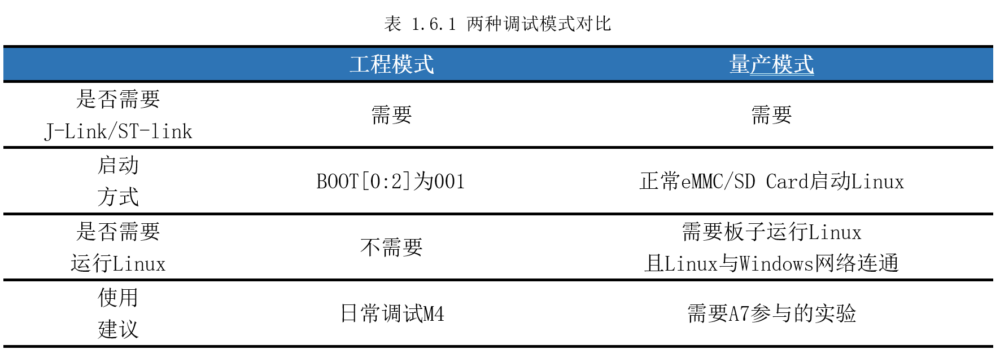

## 1.6.1工程模式调试方法

以前面“ProjectDemo”工程为例，介绍工程模式调试方法。首先将ST-Link一端连着电脑USB，另一端经过JTAG转接板插在开发板JTAG口，如图1.6.1所示，一切连接完后再打开电源开关。

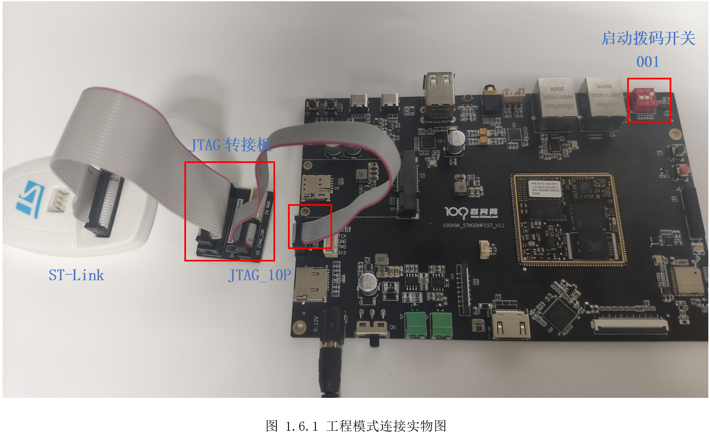

打开STM32CubeIDE，在菜单栏点击“Run”-\>“Debug Configurations”，如图 1.6.2所示。

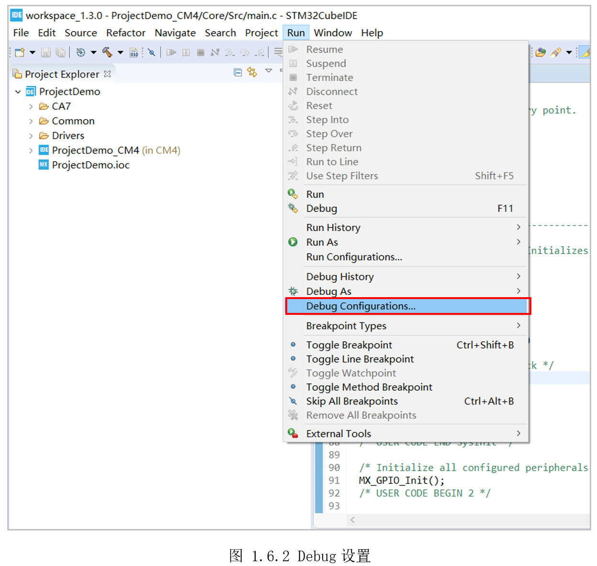

随后弹出设置框，先选中图 1.6.3①处的“STM32 Cortex-M C/C++Application”,然后点击左上角②处的新建调试按钮“New launchconfiguration”，右边的配置视图窗口，③处会默认选择之前编译生成的ELF文件（需先编译工程）。

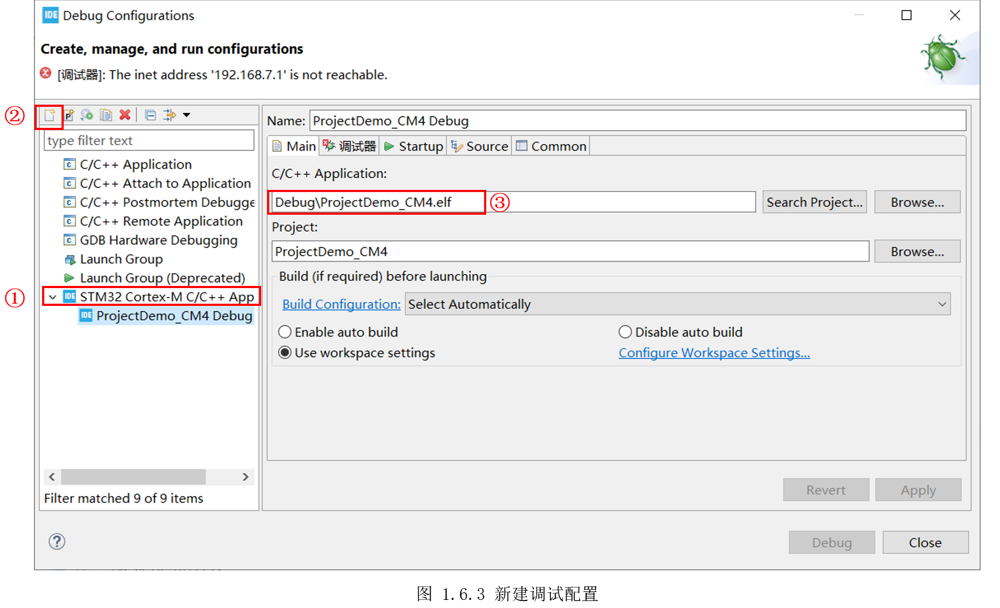

然后切到“调试器”标签页，在“Load Mode”单选框里选择“thru JTAG/SWD link(Engineering
mode)”,也就是工程模式，调试探头选择默认的“ST-LINK(OpenOCD)”，最后点击“Debug”开始调试，如图
1.6.4所示。

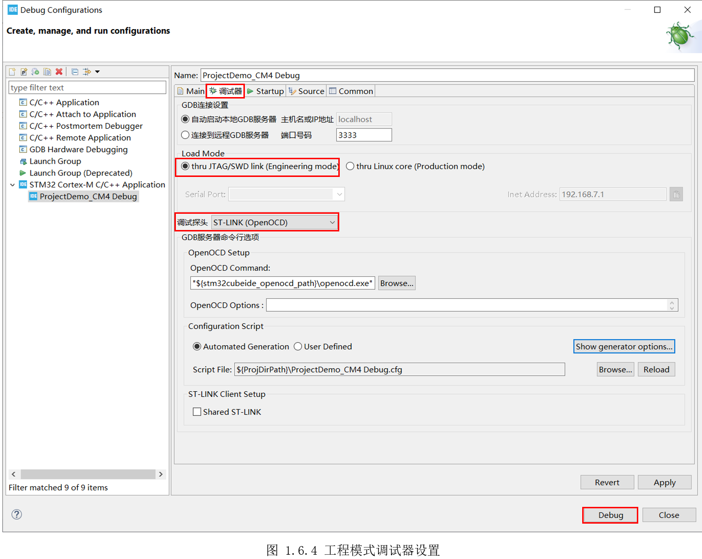

随后重新编译，进入调试视图，调试视图常用按钮如图 1.6.5所示。

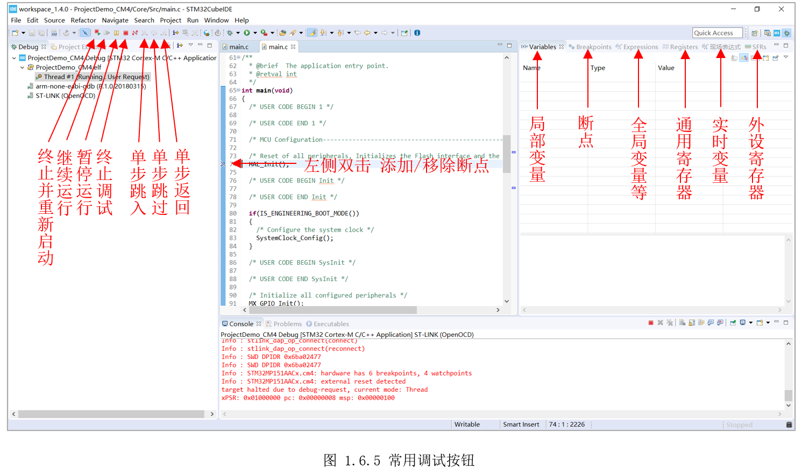

此时开发板黄色LED闪烁，使用工程模式可以很方便的对M4进行调试、验证。

## 1.6.2量产模式调试方法

以前面“ProjectDemo”工程为例，介绍量产模式调试方法。首先将ST-Link一端连着电脑USB，另一端插在开发板JTAG口。再使用Type-C线，将开发板的USBOTG接口与电脑相连（用于模拟USB网络连接），最后还需使用Type-C线，将开发板的USB串口与电脑相连（用于自动获取USB模拟网卡的IP），连接如所示。

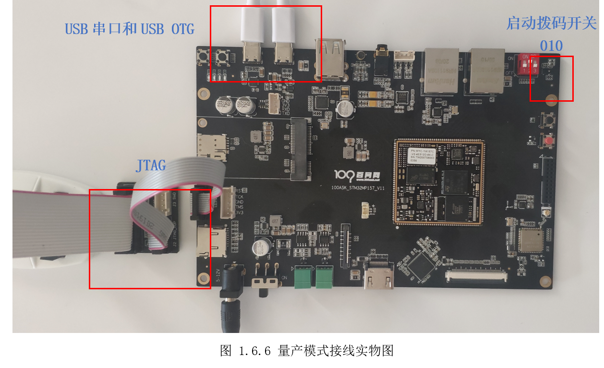

因为STM32CubeIDE使用串口获取USB虚拟网卡IP，又通过USB网卡组成的局域网上传固件，因此无论是USB串口还是USBOTG出错，都会导致量产模式无法继续。为了防止串口端口被占用，建议此时关闭MobaXterm等串口助手工具。另外，STM32CubeIDE对串口设备有筛选，默认只识别“FTDI”和“STMicroelectronics”设备，100ASK_STM32MP157使用的USB转串口芯片为CP2104，需要修改偏好设置，如图1.6.7所示，选择“Windows”-\>“Preferences”。

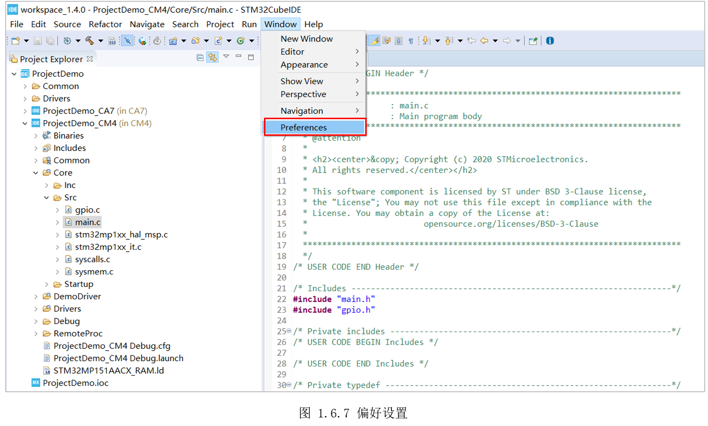

展开“STM32Cube”标签，选择“MPU Serial”,勾选右边的移除筛选“Removefilter”,在下拉框中选择当前开发板的端口号（以读者自己实际端口号为准，如果存在多个，需要去设备管理器查看CP210X对应的端口号），如图1.6.8所示。

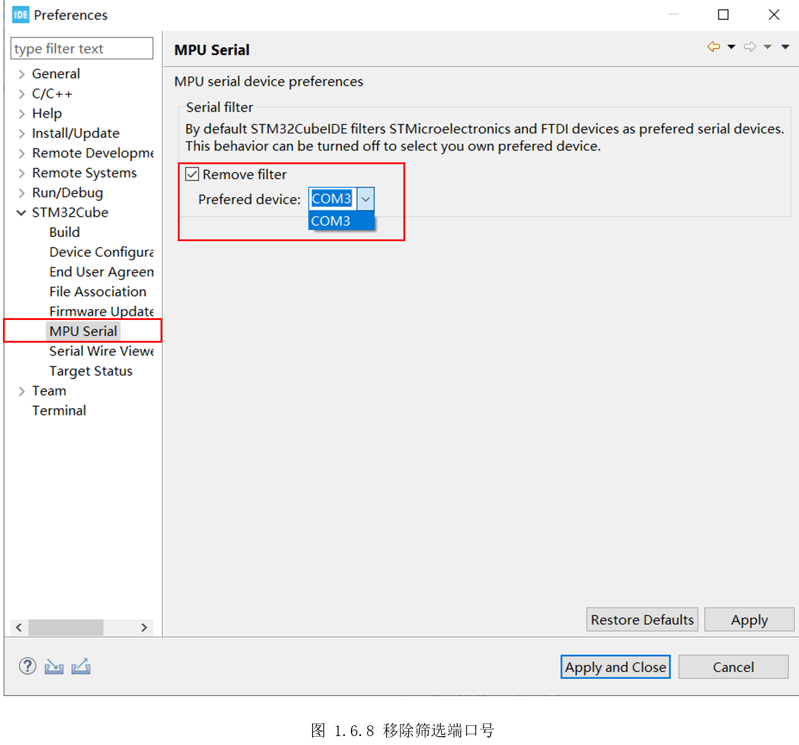

再次打开“调试器”标签页，在“Load Mode”单选框里选择“thru JTAG/SWD link(Engineeringmode)”,也就是工程模式，调试探头选择默认的“ST-LINK(OpenOCD)”，可以看到软件自动识别了串口和USB虚拟网卡的IP，最后点击“Debug”开始调试，如图1.6.4所示。如果未识别到IP，检查下电脑是否识别到“Remote NDIS Compatible
Device”设备。如果未出现该设备，尝试先拔掉USBOTG线，重新启动Linux，待进入Linux终端后，再稍等一会插入USB OTG线。

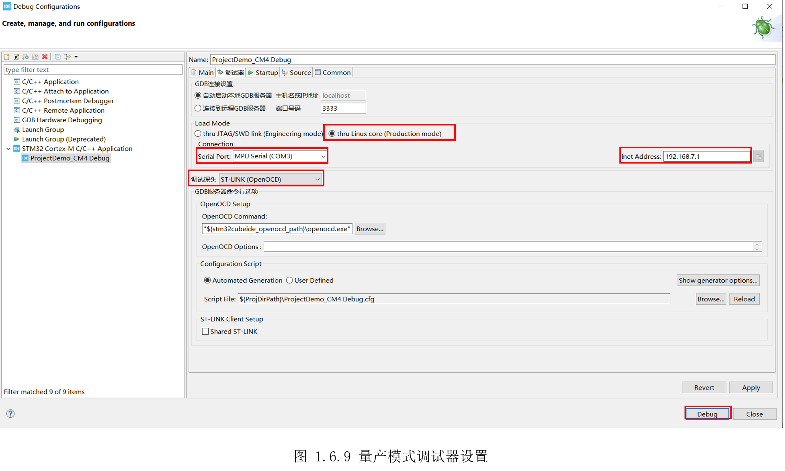

随后进入调试视图，后续调试操作和前面工程模式的调试方式一样，如图 1.6.10所示。

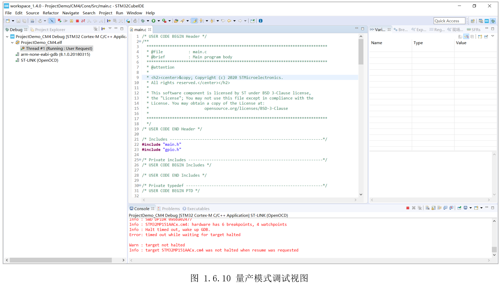

