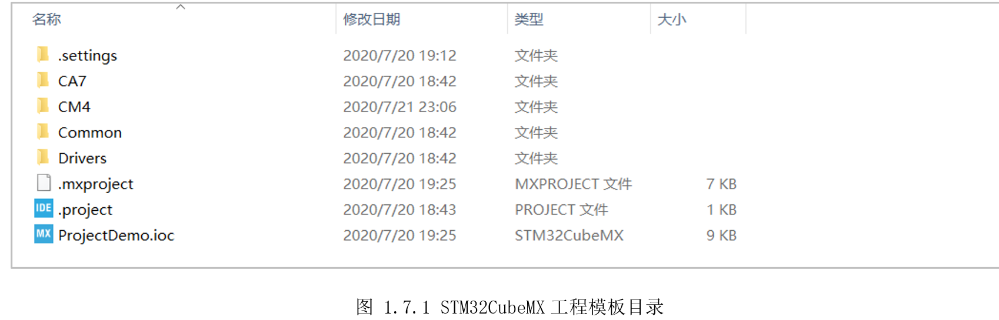
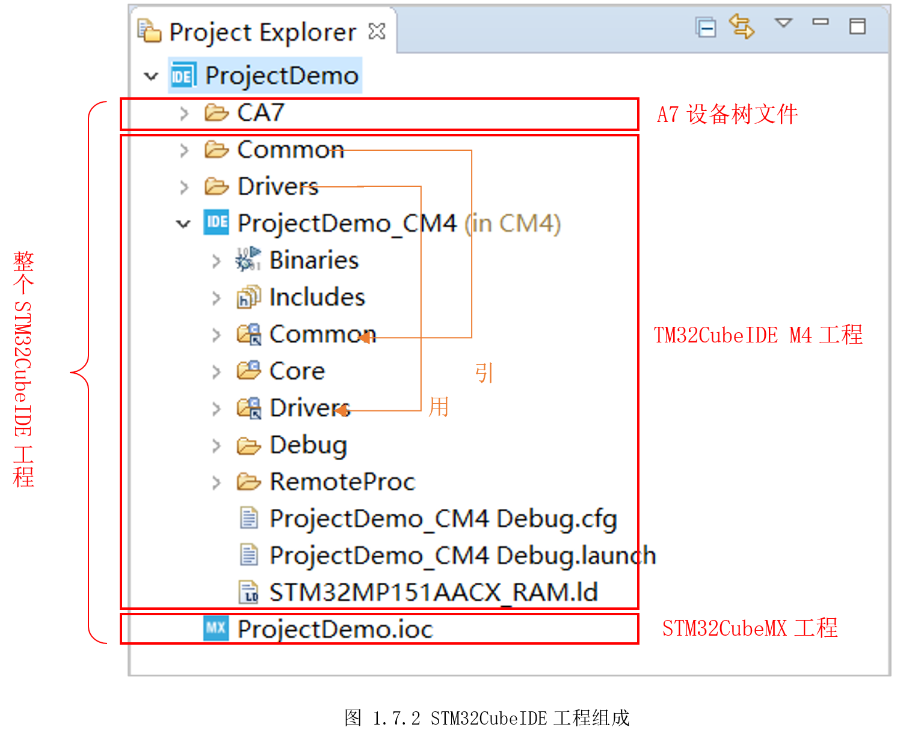
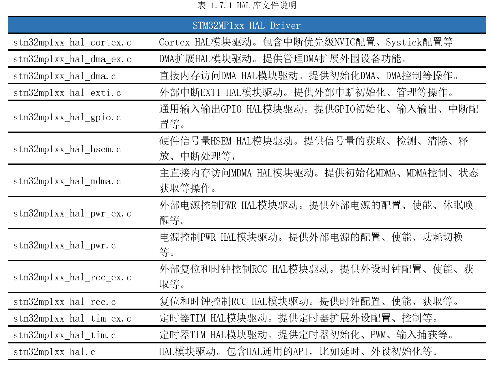
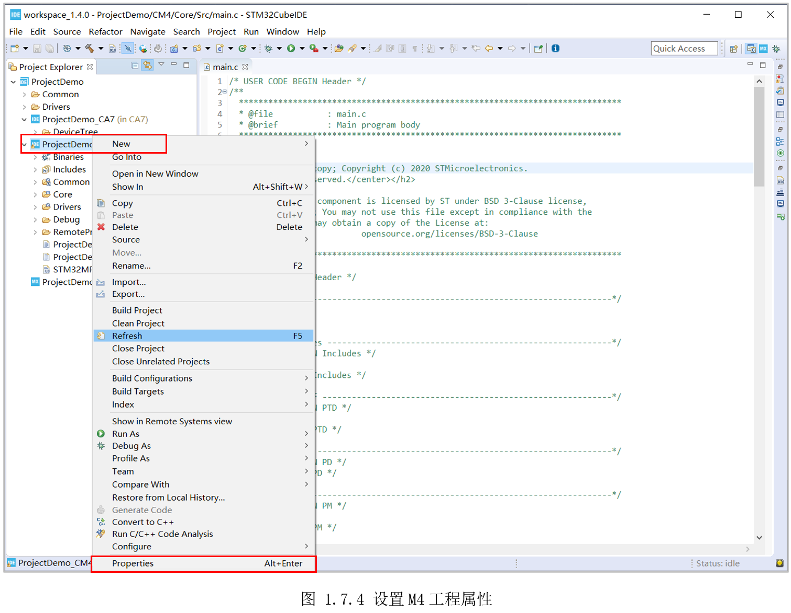
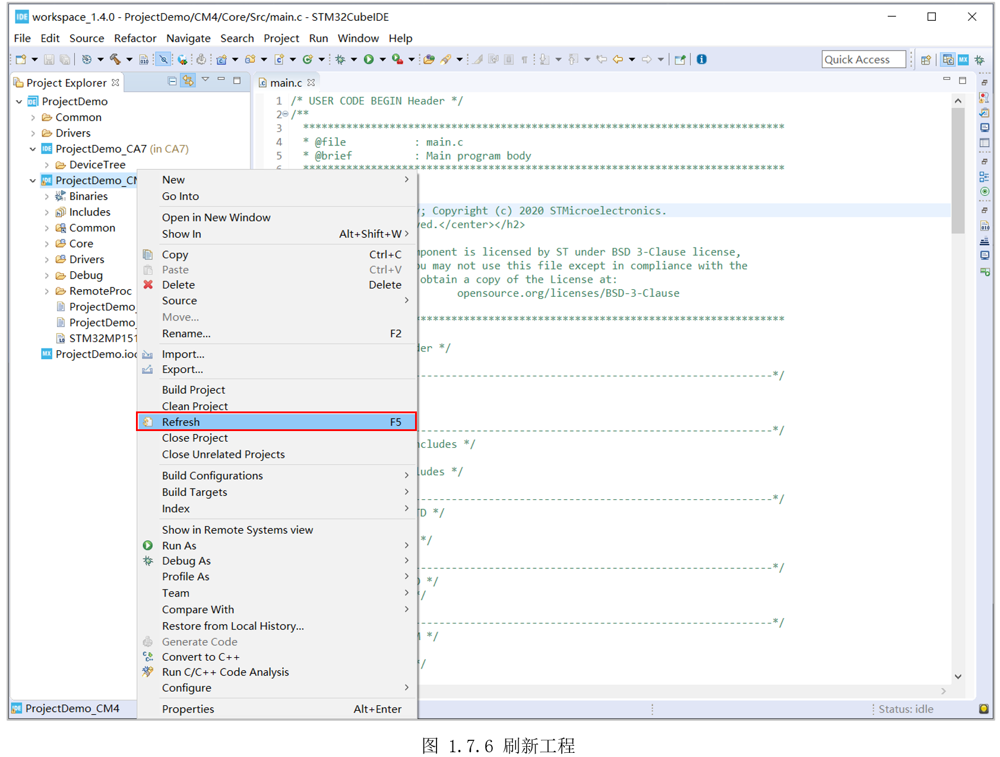
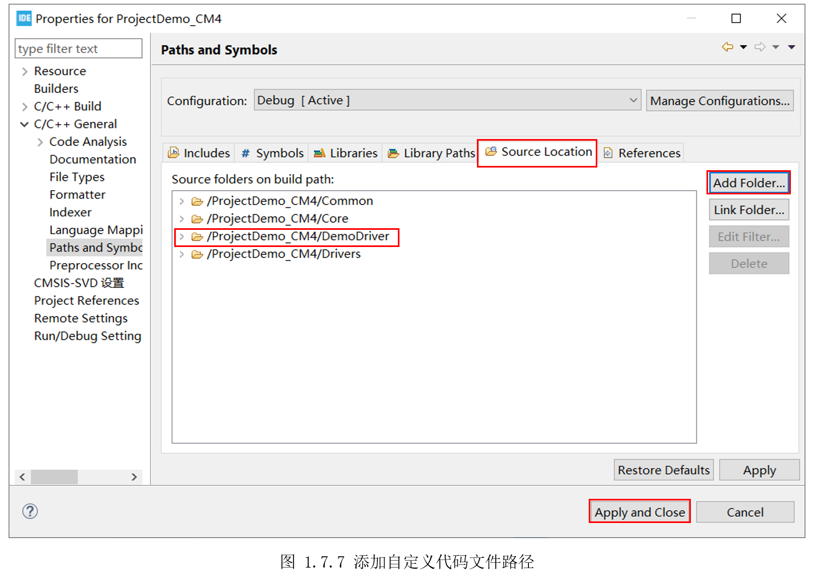
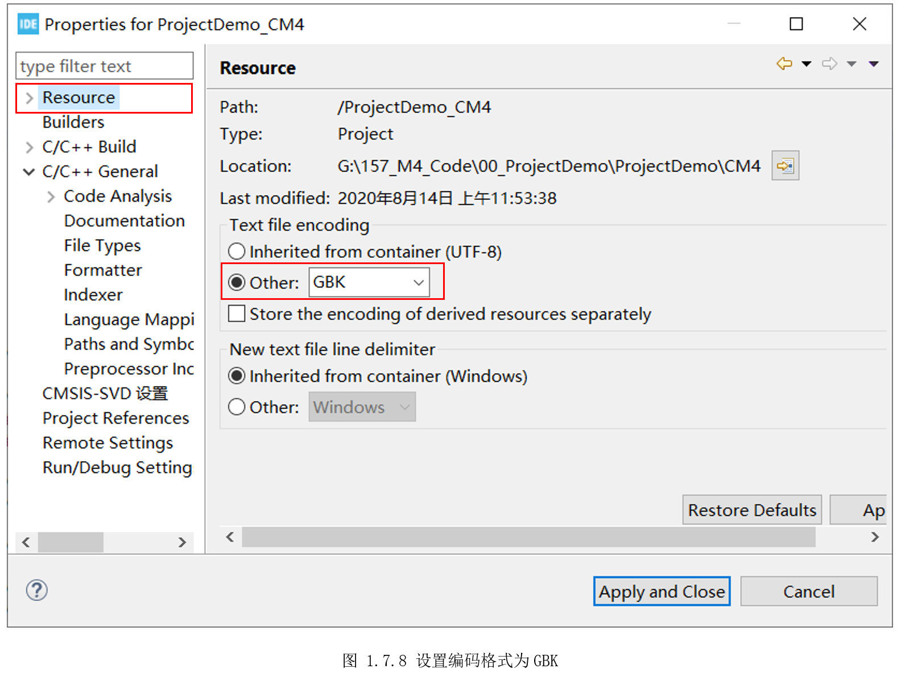

# 1.7 工程结构分析

本节将对STM32CubeIDE生成的工程模板框架进行讲解，了解这些文件的作用、包含关系，为后面的学习打下基础。

一个默认生成的工程模板源文件结构如图 1.7.1所示。

* CA7：里面包含A7处理器的各个阶段(TF-A、U-Boot、Kernel)的可能用到的设备树文件。之所以需要生成设备树文件，是因为STM32MP157x上的一些资源，只能A7或M4独享，因此需要在设备树里提前指定谁占用该资源，这个在后续的M4开发实例中会有用到。

* CM4：M4工程的核心，里面有一个M4的工程项目，后面讲解的重点。

* Common：CMSIS设备外设访问层，会被包含到M4工程里面。

* Driver：CMSIS库、HAL库，会被包含到M4工程里面。

* .mxproject和ProjectDemo.ioc：STM32CubeMX工程入口和配置信息。

* .project：本STM32CubeIDE工程入口

可以看出，STM32CubeIDE工程 = STM32CubeMX工程 + STM32CubeIDE M4工程 +A7设备树文件。用STM32CubeIDE打开工程，在工程浏览器可以清楚的看到工程层级关系，如图1.7.2所示。

STM32CubeIDE M4是我们主要关心的内容，前面图1.7.2是一个经过编译、调试后的工程，内容结构介绍如下：

* Binaries：指向生成的目标ELF二进制文件。
* Includes：指向所有涉及的头文件。包括交叉编译工具链头文件和后面“Core”、“Driver”文件夹里相关文件的头文件。
* Common：CMSIS设备外设访问层，里面有个“system_stm32mp1xx.c”文件，提供系统初始化函数“SystemInit()”、系统核心时钟更新函数“SystemCoreClockUpdate()”、系统核心时钟频率全局变量“SystemCoreClock”。
* Core：“Inc”文件夹里是相关头文件；“Src”文件夹里包含主函数所在文件“main.c”、资源列表文件“rsc_table.c”、MCU特定包(MCU Specific Package)初始化文件“stm32mp1xx_hal_msp.c”、中断服务程序“stm32mp1xx_it.c”、最小系统调用文件“syscalls.c”、最小系统内存调用文件“sysmem.c”; “Startup”文件夹里是“startup_stm32mp15xx.s”，是MCU上电后运行的第一个程序，会初始化栈、中断向量表等，最后跳到“main()”函数。
* Drivers:“CMSIS”文件夹里是CMSIS设备外设访问层相关的头文件。“STM32MP1xx_HAL_Driver”文件夹就是STM32提供的HAL库源文件，每个文件的内容如表1.7.1所示。

* Debug：执行编译或debug生成的文件，其中就包含ELF二进制文件；

* RemoteProc文件夹：里面是ST制作的一个Linux脚本，用于自动运行ELF文件；

* ProjectDemo_CM4 Debug.\*：debug配置信息文件；

* STM32MP157AACX_RAM.ld：工程的链接脚本，指定ELF文件的空间布局；

在实际开发中，习惯将外设操作，定义在相应的.c文件和.h文件里，然后添加到工程中来使用。这样可以方便工程管理，同时也不用担心STM32CubeMX修改配置后更新导致自己代码丢失。

继续以“ProjectDemo”工程为例，在“CM4”目录里，新建一个“DemoDriver”目录，如图1.7.3所示。

然后在STM32CubeIDE里选中M4工程“ProjectDemo”，鼠标右键选择“Properties”，如图1.7.4所示。

接着在“C/C++ General”下选择“Paths andSymbols”，切到“Includes”标签，点击右边的“Add…”,输入刚才新建的文件夹名“DemoDriver”,最后点击应用并关闭窗口“Applyand Close”，如图 1.7.5所示。

再次选中M4工程“ProjectDemo”，鼠标右键选择刷新工程“Refresh”，便可在工程看到“DemoDriver”目录，如图1.7.6所示。

重新进入属性“Properties”窗口，切换到“Source Location”标签，点击右边的“AddFolder”，在弹出的窗口中选中“DemoDriver”,最后点击“Apply and Close”，如图1.7.7所示。

以后将外设操作文件放在“DemoDriver”目录，具体效果参考后面示例。

另外，需要一提的是，STM32CubeIDE默认编码为UTF-8，如果有中文注释，STM32CubeMX动态重新生成初始化代码时，中文会部分乱码。后面示例的代码，会有中文注释，因此需要把编码格式改为GBK，如图1.7.8所示，进入属性“Properties”窗口，选择“Resource”标签，在“Text fileencoding”下“Other”手动输入“GBK”。这样其实也有弊端，比如串口打印中文就会乱码，用户根据需求自行取舍。

