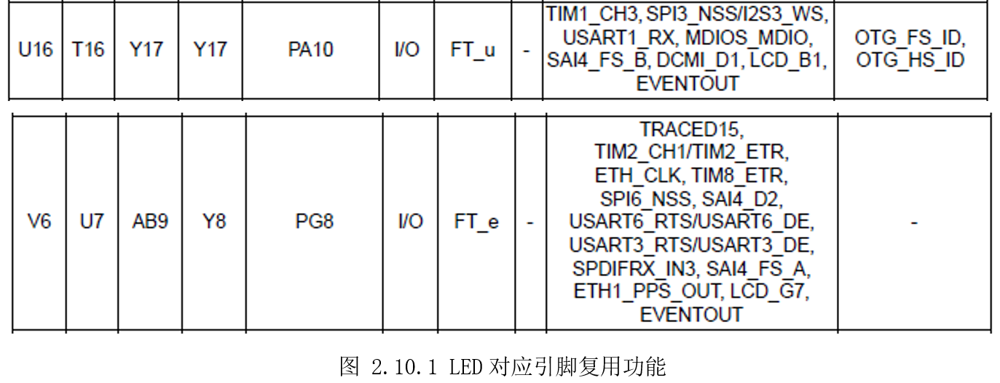
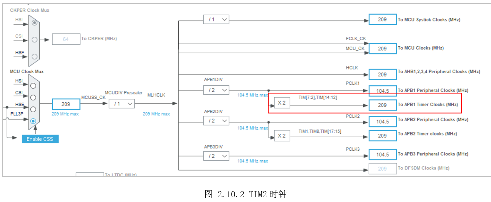
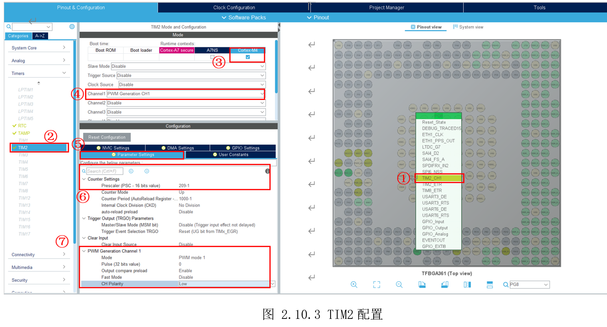
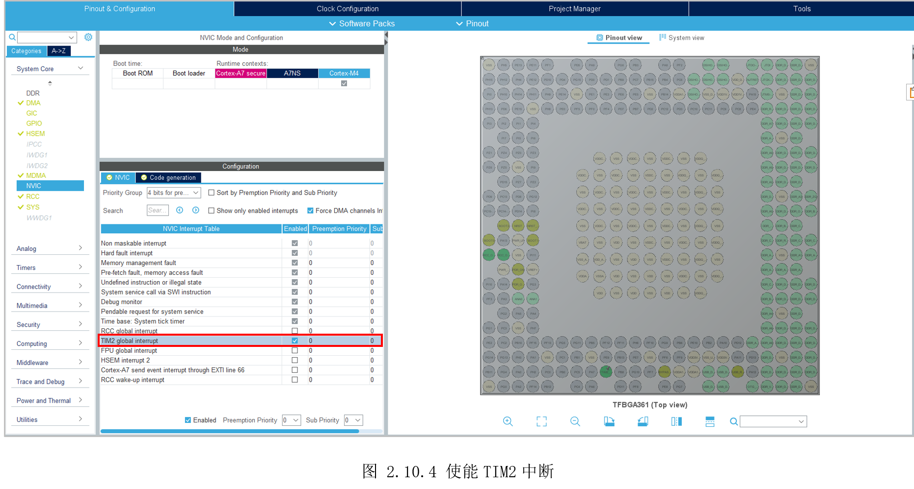

# 2.10 通用定时器—PWM

* 设计需求

这里假设需求为利用定时器产生PWM，实现LED亮度渐变。

## 2.10.1 基础知识

PWM(Pulse WidthModulation),即脉冲宽0度调制。是一种利用微处理器的数字输出来对模拟电路进行控制的技术，广泛应用在测量、通信、功率控制等诸多领域。

举个最常见的例子，利用PWM控制显示屏亮度。屏幕背光可以看作是一个大灯，这个大灯只有亮、灭两种状态。如果把灯亮看作100%，灯灭看作0%，要实现50%的亮度，可以在某个单位时间里亮灯50%时间、灭灯50%时间，只要这个单位时间够小，由于人眼具有视觉暂留效应，就会从宏观的感觉整个灯是一直亮着，且亮度只要原来的一半。本结就以LED灯类比屏幕背光灯，实现对其亮度的控制。

PWM实质就是GPIO不断翻转输出高、低电平，这个效果可以写代码控制GPIO产生，但这样就会占用CPU，CPU就不方便做其它事情。MCU里都有一个定时器，配置好这个定时器，就可以让它去控制GPIO自动翻转，无需CPU再参与。

STM32MP157有14个定时器TIM(各有差异)，5个低功耗定时器LPTIM。

## 2.10.2 硬件设计

参考前面图 2.2.2开发板LED原理图可知，两个LED灯，分别使用PA10和PG8，由前面图1.5.15提到的数据手册（Datasheet）可以查到这两个脚都支持TIM功能。



这里以PG8为例，设置其复用功能位TIM2_CH1输出PWM。

## 2.10.3 MX设置

参考前面设置MCU系统时钟为209MHz，此时TIM2的时钟也为209MHz,如所示。



然后如图2.10.3先设置PG8引脚复用功能为TIM2_CH1。然后切换到“Timers”标签，选择“TIM2”，勾选给Cortex-M4。在下面的通道1“Channel1”选择其功能为产生PWM“PWMGeneration CH1”。再切换到下面的“Parameter Settings”标签，参考⑥、⑦处设置。



这里简单说明下⑥、⑦处设置的含义。

在⑥处主要设置分频系数“Perscaler”，这里MCU主频为209MHz，这里为了方便计算，设置为“209-1”分频，这样定时器频率就工作在209MHZ/209=1MHz。接着设置定时器计数周期“Counter
Period”值为“1000-1”,这样定时器计数就会从0开始，计数到1000，完成一次计数周期，然后再从0开始，周而往复，此时一个定时器频率为1MHz/1000=1KHz，即1秒GPIO翻转1000次。

在⑦处大部分默认即可，通道极性“CHPolarity”可改为“Low”,因为LED是低电平亮。在代码里，修改“Pulse”的值，即可修改占空比。比如当“Pulse”值为500时，即0-500计数期间为低电平LED亮，500-1000计数周期为高电平LED灭，LED从宏观看就是半亮状态。

此外，还需要使能TIM2中断，这样完成一个计数周期才会进入中断回调函数，在中断回调函数实现修改占空比，不断改变LED亮度。TIM2中断使能如图2.10.4所示。



## 2.10.4 代码设计

创建“DemoDriver”目录，在里面新建“driver_tim_pwm.c”。首先需要完善定时器中断回调函数，在该函数里，使用“__HAL_TIM_SET_COMPARE()”修改寄存器CCR，实现不同的占空比。

```c
/*
 *  函数名：void HAL_TIM_PeriodElapsedCallback(TIM_HandleTypeDef *htim)
 *  输入参数：htim->定时器句柄
 *  输出参数：无
 *  函数作用：每当发生一次周期溢出时间会到此中断回调函数，在此函数内更新占空比
*/
static uint16_t pulse = 0;
void HAL_TIM_PeriodElapsedCallback(TIM_HandleTypeDef *htim)
{
    if(htim->Instance == TIM2)
    {
        pulse = pulse + 1;
        if(pulse>=1000)
        {
            pulse = 0;
        }
        __HAL_TIM_SET_COMPARE(&htim2, TIM_CHANNEL_1, pulse);
    }
}
```

将定时器中断启动函数“HAL_TIM_Base_Start_IT()”和定时器PWM输出开始函数“HAL_TIM_PWM_Start()”封装在一起。

```c
/*
 *  函数名：void TIM_LED3_PWM_Start(void)
 *  输入参数：无
 *  输出参数：无
 *  函数作用：开启定时器
*/
void TIM_LED3_PWM_Start(void)
{
    if(HAL_TIM_Base_Start_IT(&htim2) != HAL_OK)
    {
        Error_Handler();
    }
    HAL_TIM_PWM_Start(&htim2, TIM_CHANNEL_1);
}
```


最后主函数调用“TIM_LED3_PWM_Start()”即可启动TIM中断和输出占空比不断增加的PWM。

## 2.10.5 实验效果

使用工程模式调试，可以发现LED_YELLOW逐渐变亮，再变暗，如此循环。注意，如果是实际应用，需要设备树覆盖，将TIM2分配给M4。

