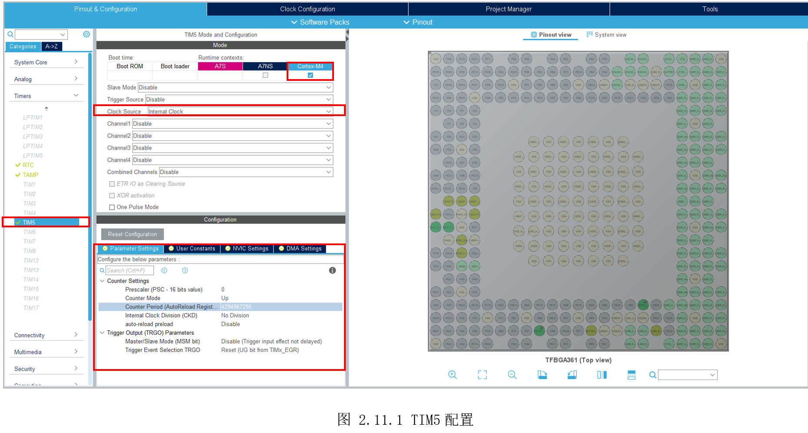
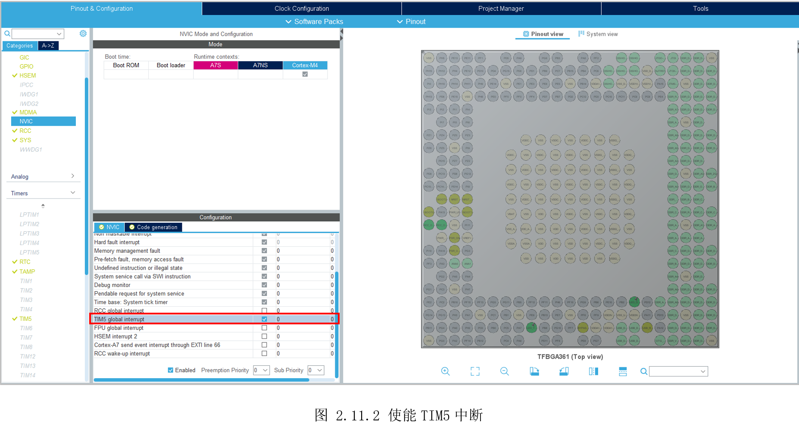

# 2.11 通用定时器—us延时

* 设计需求
  这里假设需求为使用通用定时器，得到一个us级别的延时。

## 2.11.1 基础知识

HAL库提供了一个毫秒级延时函数“HAL_Delay()”，它也是基于SysTick。有些应用场合可能需要微秒级的延时，该函数就不能满足我们需求，因此这里利用定时器，自己创建一个us级延时。

STM32MP157的TIM多达10几个，不同的定时器精度不同，这里使用TIM5，精度位32位，可以从0计数到232。

## 2.11.2 硬件设计

TIM不涉及电路设计。

## 2.11.3 MX设置

参考前面配置LED和时钟，为了方便计算，这里的把MCU系统时钟设置为200MHz。将TIM5分配给M4，时钟源选择“InternalClock”，如图2.11.1所示。下面的参数设置，保持默认即可，预分频“Prescaler”为0，表示TIM5的频率为200MHz，意味着1s时间内，会计数200000000次。那么1us则计数200000000/1000000=200次。如果“CounterPeriod”值为200-1，则计数时间为1us，如果“CounterPeriod”值为200\*t-1，则计数时间为t us。因此后面将通过代码修改“CounterPeriod”值即可实现不同长度的us延时。



每个计数周期完成，将产生中断。在中断里修改标志位，即可得知一个计数周期完成。使能TIM5中断如图
2.11.2所示。



## 2.11.4 代码设计

创建“DemoDriver”目录，在里面新建“driver_led.c”和“driver_tim.c”。“driver_led.c”参考前面的示例即可。

“driver_tim.c”里定义us延时函数，通过函数设置“autoreload”和“counter”，然后启动定时器，循环查询标志位，等待本次计数周期完成。

```c
__IO uint16_t delay_end = 0; // 延时完成标志

/*
 *  函数名：void us_timer_delay(uint32_t t)
 *  输入参数：t-延时时间us(范围:0~21,474,836us)
 *  输出参数：无
 *  返回值：无
 *  函数作用：定时器实现的延时函数，延时时间为t us，为了缩短时间，函数体使用寄存器操作，用户可对照手册查看每个寄存器每位的含义
*/
void us_timer_delay(uint32_t t)
{
    uint32_t counter = 0;
    uint32_t autoreload = 200*t-1;

    delay_end = 0;
    HAL_TIM_Base_Stop_IT(&htim5); // 先停止TIM5计数

    __HAL_TIM_SET_AUTORELOAD(&htim5, autoreload); // 设置计数自动加载值,每200个为1us
    __HAL_TIM_SET_COUNTER(&htim5, counter); // 设置计数初始值为0,启动定时器后counter将增加到autoreload

    HAL_TIM_Base_Start_IT(&htim5); // 启动TIM5计数
    while(!delay_end);
}
```

定时器将从0（counter初值设置为0），一直增加到autoreload（t个1us对应的计数值），达到autoreload后，将回调“HAL_TIM_PeriodElapsedCallback()”，在该函数里关闭定时器和修改标志位。

首先需要完善定时器中断回调函数，在该函数里，关闭定时器和修改标志位。

```c
/*
 *  函数名：void HAL_TIM_PeriodElapsedCallback(TIM_HandleTypeDef *htim)
 *  输入参数：htim->定时器句柄
 *  输出参数：无
 *  函数作用：每当发生一次周期溢出时间会到此中断回调函数，在此函数内停止计数并修改标志位
*/
void HAL_TIM_PeriodElapsedCallback(TIM_HandleTypeDef *htim)
{
    if(htim->Instance == TIM5)
    {
        HAL_TIM_Base_Stop_IT(&htim5); // 停止TIM5计数
        delay_end = 1;
    }
}

```


主函数调用us_timer_delay()，即可实现us延时。这里为了方便观察，传入1000000，即1s时间。

```c
  /* Infinite loop */
  /* USER CODE BEGIN WHILE */
  while (1)
  {
    /* USER CODE END WHILE */

    /* USER CODE BEGIN 3 */
      LED_GREEN_ON();
      LED_YELLOW_OFF();
      us_timer_delay(1000000);

      LED_GREEN_OFF();
      LED_YELLOW_ON();
      us_timer_delay(1000000);
  }
  /* USER CODE END 3 */
}

```


## 2.11.5 实验效果

调试运行后，可以看到LED灯基本按1S间隔进行闪烁。测试效果不严谨，有条件的读者可以修改测试代码，使用示波器或逻辑分析仪观察引脚翻转，验证实验效果。

