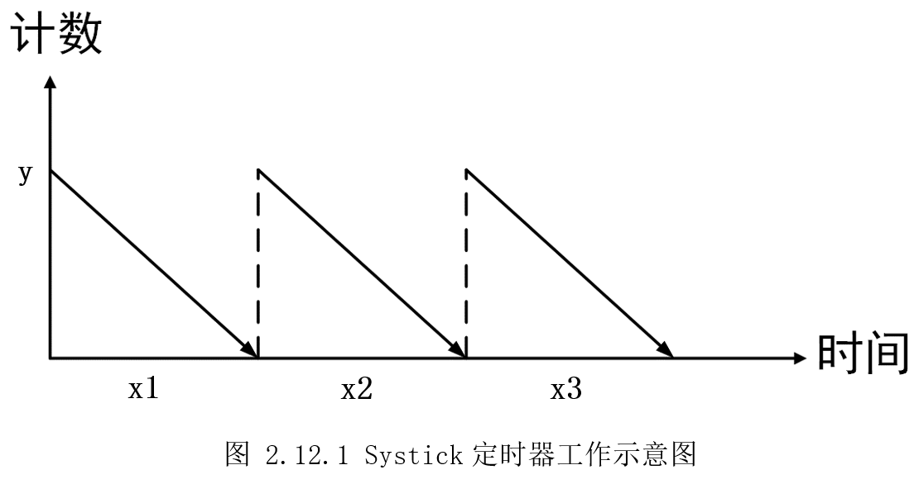

# 2.12 SysTick定时器-us延时

* 设计需求
  这里假设需求为使用SysTick定时器，得到一个us级别的延时。

## 2.12.1 基础知识

SysTick定时器(又名系统滴答定时器)是存在于内核的一个定时器，只要是ARMCotex-M系列内核的MCU都包含这个定时器。使用内核的SysTick定时器来实现延时，可以不占用系统定时器，节约资源。由于和MCU外设无关，因此可以在不同厂家的Cortex-M内核之间移植。

前面使用通用定时器，实现了一个us级别延时，这里再用SysTick实现一次。注意SysTick用于了HAL库的毫秒级延时函数“HAL_Delay()”，不建议日常使用SysTick去作为其它用途，这里只作为演示。

## 2.12.2 硬件设计

SysTick定时器不涉及硬件，这里只需要一个LED灯去展示延时效果。

## 2.12.3 MX设置

参考前面创建一个STM32CubeIDE工程，在STM32CubeMX里添加LED灯，设置M4时钟为209MHz，其它无需操作。

## 2.12.4 代码设计

SysTick定时器是一个24位递减定时器，即计数器可以从最大值224开始每个时钟周期减1，当减到0时，会产生一个中断，同时再自动重载定时初值，开始新一轮计数。而这个定时初值，则是我们可以设置的，就可以实现得到指定时间。如下图2.12.1所示，y为定时器初值，然后随着时间增加，值逐渐减小，直至为0，再重新加载初值，如此往复，x1、x2、x3这些时间段，就是我们需要的。



M4工作在209MHz，即209000000Hz，意味着1s时间内，会计数209000000次。那么1us则计数209000000/1000000=209次。这个209就是滴答定时器的初始值，将这个值写入滴答定时器，定时器在每个时钟周期减1，减到0时，就刚好是1us，同时产生中断通知，再次加载209如此反复。HAL库提供“HAL_SYSTICK_Config()”函数去设置这个初始值。

在“DemoDriver”目录新建“driver_systick.c”和“driver_systick.h”。首先需要初始化Systick，让其初始值为209，再设置SysTick定时器的中断优先级，最后使能SysTick定时器中断。

```c
/*
 *  函数名：void SysTickInit(void)
 *  输入参数：无
 *  输出参数：无
 *  返回值：无
 *  函数作用：初始化系统滴答时钟的频率和中断优先级
*/
void SysTickInit(void)
{
    uint32_t init_t = 0;

    init_t = SystemCoreClock/1000000;

      /* 时间(单位:s)=1/频率(单位:HZ)
     * SystemCoreClock频率: 209MHz = 209,000,000
     * 即MCU 1秒会计数209,000,000次
     *       1us则计数 209MHz/1000000 = 209次
     * 209就是滴答时钟的初始值,它向下计数209次,计数将变为0,就会产生一次中断
     *
     * SystemCoreClock/1000:    1ms中断一次
     * SystemCoreClock/100000:  10us中断一次
     * SystemCoreClock/1000000: 1us中断一次
     */
    if(HAL_SYSTICK_Config(init_t) != HAL_OK)
    {
        Error_Handler();
    }

    // 设置滴答定时器中断优先级：最高
    HAL_NVIC_SetPriority(SysTick_IRQn, 0, 0);
    // 使能滴答定时器中断
    HAL_NVIC_EnableIRQ(SysTick_IRQn);
}

```


配置完成后，每个1us就会产生一次中断，也就会调用“stm32mp1xx_it.c”里的“SysTick_Handler()”。为了不影响HAL库的“HAL_Delay()”，这里添加一个自己的中断处理函数“OwnSysTick_Handler()”。

```c
	/**
  * @brief This function handles System tick timer.
  */
void SysTick_Handler(void)
{
  /* USER CODE BEGIN SysTick_IRQn 0 */

  /* USER CODE END SysTick_IRQn 0 */
  HAL_IncTick();
  /* USER CODE BEGIN SysTick_IRQn 1 */
  OwnSysTick_Handler();
  /* USER CODE END SysTick_IRQn 1 */
}
/*
 * 全局变量定义
*/

static volatile uint32_t systick_t = 0

……

/*
 *  函数名：void SysTickDelay(uint16_t u)
 *  输入参数：u-延时时间
 *  输出参数：无
 *  返回值：无
 *  函数作用：滴答定时器实现的延时函数
*/
void SysTickDelay(uint32_t u)
{
    systick_t = u;
    while(systick_t != 0);
}

/*
 *  函数名：void OwnSysTick_Handler(void)
 *  输入参数：无
 *  输出参数：无
 *  返回值：无
 *  函数作用：滴答定时器的中断服务函数
*/
void OwnSysTick_Handler(void)
{
    if(systick_t != 0)
    {
        systick_t--;
    }
}

```


回到“driver_systick.c”，我们定义个一个全局变量“systick_t”，用于记录需要多少个1us，然后中断函数里每次将“systick_t”减1，这样就循环了“systick_t”个1us。

“main.c”即可调用“SysTickDelay()”实现us级别延时。

```c
  /* Initialize all configured peripherals */
  MX_GPIO_Init();
  /* USER CODE BEGIN 2 */
  SysTickInit();
  /* USER CODE END 2 */

  /* Infinite loop */
  /* USER CODE BEGIN WHILE */
  while (1)
  {
    /* USER CODE END WHILE */

    /* USER CODE BEGIN 3 */
  LED_GREEN_ON();
  SysTickDelay(1000000);
  LED_GREEN_OFF();
  SysTickDelay(1000000);
  }
  /* USER CODE END 3 */
}

```


## 2.12.5 实验效果

调试运行后，可以看到LED灯基本按1S间隔进行闪烁。测试效果不严谨，有条件的读者可以修改测试代码，使用示波器或逻辑分析仪观察引脚翻转，验证实验效果。

