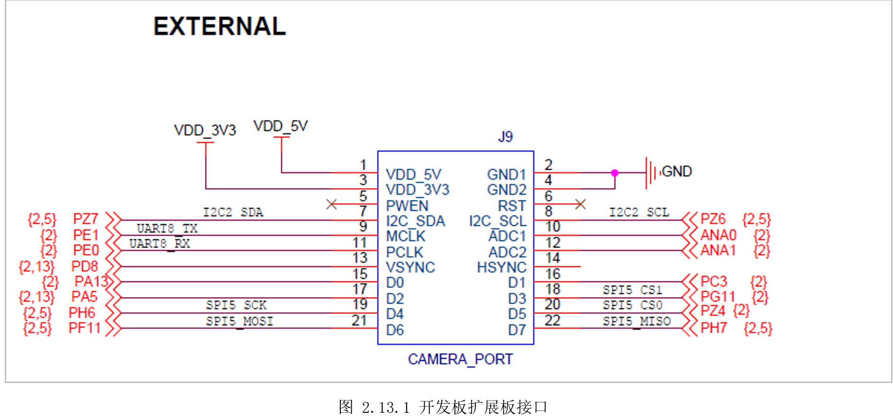
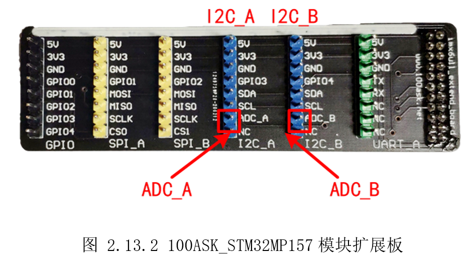
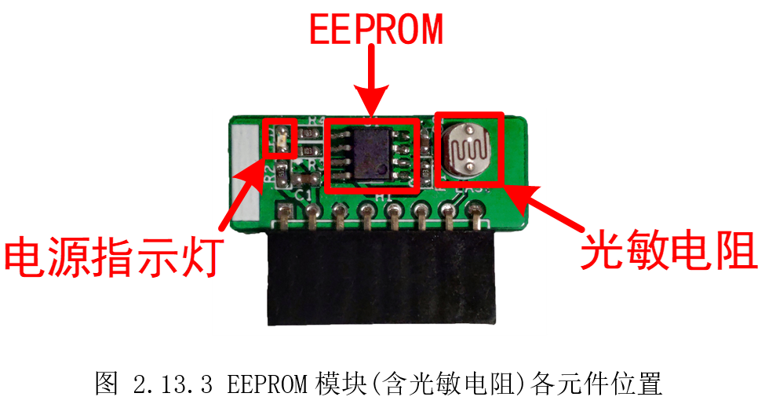
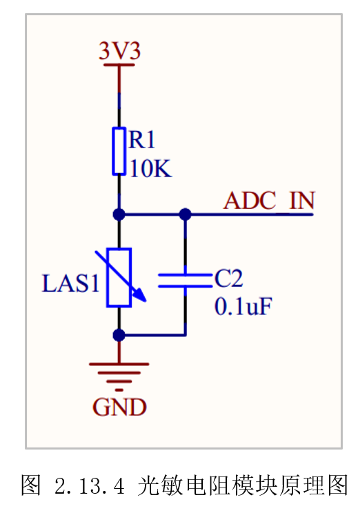
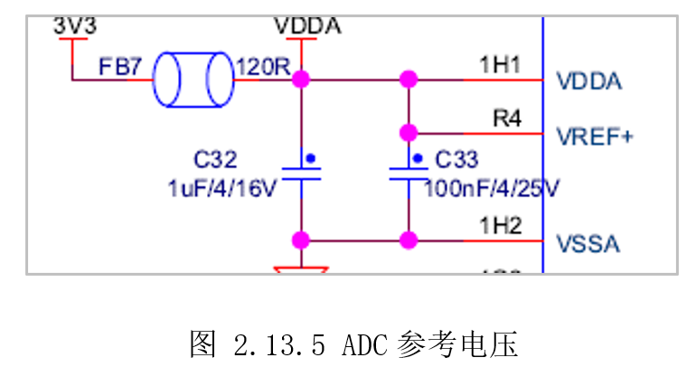
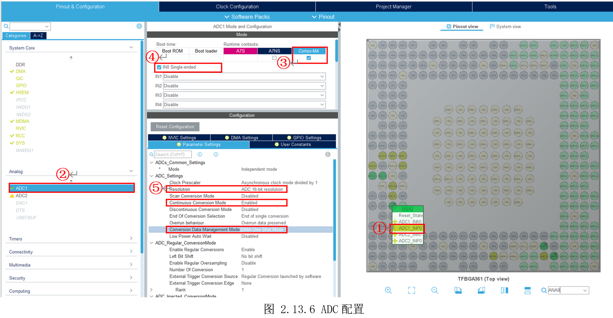
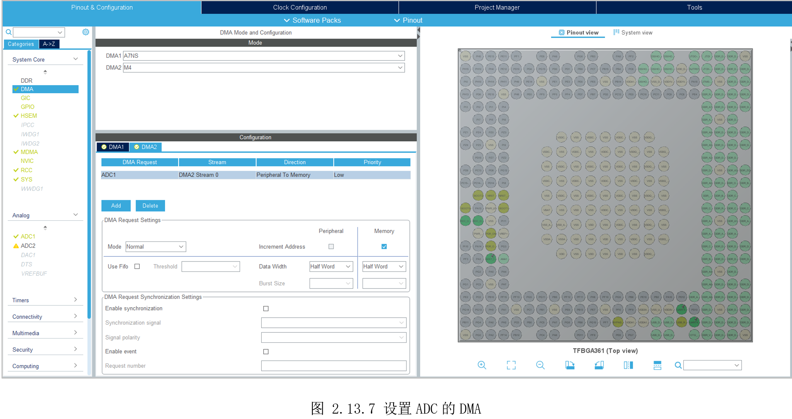
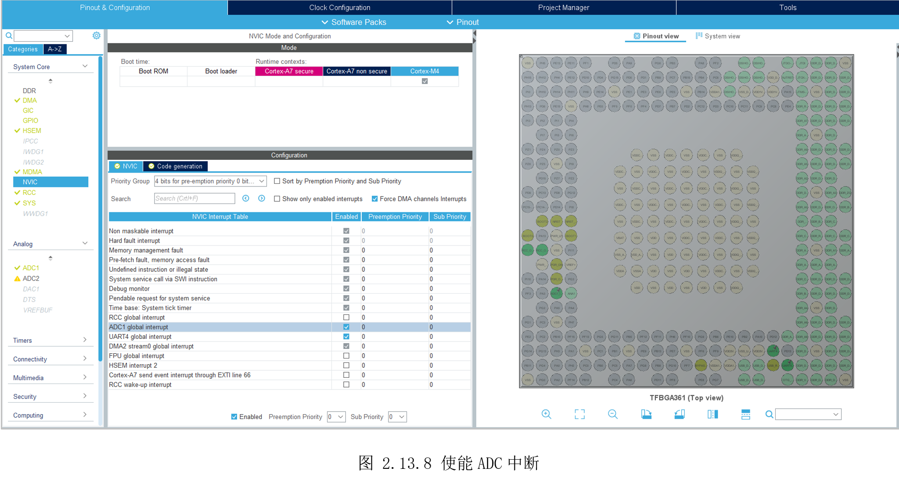
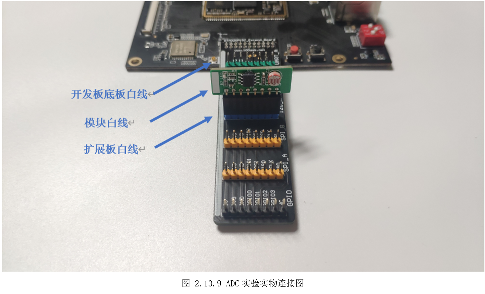
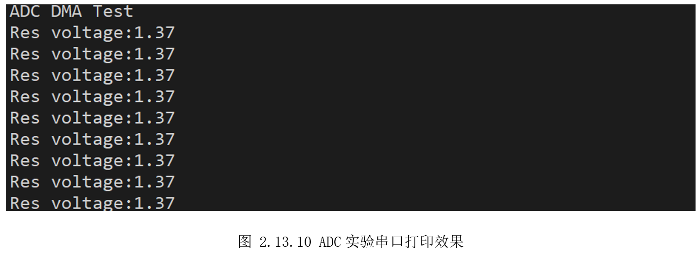

# 2.13 ADC—使用DMA

* 设计需求

这里假设需求为使用ADC，获取光敏电阻两端电压值，从而得知外部光照变化。

## 2.13.1 基础知识

ADC(Analog-to-DigitalConverter)模数转换器，自然界的信号几乎都是模拟信号，比如光亮、温度、压力、声音；而为了方便存储、处理，计算机里面都是数字的0/1信号，将模拟信号转换成数字信号的装置就叫模数转换器(ADC)。

STM32MP157有两个ADC，都可以给分配给M4，每个ADC有19个通道。

## 2.13.2 硬件设计

100ASK_STM32MP157将ADC引脚引了出去，在J9的External接口上，如图2.13.1所示，ADC分别是10脚和12脚。



这个座子并不方便实验，因此做了一个转接板，将扩展引脚分类整理引了出来，如图2.13.2所示为100ASK_STM32MP157配套的扩展板。



为了方便观察ADC效果，这里制作一个模块，上面有一个光敏电阻，光敏电阻阻值受光照影响变化，反应到光敏电阻两端就是电压变化，就可以通过ADC测出变化。光敏电阻与EEPROM制作在了一起，直接将EEPROM模块接在I2C接口即可，各部分介绍如图2.13.3所示。为了防止用户接错方向，模块和扩展板都有一条长白线，连接时长白线在同一侧。



如图2.13.4是光敏电阻模块的电路图，电路图中最上面是3.3V电源，往下是电阻R1和光敏电阻LAS1，两个电阻之间，与100ASK_STM32MP15的ADC引脚相连，最下面是接地，一旁的电容C2可以暂时忽略(它起稳压作用，防止电压突然变化)。

当光敏电阻LAS1受到光照时，阻值会变小，此时它两端的电压会变小；当光照比较弱时，阻值会变大，导致它两端的电压也变大。假设上图中的ADC_IN接到某个GPIO引脚，通过读GPIO引脚只能得到0或1两个值之一，只能判断光照在某个阀值上下。如果使用ADC去读取光敏电阻两端电压，不仅可以知道是否有光照，还能知道光照的强度。



此外，ADC还涉及参考电压，查看核心板电路图可知，参考电压为3.3V，如所示。



## 2.13.3 MX设置

先参考前面设置好MCU系统时钟209MHz，设置好调试串口方便打印结果。这里假设将模块接到ANA0,如图
2.13.6所示配置ADC。①搜索ANA0，复用功能设置为ADC1_INP0；②选择ADC1；③勾选给M4；④勾选通道0“IN0Single-ended”；⑤默认ADC分辨率为16位，使能连续ADC转换，转换数据管理模式这里暂时还不能选择DMA，需要将后面的DMA设置后，再回来设置为“DMAOne Shot Mode”。



切到DMA标签，在DMA2里“Add”选择“ADC1”，其它默认的配置就行，如图2.13.7所示。使用DMA就无需CPU参与数据的搬运，外设ADC产生数据，就通过DMA自动搬运到内存。在连续采集多次的情境下，将大大降低CPU的负担。



最后勾选上ADC中断使能，这样就能通过中断得知转换完成，如图 2.13.8所示。



## 2.13.4 代码设计

创建“DemoDriver”目录，新建“driver_adc.c”,只需调用HAL库的“HAL_ADC_Start_DMA()”即可启动ADC
DMA采样，需要传入数据保存位置和采样次数。然后等待中断修改标志位，得知转换完成，再将得到的数据转换成电压值。这里参考电压为3.3V，ADC分辨率为216，因此对应的电压值为：ADC采集值\*3.3/65536。

```c
/*
void GetAdcValue(uint16_t *pdatain, float *pdataout, uint16_t sz)
 *  输入参数：sz-采样点数
 *  输出参数：pdatain-采样的数据存储的首地址
 *       pdataout-电压转换至存储的首地址
 *  返回值：无
 *  函数作用：获取ADC的采样到的模拟电压
 *
 *  备注：此处参考电压为3.3V
*/
void GetAdcValue(uint16_t *pdatain, float *pdataout, uint16_t sz)
{
  uint16_t i = 0;
  conv_flag = 0;
  HAL_ADC_Start_DMA(&hadc1, (uint32_t*)pdatain, sz);
  while(conv_flag != 1);

  for(i=0; i<sz; i++)
  {
    pdataout[i] = pdatain[i] * 3.3 / 65536;
  }
}

```

接着完善ADC完成回调函数，在里面更新完成标志。

```c
/*
 *  函数名：void HAL_ADC_ConvCpltCallback(ADC_HandleTypeDef* hadc)
 *  输入参数：hadc->adc句柄
 *  输出参数：无
 *  函数作用：每当ADC转换完成会到此中断回调函数，在此函数内更新完成标志
*/
void HAL_ADC_ConvCpltCallback(ADC_HandleTypeDef* hadc)
{
    if(hadc->Instance==ADC1)
    {
        conv_flag = 1;
    }
}

```

在主函数里，调用前面封装的“GetAdcValue()”，一次性采集256次，然后将采集结果取平均值，提高准确率。

```c
  /* USER CODE BEGIN 2 */
  printf("\r ADC DMA Test \n");
  /* USER CODE END 2 */

  /* Infinite loop */
  /* USER CODE BEGIN WHILE */
  while (1)
  {
    /* USER CODE END WHILE */

    /* USER CODE BEGIN 3 */
    GetAdcValue((uint16_t*)AdcDigitalData, (float*)AdcAnolgaValue, 256); // 启动ADC,采集256次,保存到AdcAnolgaValue

    sum_value = 0;
    for(i=0; i<256; i++)
    {
      sum_value = sum_value + AdcAnolgaValue[i]; // 将AdcAnolgaValue所有值加起来
    }
    sum_value = (float)sum_value/256; // 得到电压值平均值

    printf("\r Res voltage:%.2f \n", sum_value); // 打印光敏电阻两端的电压值

    HAL_Delay(1000);
  }
  /* USER CODE END 3 */
}

```


## 2.13.5 实验效果

将扩展板接到开发板上，将模块接到扩展板I2C_A（ANA0）上，如图2.13.9所示，注意模块白线、扩展板白线、开发板底板白线，三线朝向一致。。



调试运行，可以看到如图2.13.10所示打印，改变光敏电阻光照环境，可以看到打印结果数值也发生变化。



