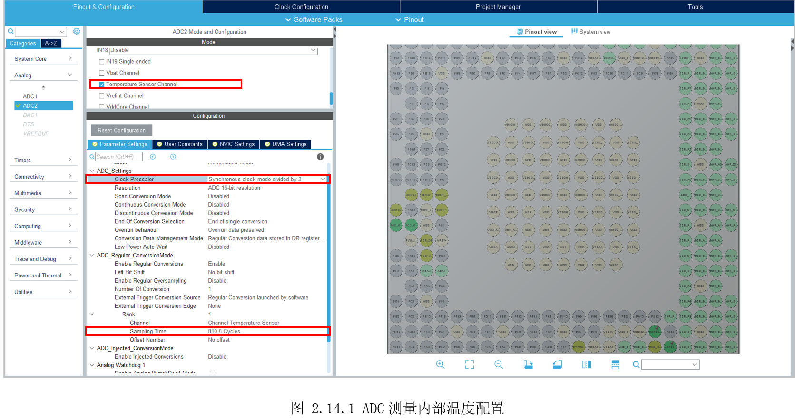

# 2.14 ADC—内部温度

* 设计需求

这里假设需求为使用ADC，获取芯片内部温度。

## 2.14.1 基础知识

ADC2的通道19可以设置为获取芯片内部温度。

## 2.14.2 硬件设计

不涉及电路设计。

## 2.14.3 MX设置

ADC有两个时钟方案：一个是来自adc_hclk（AHB时钟），一个是来自adc_ker_ck（ADCKernel时钟）。两个时钟源独立且异步。

先设置MCU系统时钟工作在209MHz，ADC默认由“PLL4R”提供时钟，然后设置UART4方便打印。最后切到ADC2标签，勾选给M4，再勾选“Temperature Sensor Channel”，如图 2.14.1所示。需要注意的是“Clock Prescaler”选择“Synchronous clock mode divided by 2”，“Rank”下的采样周期“Sampling Time”选择大一点，比如“810.5 Cycles”。



## 2.14.4 代码设计

创建“DemoDriver”目录，在里面新建“driver_adc.c”，在该文件里调用“HAL_ADC_Start()”启动ADC，调用“HAL_ADC_PollForConversion()”等待ADC转换结束，调用“HAL_ADC_GetValue()”获取ADC的结果，最后再将ADC值转换为温度值，转换公式在手册写有如下：

其中：

* TS_CAL2是在110℃下获取的温度传感器校准值；

* TS_CAL1是在30℃下获取的温度传感器校准值；

* TS_DATA是由ADC转换的实际温度传感器输出值；

HAL库提供了一个带参数的宏“__HAL_ADC_CALC_TEMPERATURE()”实现对温度的转换。

```c
/*
 *  函数名：int GetAdcAnlogValue(void)
 *  输入参数：无
 *  输出参数：无
 *  返回值：返回采样到的模拟电压
 *  函数作用：获取ADC的采样到的内部温度
 *
 *  备注：此处参考电压为3.3V
*/
int GetTemptureValue(void)
{
  uint32_t nData = 0;
  uint16_t nValue = 0;

  HAL_ADC_Start(&hadc2);
  HAL_ADC_PollForConversion(&hadc2, 100);  // 等待转换完成，超时时间为100ms
  nData = HAL_ADC_GetValue(&hadc2);

  // 157的参考电压为3.3V;采样位数是16bit;
  nValue = __HAL_ADC_CALC_TEMPERATURE(3300UL, nData, ADC_RESOLUTION_16B);

  return nValue;
}

```


最后主函数调用“GetTemptureValue()”打印温度值。

```c
  /* Infinite loop */
  /* USER CODE BEGIN WHILE */
  while (1)
  {
    /* USER CODE END WHILE */

    /* USER CODE BEGIN 3 */
    printf("\r Internal temprature: %d\n", GetTemptureValue());
    HAL_Delay(500);
  }
  /* USER CODE END 3 */

```


## 2.14.5 实验效果

调试运行，打印效果如所示。


