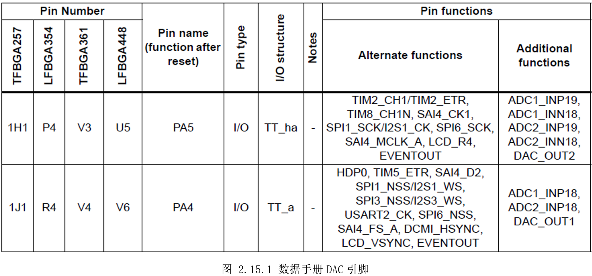
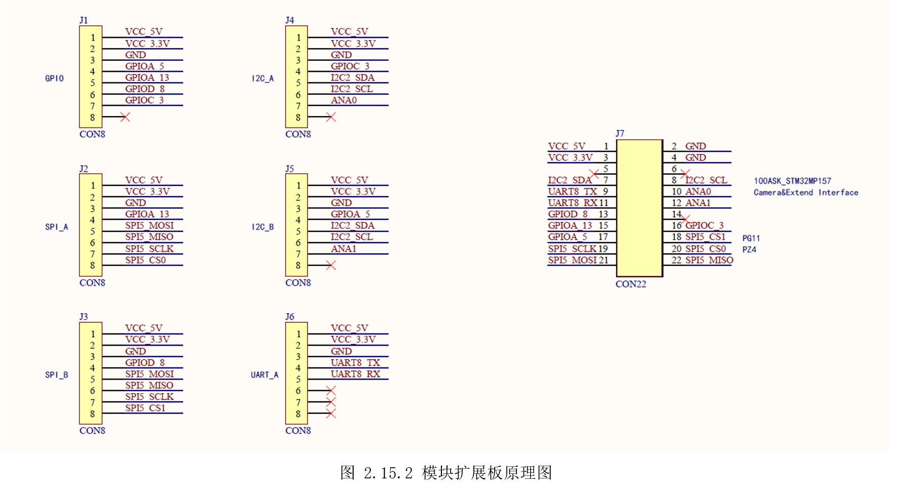
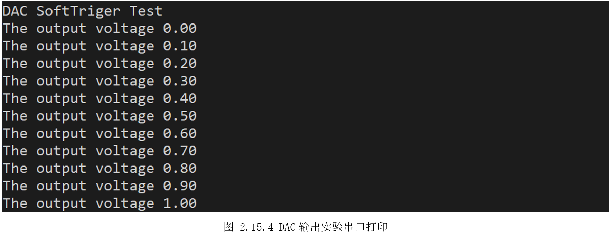

# 2.15 DAC—软件触发

* 设计需求

这里假设需求为使用DAC控制引脚输出不同电压。

## 2.15.1 基础知识

与前面ADC模数转换器相反，DAC(Digital to analog converter)将数字信号转换为模拟信号，使得MCU不再只输出0或1，适应更多领域。

STM32MP157有一个DAC，该ADC有两个通道，可以分配给A7或M4。

## 2.15.2 硬件设计

由图 1.5.15的数据手册（Datasheet）可知，DAC两个输出通道分别接到PA4和PA5，如图2.15.1所示。



其中PA5接在模块扩展接口，通过模块扩展板引出到GPIO位置，如图2.15.2所示，因此这里使用PA5进行测试。



## 2.15.3 MX设置

先设置好系统时钟、串口，然后搜索PA5，设置为“DAC_OUT2”，切换到DAC1标签，勾选给“M4”。在下方的“OUT2mode”选择“Connected to external pinonly”以输出到引脚上，最后在下方触发方式“Trigger”选择软件触发“Softwaretrigger”，如图 2.15.3所示。


## 2.15.4 代码设计

创建“DemoDriver”目录，在里面新建“driver_dac.c”,使用HAL库的“HAL_DAC_Start()”可以启动DAC，使用“HAL_DAC_SetValue()”设置DAC输出值，前面我们选择的默认是右对齐12位。将这两个函数简单封装下，实现“DAC_SetVoltage()”传入需要的电压值，即可让DAC输出对应的电压值。

```c
#include "driver_dac.h"
#include "dac.h"

/*
 *  函数名：void DAC_Start(void)
 *  输入参数：无
 *  输出参数：无
 *  返回值：无
 *  函数作用：启动DAC_OUT2
 *
*/
void DAC_Start(void)
{
  HAL_DAC_Start(&hdac1, DAC_CHANNEL_2);
}

/*
 *  函数名：void DAC_Stop(void)
 *  输入参数：无
 *  输出参数：无
 *  返回值：无
 *  函数作用：停止DAC_OUT2
 *
*/
void DAC_Stop(void)
{
  HAL_DAC_Stop(&hdac1, DAC_CHANNEL_2);
}

/*
 *  函数名：int8_t DAC_SetValue(uint16_t data)
 *  输入参数：无
 *  输出参数：无
 *  返回值：0:正确 -1:超过设置范围 -2:设置错误
 *  函数作用：设置DAC输出值
 *
 */
int8_t DAC_SetValue(uint16_t data)
{
  if(data>=4096)
  {
    return -1;
  }
  if(HAL_DAC_SetValue(&hdac1, DAC_CHANNEL_2, DAC_ALIGN_12B_R, data) != HAL_OK)
  {
    return -2;
  }
  DAC_Start(); // 软件触发,每次修改值都需要启动DAC

  return 0;
}

/*
 *  函数名：void DAC_SetVoltage(float vol)
 *  输入参数：需要设置的输出电压值
 *  输出参数：无
 *  返回值：无
 *  函数作用：设置DAC输出值
 *
 *注意:参考电压为VREF_VALUE 3.3V
 */
void DAC_SetVoltage(float vol)
{
  if (vol > VREF_VALUE)
  {
    printf("\r Set voltage out of range \n");
    return;
  }

  DAC_SetValue(vol*4095/VREF_VALUE);
}

```


主函数里调用“DAC_SetVoltage()”，循环修改传入的电压值，即可让DAC输出不断变化的电压。

```c
  /* Infinite loop */
  /* USER CODE BEGIN WHILE */
  while (1)
  {
    /* USER CODE END WHILE */

    /* USER CODE BEGIN 3 */
    printf("\rThe output voltage %.2f\n", out_vol);
    DAC_SetVoltage(out_vol); // 设置输出电压

    out_vol = out_vol + 0.1; //依次增加输出电压

    if(out_vol>3.3) //超过输出最大值重置为0
      out_vol = 0;

    HAL_Delay(1000);
  }
  /* USER CODE END 3 */

```


## 2.15.5 实验效果

开发板连接串口，启动调试运行，可以看到如图2.15.4所示打印。此时用万用表测量PA5脚的电压，可以看到电压值和串口打印值一致。



