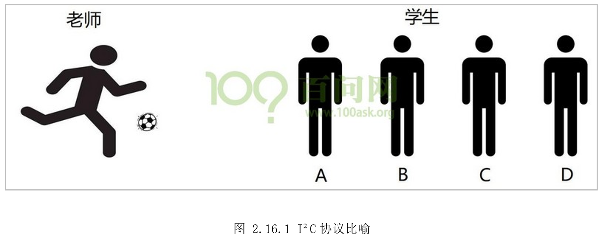
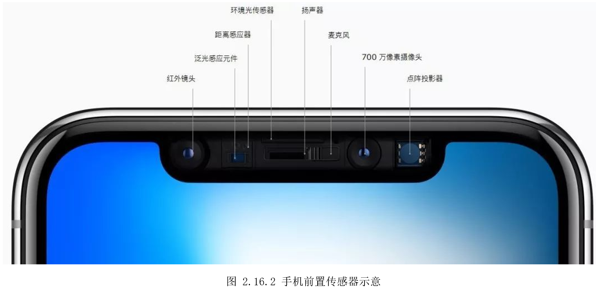
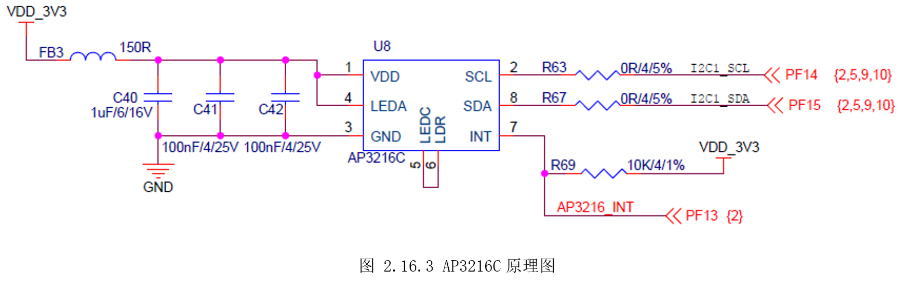
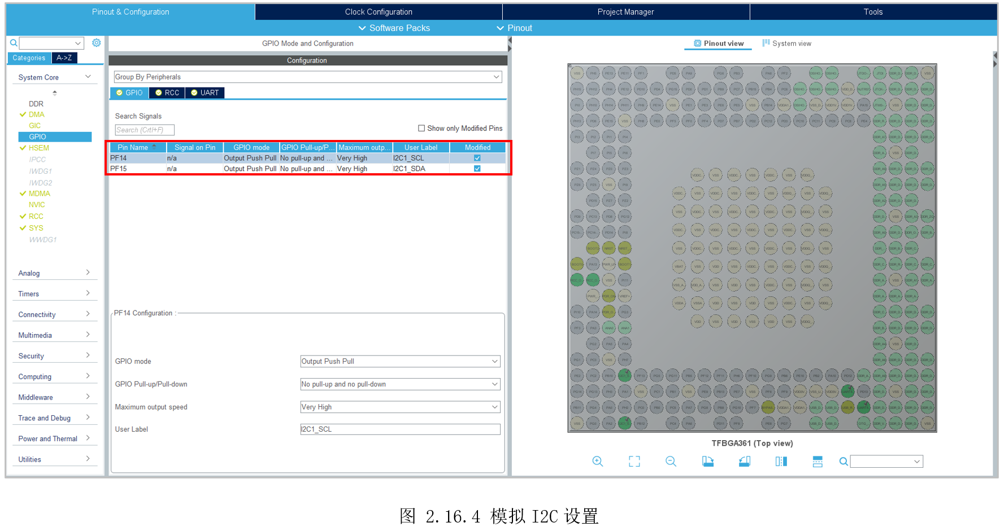
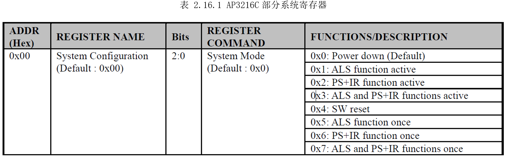
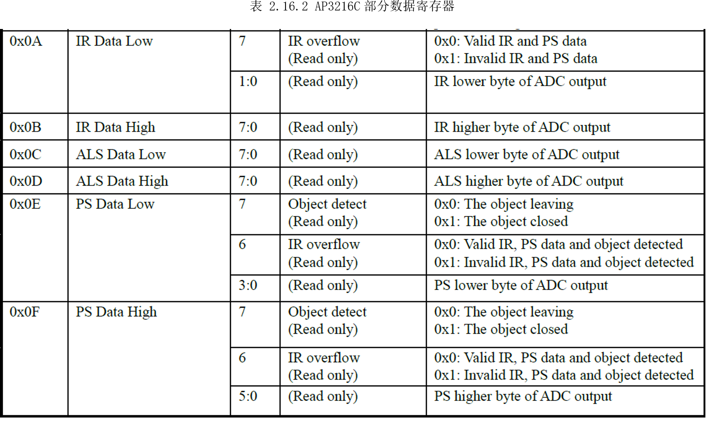
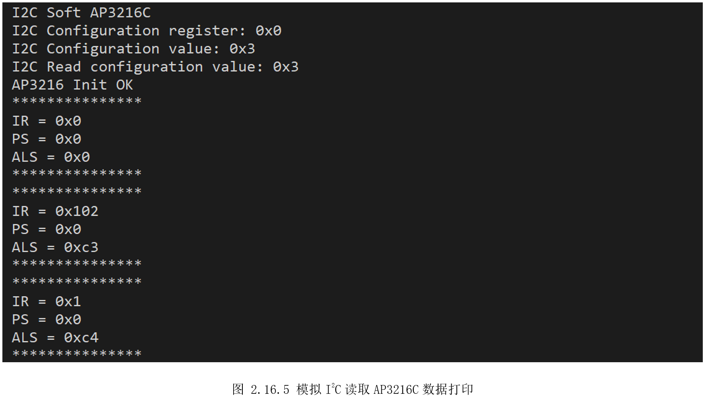

# 2.16 I2C—软件模拟

* 设计需求

这里假设需求为使用GPIO模拟I2C获取板子传感器AP3216C的数据。

## 2.16.1 基础知识

I²C（Inter-IntegratedCircuit），常读作“I方C”,它是一种多主从架构串行通信总线。在1980年由飞利浦公司设计，为了让主板、嵌入式系统或手机连接低速周边设备。如今在嵌入式领域是非常常见通信协议，常用于MPU/MCU与外部设备连接通信、数据传输。

I²C由两条线组成，一条双向串行数据线SDA，一条串行时钟线SCL。每个连接到总线的设备都有一个独立的地址，主机可以通过该地址来访问不同设备。因为I²C协议比较简单，常常用GPIO来模拟I²C时序，这种方法称为模拟I²C。如果使用MCU的I²C控制器，设置好I²C控制器,I²C控制器就自动实现协议时序，这种方式称为硬件I²C。因为I²C设备的速率比较低，通常两种方式都可以，模拟I²C方便移植，硬件I²C工作效率相对较高。

关于I²C协议，通过下面例子进行一个形象的比喻方便大家理解，如图2.16.1所示，老师（MCU）将球（数据）传给众多学生中的一个（众多外设设备中的一个）。



老师：可以把球发给学生，也可以把球从学生中接过来。

① 发球：

老师说：注意了(start)；

老师对A学生说，我要球发给你(A就是地址)；

老师就把球发出去了（传输）；

A收到球之后，应该告诉老师一声（回应）；

老师说下课（停止）。

② 接球：

老师说注意了(start)；

老师说：B把球发给我(B是地址)；

B就把球发给老师（传输）；

老师收到球之后，给B说一声，表示收到球了（回应）；

老师说下课（停止）。

从上面这个例子，分析IIC的传输（发送和接收）需要准备哪些函数：

① 老师说注意了，表示开始信号(start)；

② 老师告诉某个学生，表示发送地址(address)；

③ 老师发球/接球，表示数据的发送/接收(send/read)；

④ 老师/学生收到球，回应/不回应/等待回应(ack/noack/getack)；

⑤ 老师说下课，表示I2C传输结束(stop)；

如果是软件模拟I²C，就需要自己去实现每个操作，封装成函数。比如开始信号，就是先把SCL拉高，再SDA由高变低，这样就表示了一个开始信号。关于模拟I²C的实现函数，读者参考后面代码和相关时序文档。

AP3216C芯片集成了光强传感器（ALS:AmbientLight Sensor）、接近传感器（PS:
Proximity Sensor）、红外LED（IRLED），最常见的应用就是手机。当我们接听电话时，耳朵靠近手机前置扬声器附近，也就靠近了该传感器，此时距离传感器就告诉CPU可以关闭屏幕显示，以防误触。光强传感器能识别当前环境光，告诉CPU对应调节屏幕亮度，手机常见传感器如所示。



## 2.16.2 硬件设计

如图2.16.3所示，AP3216C接在了I2C1上，这里使用GPIO模拟，可知PF14模拟作为SCL信号，PF15作为SDA信号。



## 2.16.3 MX设置

先设置好MCU系统时钟、调试串口，同时参考前面2.11通用定时器—us延时，设置TIM5用于实现us级延时。接着搜索PF14、PF15，设置为普通GPIO输出，其中PF14别名为I2C1_SCL，PF15别名为I2C1_SDA，如图2.16.4所示。



## 2.16.4 代码设计

创建“DemoDriver”目录，将前面的“driver_tim.c”复制到该目录，然后新建“driver_i2c1.c”实现模拟I²C协议，创建“driver_ap3216c.c”实现对AP3216C的控制。

“driver_i2c1.c”实现了模拟I²C协议，代码如下：

```c
#define I2C_Delay()     us_timer_delay(5)

/*
 *  函数名：void I2C_Init(void)
 *  输入参数：
 *  输出参数：无
 *  返回值：无
 *  函数作用: SCL/SDA都初始为高电平
*/
void I2C_Init(void)
{
    SCL_H();
    SDA_H();
}

/*
 *  函数名：static void I2C_SDA_OUT(void)
 *  输入参数：
 *  输出参数：无
 *  返回值：无
 *  函数作用：配置SDA引脚为输出
*/
static void I2C_SDA_OUT(void)
{
    GPIO_InitTypeDef GPIO_InitStruct = {0};

    GPIO_InitStruct.Mode      = GPIO_MODE_OUTPUT_OD;
    GPIO_InitStruct.Pull      = GPIO_NOPULL;
    GPIO_InitStruct.Speed     = GPIO_SPEED_FREQ_HIGH;

    GPIO_InitStruct.Pin       = I2C1_SDA_Pin;
    HAL_GPIO_Init(I2C1_SDA_GPIO_Port, &GPIO_InitStruct);
}

/*
 *  函数名：static void I2C_SDA_IN(void)
 *  输入参数：
 *  输出参数：无
 *  返回值：无
 *  函数作用：配置SDA引脚为输入
*/
static void I2C_SDA_IN(void)
{
    GPIO_InitTypeDef GPIO_InitStruct = {0};

    GPIO_InitStruct.Mode      = GPIO_MODE_INPUT;
    GPIO_InitStruct.Speed     = GPIO_SPEED_FREQ_HIGH;

    GPIO_InitStruct.Pin       = I2C1_SDA_Pin;
    HAL_GPIO_Init(I2C1_SDA_GPIO_Port, &GPIO_InitStruct);
}

/*
 *  函数名：void I2C_Start(void)
 *  输入参数：
 *  输出参数：无
 *  返回值：无
 *  函数作用：I2C开始信号
*/
void I2C_Start(void)
{
    I2C_SDA_OUT();

    SCL_H();
  I2C_Delay();

    SDA_H();
    I2C_Delay();

    SDA_L();
    I2C_Delay();

    SCL_L();
    I2C_Delay();
}

/*
 *  函数名：void I2C_Stop(void)
 *  输入参数：
 *  输出参数：无
 *  返回值：无
 *  函数作用：I2C停止信号
*/
void I2C_Stop(void)
{
    I2C_SDA_OUT();

    SDA_L();
    I2C_Delay();

    SCL_H();
    I2C_Delay();

    SDA_H();
    I2C_Delay();
}

/*
 *  函数名：void I2C_ACK(void)
 *  输入参数：
 *  输出参数：无
 *  返回值：无
 *  函数作用：I2C发出应答信号
*/
void I2C_ACK(void)
{
    I2C_SDA_OUT();

    SCL_L();
    I2C_Delay();

    SDA_L();
    I2C_Delay();

    SCL_H();
    I2C_Delay();

    SCL_L();
    I2C_Delay();
}

/*
 *  函数名：void I2C_NACK(void)
 *  输入参数：
 *  输出参数：无
 *  返回值：无
 *  函数作用：I2C发出非应答信号
*/
void I2C_NACK(void)
{
    I2C_SDA_OUT();

    SCL_L();
    I2C_Delay();

    SDA_H();
    I2C_Delay();

    SCL_H();
    I2C_Delay();

    SCL_L();
    I2C_Delay();
}

/*
 *  函数名：uint8_t I2C_GetACK(void)
 *  输入参数：
 *  输出参数：无
 *  返回值：无
 *  函数作用：I2C等待从机的应答信号
*/
uint8_t I2C_GetACK(void)
{
    uint8_t time = 0;
    I2C_SDA_IN();

    SCL_L();
  I2C_Delay();

    SDA_H();
  I2C_Delay();

  SCL_H();
  I2C_Delay();

    while(SDA_INPUT())
    {
        time++;
        if(time>250)
        {
            SCL_L();
            return 1;
        }
    }
    SCL_L();

    return 0;
}

/*
 *  函数名：void I2C_SendByte(uint8_t data)
 *  输入参数：data->发送的数据
 *  输出参数：无
 *  返回值：无
 *  函数作用：I2C发送一个字节
*/
void I2C_SendByte(uint8_t data)
{
    uint8_t cnt = 0;

    I2C_SDA_OUT();

    for(cnt=0; cnt<8; cnt++)
    {
        SCL_L();
        I2C_Delay();

        if(data & 0x80)
        {
            SDA_H();
        }
        else
        {
            SDA_L();
        }
        data = data<<1;

        SCL_H();
        I2C_Delay();
    }

    SCL_L();
    I2C_Delay();
    I2C_GetACK();
}

/*
 *  函数名：uint8_t I2C_ReadByte(uint8_t ack)
 *  输入参数：ack->发送的应答标志，1应答，0非应答
 *  输出参数：无
 *  返回值：返回读到的字节
 *  函数作用：I2C读出一个字节
*/
uint8_t I2C_ReadByte(uint8_t ack)
{
    uint8_t cnt;
    uint8_t data = 0xFF;
    I2C_SDA_IN();
    SCL_L();
    I2C_Delay();

    for(cnt=0; cnt<8; cnt++)
    {
        SCL_H();                 //SCL高(读取数据)
        I2C_Delay();

        data <<= 1;
        if(SDA_INPUT())
        {
            data |= 0x01;        //SDA高(数据有效)
        }
        SCL_L();
        I2C_Delay();
    }
    //发送应答信号，为低代表应答，高代表非应答
    if(ack == 0)
    {
        I2C_NACK();
    }
    else
    {
        I2C_ACK();
    }
    return data;                 //返回数据
}

```


“driver_ap3216c.c”调用前面I2C协议的函数，配置AP3216C，读取AP3216C寄存器获取数据。首先初始化配置AP3216C，相关寄存器如

表 2.16.1所示，初始化流程如下：

① 复位:设置SYS_CONFIG_ADDR(0x00)寄存器为SYS_SW_RESET(0x04)；

②
设置工作模式：设置SYS_CONFIG_ADDR(0x00)寄存器为SYS_ALS_PS_IR_ACT(0x03)，IR+PS+ALS三个都激活使用；

③ 设置中断(这里没使用中断)；

```c
uint8_t AP3216_Init(void)
{
  uint8_t ret_value = 0;
  AP3216_WriteOneByte(SYS_CONFIG_ADDR, SYS_SW_RESET); // 系统软件复位
  HAL_Delay(50);

  AP3216_WriteOneByte(SYS_CONFIG_ADDR, SYS_ALS_PS_IR_ACT);  // IR+PS+ALS三个都激活使用
  HAL_Delay(50);
  ret_value = AP3216_ReadOneByte(SYS_CONFIG_ADDR);  // 读取配置字
  if(ret_value != SYS_ALS_PS_IR_ACT)  // 判断是否与设置的一致
  {
    return 1;
  }
  printf("\r I2C Configuration register: 0x%x \n", SYS_CONFIG_ADDR);
  printf("\r I2C Configuration value: 0x%x \n", SYS_ALS_PS_IR_ACT);
  printf("\r I2C Read configuration value: 0x%x \n", ret_value);
  return 0;
}

```




初始化配置完后，就可以读取AP3216C寄存器数据，如表
2.16.2所示，分别是IR、ALS、PS的数据，每个数据占据相邻两位。以IR为例，分别读取IR_DATA_LOW(0x0A)和IR_DATA_HIGH(0x0B)寄存器的值，再合并就得到IR的数据，同理可以得到ALS、PS的数据。



```c
void AP3216_Read_IR_Data(uint16_t *pIR)
{
  uint8_t ir_l = 0, ir_h = 0;

  ir_l = AP3216_ReadOneByte(IR_DATA_LOW);
  ir_h = AP3216_ReadOneByte(IR_DATA_HIGH);

  if( (ir_l&0x80) == 0x80)  // Invalid IR and PS data
  {
    *pIR = 0;
  }
  else  // ir_l Bit[1:0] is data, ps_l bits[3:0] ans ps_h bits[5:0] is data
  {
    *pIR = (ir_h<<8) | (ir_l&0x03);
  }
}

void AP3216_Read_PS_Data(uint16_t *pPS)
{
  uint8_t ps_l = 0, ps_h = 0;

  ps_l = AP3216_ReadOneByte(PS_DATA_LOW);
  ps_h = AP3216_ReadOneByte(PS_DATA_HIGH);

  if( (ps_l&0x40)==0x40)  // Invalid IR and PS data
  {
    *pPS = 0;
  }
  else  // ir_l Bit[1:0] is data, ps_l bits[3:0] ans ps_h bits[5:0] is data
  {
    *pPS = ((ps_h&0x1F)<<8) | (ps_l&0x0F);
  }
}

void AP3216_Read_ALS_Data(uint16_t *pALS)
{
  uint8_t als_l = 0, als_h = 0;

  als_l = AP3216_ReadOneByte(ALS_DATA_LOW);
  als_h = AP3216_ReadOneByte(ALS_DATA_HIGH);

  *pALS = (als_h<<8) | (als_l);
}

```


主函数里，先分别初始化I2C和AP3216，再调用“AP3216_ReadDataTest()”即可获取IR、PS、ALS的打印。

## 2.16.5 实验效果

AP3216C板载在开发板上，位于启动拨码开关附近，背面丝印位号为U8。调试运行，可以在串口看到如图
2.16.5所示打印。将手靠近AP3216C，可以看到PS值变化，用强光照射AP3216C，可以看到ALS值变化。



