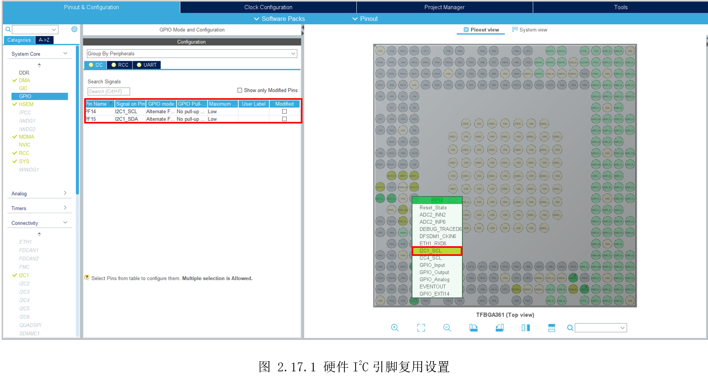
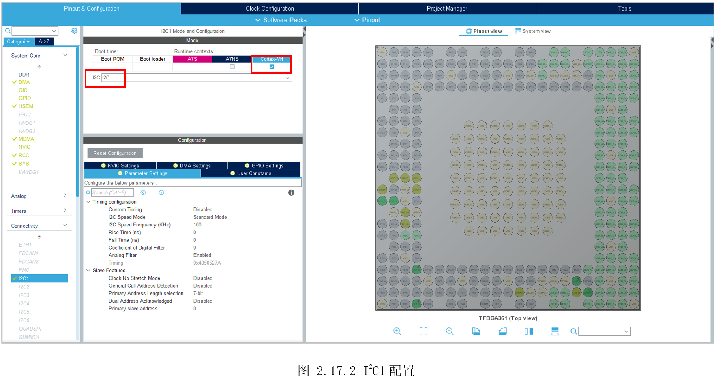
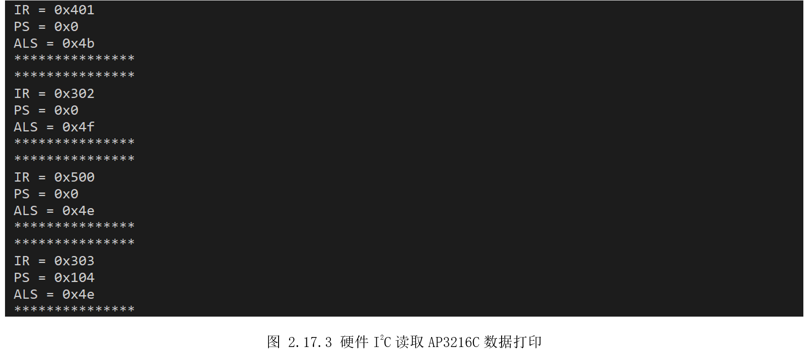

# 2.17 I2C—硬件模式

* 设计需求

这里假设需求为使用硬件I2C获取板子传感器AP3216C的数据。

## 2.17.1 基础知识

I2C协议简介和AP3216C简介，参考上一实验。STM32MP157有6个硬件I2C，其中I2C4和I2C6只能A7使用，余下可选择分配给A7或M4。

## 2.17.2 硬件设计

硬件连接参考上一个实验，这里使用硬件I2C1。

## 2.17.3 MX设置

首先配置好MCU系统时钟和串口打印，然后如图2.17.1所示，将PF14、PF15设置为复用I2C1功能。



然后切换到I2C1标签，勾选给M4，下方选择I2C，其它默认配置即可。



## 2.17.4 代码设计

因为使用的是硬件I2C，就不需要自己实现I2C协议时序。创建“DemoDriver”目录，复制前面的“driver_ap3216c.c”，需要做的仅仅是用HAL提供的硬件I2C操作函数，替换原来的GPIO模拟的I2C操作函数。调用“HAL_I2C_Master_Transmit()”发送数据，“HAL_I2C_Master_Receive()”接收数据，需要修改部分如下。

```c
uint8_t AP3216_WriteOneByte(uint8_t reg, uint8_t data)
{
  uint16_t write_data = reg | (data<<8);

  if(HAL_I2C_Master_Transmit(&hi2c1, AP3216_ADDR | AP3216_W , (uint8_t*)&write_data, 2, 300) != HAL_OK)
  {
    Error_Handler();
  }
  while (HAL_I2C_GetState(&hi2c1) != HAL_I2C_STATE_READY);

  return 0;
}

uint8_t AP3216_ReadOneByte(uint8_t reg)
{
  uint8_t read_data = 0;

  if(HAL_I2C_Master_Transmit(&hi2c1, AP3216_ADDR | AP3216_W , (uint8_t*)&reg, 1, 300) != HAL_OK)
  {
    Error_Handler();
  }
  while (HAL_I2C_GetState(&hi2c1) != HAL_I2C_STATE_READY);

  if(HAL_I2C_Master_Receive(&hi2c1, AP3216_ADDR | AP3216_R , (uint8_t*)&read_data, 1, 300) != HAL_OK)
  {
    Error_Handler();
  }

    return read_data;
}

```


## 2.17.5 实验效果

连接串口，调试、运行，可以看到如图2.17.3所示，将手靠近AP3216C，可以看到PS值变化，用强光照射AP3216C，可以看到ALS值变化。



