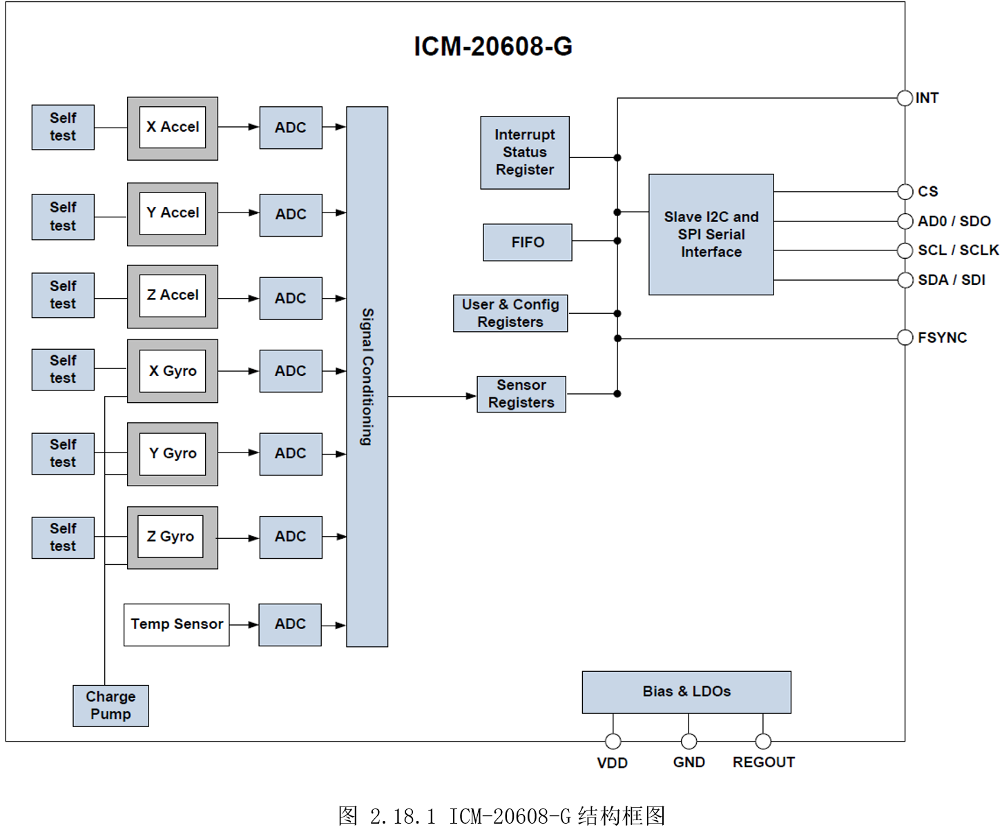
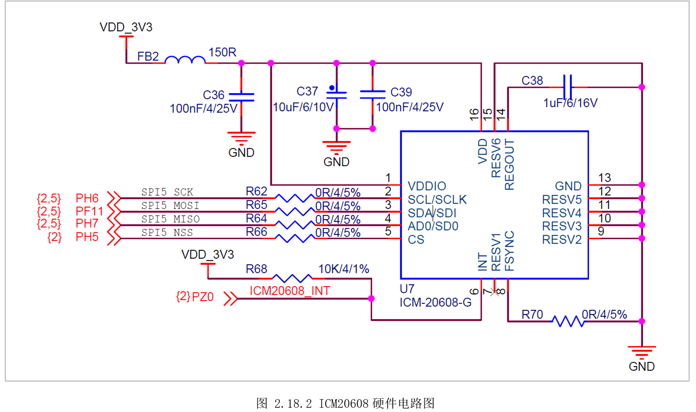
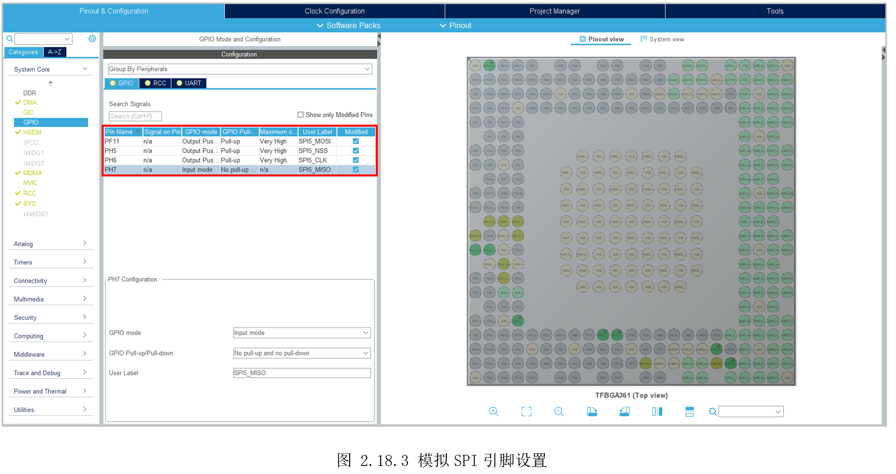
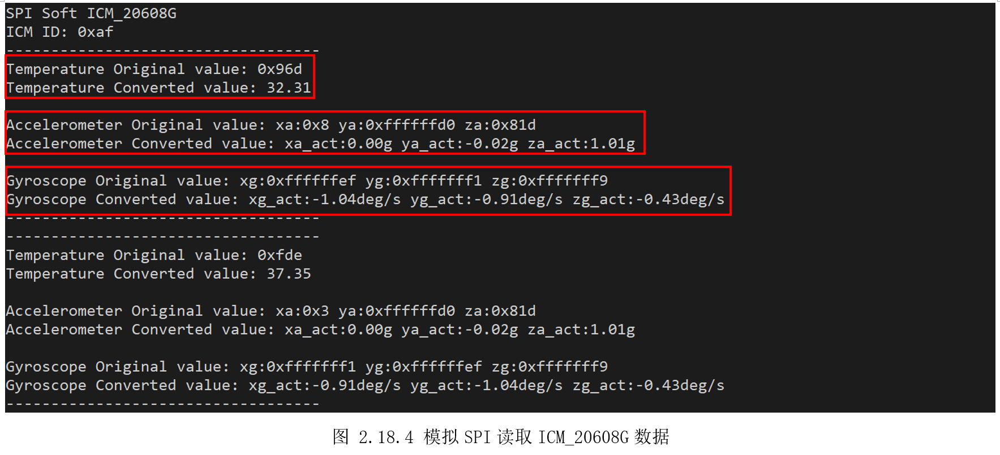

# 2.18 SPI—软件模拟

* 设计需求

这里假设需求为使用GPIO模拟SPI获取板子传感器ICM20608的数据。

## 2.18.1 基础知识

相较于I2C半双工的同步串行总线，SPI是全双工的同步串行总线，理论有更高的传输带宽，但SPI占用的引脚更多，通常需要四根，分别是提供时钟的SCLK，提供数据输出的MOSI(MasterOut Slave In)，提供数据输入的MISO(Master In SlaveOut)和提供片选信号的CS。同一时刻只能有一个SPI设备处于工作状态，即多个CS信号中某时间只能有一个有效。为了适配不同的外设，SPI支持通过寄存器来配置片选信号和时钟信号的极性和相位。

SPI的速度也不是很高，通信协议也不是很复杂，因此在实际工程中，也不少使用GPIO模拟SPI的场景，关于SPI协议的详细分析，这里也不过多描述，读者参考后面的模拟SPI代码和其它资料。

ICM-20608-G是InvenSense面向大众市场的一款六轴姿态传感器，包含三轴加速度传感器、三轴角速度传感器和温度传感器。三轴加速度传感器（Accelerometer、G-Sensor）也叫重力感应器，可以感知任意方向上的加速度（重力加速度则只是地表垂直方向加速度），加速度传感器主要用于测量设备的受力情况，相对外部参考物的运动。三轴角速度传感器（Gyroscope、GYRO-Sensor）也叫陀螺仪，通过测量三维坐标系内陀螺转子的垂直轴与设备之间的夹角，并计算角速度，角速度传感器主要用于测量设备的自身的旋转运动，擅长感知自身运动。通过六轴数据，基本可以计算出物体的运动状态，常用手机、手环、无人机、云台等领域。

ICM-20608-G的内部框图如图2.18.1所示，六轴和温度传感器经过ADC转换保存到内部寄存器，最后通过I2C或SPI向外提供数据。



## 2.18.2 硬件设计

ICM-20608-G在底板的电路图，如图2.18.2所示。接在了SPI5上，这里使用GPIO模拟，可知PH6模拟作为SPI的SCK信号，PF11作为SPI MOSI信号, PH7作为SPI MISO信号,PH5作为SPI NSS片选信号。



## 2.18.3 MX设置

先设置好MCU时钟、串口，接着设置PH6、PF11、PH7、PH5作为普通GPIO，注意PH7是MISO，数据输入引脚，因此要设置为输入模式，其它为输出模式。



## 2.18.4 代码设计

创建“DemoDriver”目录，将前面的“driver_tim.c”复制到该目录，然后新建“driver_spi.c”实现模拟SPI协议，创建“icm_20608g.c”实现对ICM_20608_G的控制。

“driver_spi.c”实现了模拟SPI协议，代码如下：

```c
/*
 *  函数名：void SPI_Init(void)
 *  输入参数：
 *  输出参数：无
 *  返回值：无
 *  函数作用：初始化SPI的四根引脚
*/
void SPI_Init(void)
{
SPI_CS(1);      // CS初始化高
SPI_CLK(0);     // CLK初始化高
}

/*
 *  函数名：void SPI_WriteByte(uint8_t data)
 *  输入参数：data -> 要写的数据
 *  输出参数：无
 *  返回值：无
 *  函数作用：模拟SPI写一个字节
*/
void SPI_WriteByte(uint8_t data)
{
    uint8_t i = 0;
    uint8_t temp = 0;

    for(i=0; i<8; i++)
    {
        temp = data&0x80;
        data = data<<1;

        SPI_CLK(0);
        SPI_MOSI(temp);
        SPI_Delay();
        SPI_CLK(1);
        SPI_Delay();
    }
}

/*
 *  函数名：uint8_t SPI_ReadByte(void)
 *  输入参数：
 *  输出参数：无
 *  返回值：读到的数据
 *  函数作用：模拟SPI读一个字节
*/
uint8_t SPI_ReadByte(void)
{
    uint8_t i = 0;
    uint8_t read_data = 0xFF;

    for(i=0; i<8; i++)
    {
        read_data = read_data << 1;

        SPI_CLK(0);
        SPI_Delay();
        SPI_CLK(1);
        SPI_Delay();
        if(SPI_MISO()==1)
        {
            read_data = read_data + 1;
        }
    }
    SPI_CLK(0);
    return read_data;
}

/*
 *  函数名：uint8_t SPI_WriteReadByte(uint8_t pdata)
 *  输入参数：pdata -> 要写的一个字节数据
 *  输出参数：无
 *  返回值：读到的数据
 *  函数作用：模拟SPI读写一个字节
*/
uint16_t SPI_WriteReadByte(uint16_t pdata)
{
    uint8_t i = 0;
    uint8_t temp = 0;
    uint16_t read_data = 0xFFFF;

    for(i=0;i<16;i++)
    {
        temp = ((pdata&0x8000)==0x8000)? 1:0;
        pdata = pdata<<1;
        read_data = read_data<<1;

        SPI_CLK(0);
        SPI_MOSI(temp);
        SPI_Delay();
        SPI_CLK(1);
        SPI_Delay();
        if(SPI_MISO()==1)
        {
            read_data = read_data + 1;
        }
    }

    return read_data;
}

```


接着就是利用SPI读写函数，对ICM_20608_G进行操作。在读取数据前，需要先初始化、配置ICM_20608_G。初始化的内容比较多，依次为复位、选择时钟、获取ID测试、设置六轴详细参数（分辨率、量程、是否使用滤波器等）、使能、关闭低功耗模式和FIFO等。每个寄存器的功能、设置的值含义，读者可以参考芯片手册的寄存器对应理解，这里不再赘述。

```c
void ICM_Init(void)
{
  uint8_t ret = 0;

  // 复位ICM
  ICM_RW_Register(ICM_PWM_MGMT_1 | ICM_WRITE, 0x80);
  HAL_Delay(50);

  // 选择时钟
  ICM_RW_Register(ICM_PWM_MGMT_1 | ICM_WRITE, 0x01);
  HAL_Delay(50);
  // 获取设备ID
  ret = ICM_RW_Register(ICM_WHO_AM_I | ICM_READ, Dummy_Byte);
  printf("\rICM ID: 0x%x\n", ret);

  ICM_CS_ENABLE();
  // 输出速率：内部采样率
  ICM_RW_Register(ICM_SMPLRT_DIV | ICM_WRITE, 0x00);
  // 陀螺仪 2000dps
  ICM_RW_Register(ICM_GYRO_CONFIG | ICM_WRITE, 0x18);
  // 加速度16G量程
  ICM_RW_Register(ICM_ACCEL_CONFIG | ICM_WRITE, 0x18);
  // 陀螺仪低通滤波 20Hz
  ICM_RW_Register(ICM_CONFIG | ICM_WRITE, 0x04);
  // 加速度低通滤波 21.2Hz
  ICM_RW_Register(ICM_ACCEL_CONFIG_2 | ICM_WRITE, 0x04);

  // 打开加速度计和陀螺仪所有轴
  ICM_RW_Register(ICM_PWM_MGMT_1 | ICM_WRITE, 0x00);

  // 关闭低功耗
  ICM_RW_Register(ICM_LP_MODE_CFG | ICM_WRITE, 0x00);

  // 关闭FIFO
  ICM_RW_Register(ICM_FIFO_EN | ICM_WRITE, 0x00);
}

```


初始化完后，就可以读取数据，每个数据占两位，读取完后需要高低字节拼接处理。获取到寄存器原始值后，还需要做换算处理，比如温度，手册上写的换算公式为：

而“Room TemperatureOffset”可从手册查到典型值为25℃，“Temp_Sensitivity”典型值为326.8LSB/℃。

对于角速度，前面初始化的时候将量程设置了为±2000dps，读出来的原始数据是带符号的16位，则范围为-32767\~+32767，+32767对应+2000，即灵敏度为16.4。

对于加速度，前面初始化的时候将量程设置了为±16g，出来的原始数据是带符号的16位，则范围为-32767\~+32767，+32767对应+16，即灵敏度为2048。

```c
void ICM_ReadGyroAccel(void)
{
  int16_t temp = 0;
  float temp_value = 0;
  uint8_t temp_h = 0, temp_l = 0;

  int16_t xa = 0, ya = 0, za = 0;
  float xa_act = 0, ya_act = 0, za_act = 0;
  uint8_t xa_l = 0, ya_l = 0, za_l = 0;
  uint8_t xa_h = 0, ya_h = 0, za_h = 0;

  int16_t xg = 0, yg = 0, zg = 0;
  float xg_act = 0, yg_act = 0, zg_act = 0;
  uint8_t xg_l = 0, yg_l = 0, zg_l = 0;
  uint8_t xg_h = 0, yg_h = 0, zg_h = 0;

  temp_l = ICM_RW_Register(ICM_TEMP_OUT_L | ICM_READ, Dummy_Byte);
  temp_h = ICM_RW_Register(ICM_TEMP_OUT_H | ICM_READ, Dummy_Byte);
  temp = (temp_h<<8) | temp_l;
  temp_value = (temp - 25)/326.8 + 25;

  xa_l = ICM_RW_Register(ICM_ACCEL_XOUT_L | ICM_READ, Dummy_Byte);
  xa_h = ICM_RW_Register(ICM_ACCEL_XOUT_H | ICM_READ, Dummy_Byte);
  ya_l = ICM_RW_Register(ICM_ACCEL_YOUT_L | ICM_READ, Dummy_Byte);
  ya_h = ICM_RW_Register(ICM_ACCEL_YOUT_H | ICM_READ, Dummy_Byte);
  za_l = ICM_RW_Register(ICM_ACCEL_ZOUT_L | ICM_READ, Dummy_Byte);
  za_h = ICM_RW_Register(ICM_ACCEL_ZOUT_H | ICM_READ, Dummy_Byte);
  xa = xa_l + (xa_h<<8);  xa_act = xa / 2048.0;
  ya = ya_l + (ya_h<<8);  ya_act = ya / 2048.0;
  za = za_l + (za_h<<8);  za_act = za / 2048.0;

  xg_l = ICM_RW_Register(ICM_GYRO_XOUT_L | ICM_READ, Dummy_Byte);
  xg_h = ICM_RW_Register(ICM_GYRO_XOUT_H | ICM_READ, Dummy_Byte);
  yg_l = ICM_RW_Register(ICM_GYRO_YOUT_L | ICM_READ, Dummy_Byte);
  yg_h = ICM_RW_Register(ICM_GYRO_YOUT_H | ICM_READ, Dummy_Byte);
  zg_l = ICM_RW_Register(ICM_GYRO_ZOUT_L | ICM_READ, Dummy_Byte);
  zg_h = ICM_RW_Register(ICM_GYRO_ZOUT_H | ICM_READ, Dummy_Byte);
  xg = xg_l + (xg_h<<8);  xg_act = xg / 16.4;
  yg = yg_l + (yg_h<<8);  yg_act = yg / 16.4;
  zg = zg_l + (zg_h<<8);  zg_act = zg / 16.4;

  printf("\r-----------------------------------\n");

  printf("\rTemperature Original value: 0x%x \n", temp);
  printf("\rTemperature Converted value: %.2f\n", temp_value);
  printf("\r\n");
  printf("\rAccelerometer Original value: xa:0x%x ya:0x%x za:0x%x \n", xa, ya, za);
  printf("\rAccelerometer Converted value: xa_act:%.2fg ya_act:%.2fg za_act:%.2fg \n", xa_act, ya_act, za_act);
  printf("\r\n");
  printf("\rGyroscope Original value: xg:0x%x yg:0x%x zg:0x%x \n", xg, yg, zg);
  printf("\rGyroscope Converted value: xg_act:%.2fdeg/s yg_act:%.2fdeg/s zg_act:%.2fdeg/s \n", xg_act, yg_act, zg_act);

  printf("\r-----------------------------------\n");
}

```


最后主函数调用“ICM_ReadGyroAccel()”打印结果。

## 2.18.5 实验效果

调试运行，串口输出如图2.18.4所示。先打印出ICM_20608_G的ID为0xAF,再打印温度原始数据和转换数据。接着是三轴加速度传感器（重力感应器）的原始数据和转换数据，其中Z轴的值为1g，即受重力影响，大小为1g，其它两个方向无受力，数值为0，用户将板子立放将会看到数值变化。最后是三轴角速度传感器（陀螺仪）的原始数据和转换数据，开发板目前静置，三个轴方向数值为0，用户晃动开发板，将看到值对应变化。



