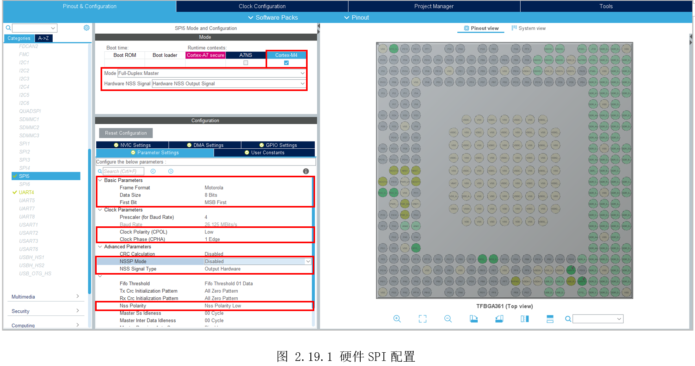
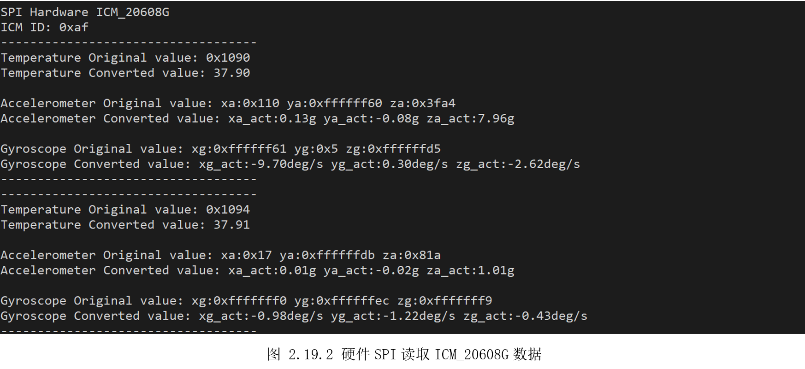

# 2.19 SPI—硬件模式

* 设计需求

这里假设需求为使用硬件SPI获取板子传感器ICM20608的数据。

## 2.19.1 基础知识

SPI简介和ICM20608简介，参考上一实验。STM32MP157有6个硬件SPI，其中SPI6只能A7使用，余下可选择分配给A7或M4。

## 2.19.2 硬件设计

硬件连接参考上一个实验，这里使用硬件SPI。

## 2.19.3 MX设置

首先配置好MCU系统时钟和串口打印，然后如图2.19.1所示。因为使用的引脚是SPI的默认引脚，所以无需先设置引脚复用，直接切换到SPI5标签，勾选给M4，“Mode”选择“Full-DuplexMaster”，使用硬件片选，这里选择“Hardware NSS OutputSignal”。接着下方属性需要注意的是数据大小“Data Size”常见的是8位，MSB（MostSignificantBit）高位在前，时钟极性（CPOL）和时钟相位（CPHA）根据设备芯片手册需求设置，最后还需要关闭“NSSPMode”。



## 2.19.4 代码设计

因为使用的是硬件SPI，就不需要自己实现SPI协议时序。创建“DemoDriver”目录，复制前面的“icm_20608g.c”，需要做的仅仅是用HAL提供的硬件SPI操作函数，替换原来的GPIO模拟的SPI操作函数。调用“HAL_SPI_TransmitReceive()”收发送数据，重新编写“ICM_RW_Register()”即可，需要修改部分如下。

```c
uint8_t ICM_RW_Register(uint8_t reg, uint8_t data)
{
    uint16_t rxdata = 0;
    uint16_t txdata = (data<<8) | reg;

    if(HAL_SPI_TransmitReceive(&hspi5, (uint8_t*)&txdata, (uint8_t*)&rxdata, sizeof(rxdata), 300) != HAL_OK)
    {
        Error_Handler();
    }

    return (rxdata>>8);
}

```


## 2.19.5 实验效果

调试运行，串口输出如图2.19.2所示。先打印出ICM_20608_G的ID为0xAF,再打印温度原始数据和转换数据。接着是三轴加速度传感器（重力感应器）的原始数据和转换数据，其中Z轴的值为1g，即受重力影响，大小为1g，其它两个方向无受力，数值为0，用户将板子立放将会看到数值变化。最后是三轴角速度传感器（陀螺仪）的原始数据和转换数据，开发板目前静置，三个轴方向数值为0，用户晃动开发板，将看到值对应变化。



