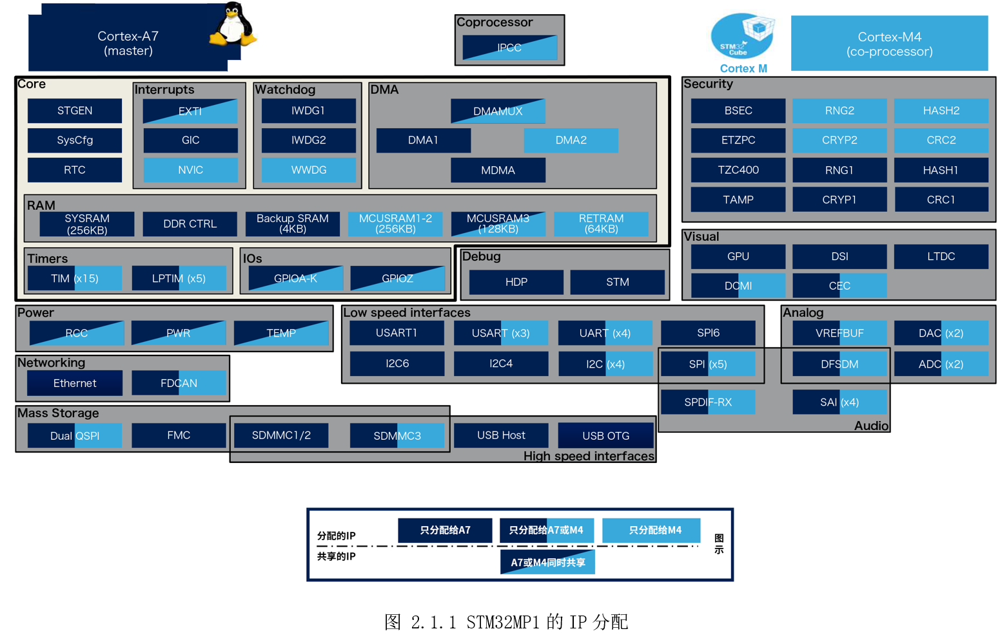
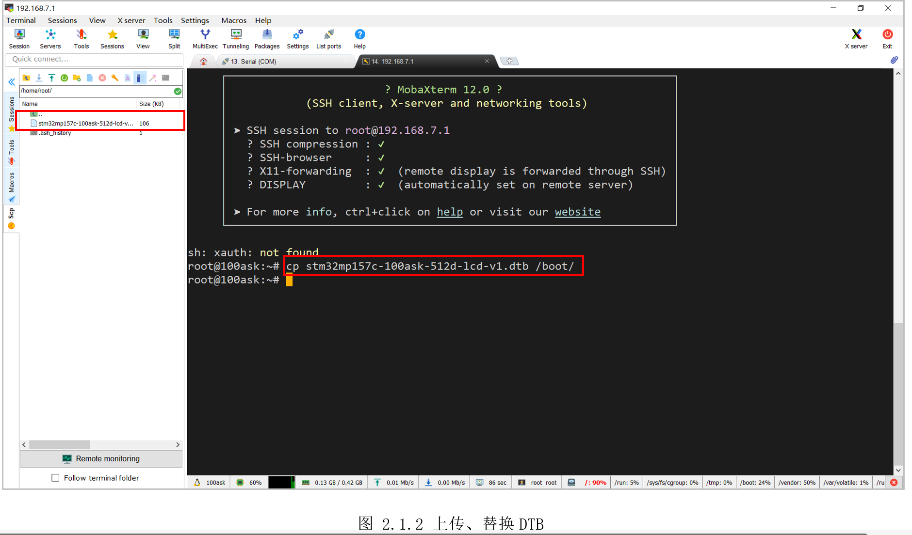

# 2.1 资源分配

STM32MP157x片上有很多功能模块，每个功能模块/资源/外设通常称作IP(IntelligentProperty)，这些IP有些只能分配给A7，有些只能分配给M4，有些只能同时分配给其中一个，有些则可以两者同时使用。各IP分配的详细示意如图2.1.1所示。

本手册主要针对M4开发，因此对只能分配给A7的功能模块将跳过。对于同时分配给其中一个的IP，需要配合设备树分配IP进行实验。对于只能分配给M4或共享的IP则直接操作进行实验。



为了方便大家使用，这里提供DTBO（Device TreesOverlays）方案，动态的共享资源。比如I2C1,启动系统后默认分给了A7，在系统运行的某一个时刻，想启动M4，同时把I2C1分配给M4，以往的方法是修改设备树，编译替换，重新启动，比较麻烦。采用DTBO后，可以在Linux运行时把I2C1分配给M4，无需重启系统，下面来体验一下动态分配流程。

在本手册配套的源码里，有个“IP_ALLOC”目录，目录里三个子文件，如下：

* 
“0_DTB”：里面是设备树编译出来的DTB文件，该DTB支持设备树覆盖，因此要用它替换目前系统的DTB文件，该操作只需执行一次；

* 
“1_DTBO”：里面是本文档涉及到的外设共享资源，以IP为最小单位，比如“100ask_stm32mp1_i2c1_m4.dtbo”就是指I2C1分配给M4。此外还有dts源文件，供读者参考；

* “2_ELF”：存放本示例所有生成的ELF文件，供读者直接使用验证；

启动开发板，在Linux上执行“i2cdetect -l”，可以看到识别到三个I2C控制器。

```c
[root@100ask:~]$ i2cdetect -l  
i2c-1   i2c             STM32F7 I2C(0x40013000)                 I2C adapter
i2c-2   i2c             STM32F7 I2C(0x5c002000)                 I2C adapter
i2c-0   i2c             STM32F7 I2C(0x40012000)                 I2C adapter

```

利用USB模拟网卡组成的局域网，通过MobaXtermSSH登陆开发板，再将“0_DTB”目录的“stm32mp157c-100ask-512d-lcd-v1.dtb”上传到开发板任意目录，然后拷贝到“/boot”目录下，再重启开发板，如图2.1.2所示。

```c
[root@100ask:~]$ cp stm32mp157c-100ask-512d-lcd-v1.dtb /boot
[root@100ask:~]$ reboot
```



重启后，再上传“100ask_stm32mp1_i2c1_m4.dtbo”，然后执行以下命令，覆盖设备树。

```c
[root@100ask:~]$ export DTBO_NAME=100ask_stm32mp1_i2c1_m4
[root@100ask:~]$ mkdir -p /sys/kernel/config/device-tree/overlays/$DTBO_NAME
[root@100ask:~]$ cat $DTBO_NAME.dtbo > /sys/kernel/config/device-tree/overlays/$DTBO_NAME/dtbo
[root@100ask:~]$ echo 1 > /sys/kernel/config/device-tree/overlays/$DTBO_NAME/status
```

第一行是添加个临时环境变量，简化后面命令，后面用“\$DTBO_NAME”即可表示 “100ask_stm32mp1_i2c1_m4”；

第二行是创建文件节点，自动生成相关文件；将dtbo写入节点；第四行是生效覆盖。执行完后可以看到大量打印（串口终端才能默认看到内核打印信息），再执行“执行“i2cdetect\-l”，可以发现少了一个Linux少了一个I2C控制器，如图 2.1.3所示。


后面实验如果有IP只能分配给A7或M4其中一个，调试时使用工程模式，不涉及资源分配操作。如果是实际项目部署，或者需要A7和M4同时运行的实验，就按此操作动态覆盖设备树分配IP资源。

