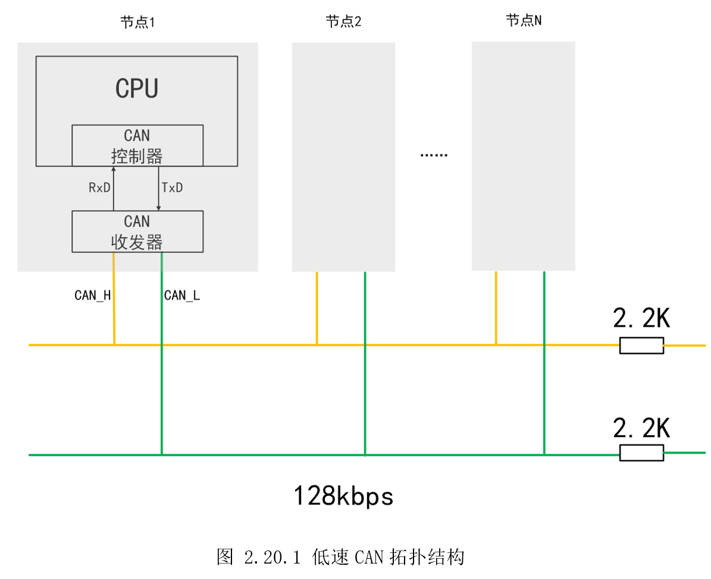

# 2.20 CAN通信

* 设计需求

这里假设需求为使用百问网的CAN-RS485互转模块，实现RS485、CAN接口互相发送、接收数据。

## 2.20.1 基础知识

控制器局域网（Controller AreaNetwork，CAN），是由德国BOSCH（博世）公司开发，是目前国际上应用最为广泛的现场总线之一。其特点是可拓展性好，可承受大量数据的高速通信，高度稳定可靠，因此常应用于汽车电子领域、工业自动化、医疗设备等高要求环境。

CAN总线有两个ISO国际标准：ISO11519 和ISO11898。

* ISO11519定义了通信速率为10～125kbps的低速CAN通信标准，属于开环总线，传输速率为40kbps时，总线长度可达1000米；

* ISO11898定义了通信速率为125 kbps～1Mbps的高速CAN通信标准，属于闭环总线，传输速率可达1Mbps，总线长度≤40米；

高速CAN主要应用在发动机、变速箱等对实时性、传输速度要求高的场景。低速CAN主要应用在车身控制系统等可靠性要求高的场景，低速CAN在断掉其任一导线后，仍可以继续接收数据，因此在汽车发生交通事故时，使用低速CAN能更大提高设备正常接收数据工作的可能性，提高安全性。

如图 2.20.1所示，是低速CAN的拓扑结构图，如图2.20.2是高速CAN的拓扑结构图。低速CAN总线为开环，高速CAN总线为闭环，总线由CAN_H和CAN_L两根线组成，总线上可以挂多个节点设备。每个节点设备由CAN控制器和CAN收发器组成，CAN控制器通常作为外设集成在MPU/MCU上，而CAN收发器则需要外围添加芯片电路。




类似RS485，CAN也使用差分信号传输数据。CAN总线使用CAN_H和CAN_L的电位差来表示数据结构。电位差分为显性电平和隐性电平，分别表示逻辑0和1。如图2.20.3所示，是低速CAN（ISO11519标准）的电平定义，图2.20.4是高速CAN（ISO11898标准）的电平定义，两者物理层电气特性不一样，因此不能将它们连接在一起。可以看到当CAN_H和CAN_L电压相近，则表示隐性电平，对应逻辑1，当两个电压相差较大，表示显性电平，对应逻辑0。


CAN总线以“帧”（Frame）的形式进行通信。CAN总线协议规定了5种帧，分别是数据帧、远程帧、错误帧、超载帧以及帧间隔，其中数据帧的应用最为频繁，表2.20.1是各个帧的用途。


这其中，数据帧是最常用的，也是后面实验需要用到的。数据帧由七段组成，如图2.20.5所示。数据帧又分为标准帧和扩展帧，主要体现在在仲裁段和控制段上。


* 帧起始(Start Of Frame-SOF)：1bit，显性信号，表示数据帧（或远程帧）的开始；

* 仲裁段(Arbitration Field)：包括标识符位（Identifier
field-ID）和远程发送请求位（Remote Transfer Request，RTR）；

标准帧的ID位是11位，即范围是0x000\~0x7FF，而扩展帧的ID是11+18=29位；在CAN协议中，ID决定报文的优先级高低，也决定这拓扑结构的节点是否接收此ID的帧数据；

远程发送请求位，用于区分该帧是数据帧还是远程帧，显性信号（0）代表数据帧（DataFrame），隐性信号（1）代表远程帧（Remote Frame）；

* 控制段（Control Field）：标准帧中由扩展标识符位（Identifier Extension
bit-IDE，1 bit）、保留位0（Reseved bit0-r0，1 bit）、数据长度编码位（Data Length
Code-DLC，4 bits）组成；扩展帧用由两个保留位（Reseved bit，2
bit）、数据长度编码位（Data Length Code-DLC，4 bits）组成;

* 数据段（Data
Field）：发送数据的内容，最多8个字节（64bit），它的实际长度会写到前面的数据长度编码位DLC里。

* 循环校验段（CRC Field）：包括循环校验序列（CRC
Sequence）和界定符（Delimiter，DEL）；循环校验序列用于校验传输是否正确；界定符用于表示循环校验序列是否结束；

* 确认段（ACK Field）：包括确认位（ACK
SLOT）和界定符（Delimiter，DEL）；确认位在节点收到正确的CRC序列时，发送端的ACK位被置位；界定符表示确认是否正常接收；

* 帧结束（End of Frame-EOF）：7位长度，隐性信号，表示帧的结束；

CAN在不断发展，从经典CAN，发展出了FDCAN。经典CAN中的高速CAN，前面提到最大传输率也不过是1Mbps，而FDCAN最高可达8Mbps；经典CAN数据段为64位，FDCAN提升到了512位。

STM32MP157的CAN支持标准CAN和FDCAN，都可以分配给A7或M4，开发板使用的是FDCAN2，实验为了简化，使用标准CAN。

## 2.20.2 硬件设计

如图 2.20.6是100ASK_STM32MP157的CAN接口电路图，PB5、PB6来自于集成了CAN控制器MCU，通过U17，也就是前面提到的CAN收发控制器，生成CAN_H和CAN_L。


另外，CAN和RS485都是半双工的差分信号，需要两个设备连接测试。百问网制作了一个CAN/RS485互转模块，可以直接连接到100ASK_STM32MP157上，实现RS485的CAN的透传，同时验证、学习两个接口，该模块外形如图2.20.7所示。


本实验除了会用到RS485和CAN以外，还会使用调试串口打印发送情况，按键控制收发，串口打印和按键电路部分参考前面，

## 2.20.3 MX设置

首先配置MCU系统时钟在209MHz，然后配置调试串口。再参考前面RS485小节添加RS485，注意
RS485_CAN互转模块的默认波特率为9600Bits/s，因此USART6的波特率要设置为9600，如图2.20.8所示。


此外还要添加RS485收发控制引脚，这个和前面的配置一样。接着参考前面按键中断实验，添加板子上的两个按键，如图2.20.9所示。记得这个三个GPIO都要设置“PinReservation”给“Cortex-M4”，否则不会生成初始化代码。


切到FDCAN2标签，勾选给“M4”，模式选择经典CAN“Classic”，如图2.20.10所示。从时钟树可以看到CAN的时钟直接来自外部晶振HSE，也就是24MHz。由参考手册FDCAN部分可知，CAN的波特率等于标称位时间的导数。


时钟预分频为8，因此当前CAN波特率为24/8/(1+3+2)=500。下方还需设置收发FIFO，如图设置即可。


最后使能按键中断和FDCAN中断，如图 2.20.11所示。


## 2.20.4 代码设计

生成代码后，先将之前按键实验和RS485的“DemoDriver”目录文件复制到本工程。打开“driver_rs485.c”，调用“HAL_UART_Transmit_IT()”发送数据，调用“HAL_UART_Receive_IT()”接收数据，并在中断回调函数里修改收发标志，用于判断是否收发完成。

```c
static uint8_t rs485_rx_flag = 0;
volatile uint8_t rs485_tx_flag = 0;

void RS485_TX(uint8_t *pdata, uint8_t sz)
{
  rs485_tx_flag = 0;

  // RS485设置为输出
  DE_TX();

  // 发送数据
  HAL_UART_Transmit_IT(&huart6, (uint8_t*)pdata, sz);

  while(!RS485_GetTxFlag());
  // RS485设置为输入
  DE_RX();
}

void RS485_RX(uint8_t *pdata, uint8_t sz)
{
  rs485_rx_flag = 0;
  HAL_UART_Receive_IT(&huart6, pdata, sz);
}

uint8_t RS485_GetTxFlag(void)
{
  return rs485_tx_flag;
}

uint8_t RS485_GetRxFlag(void)
{
  return rs485_rx_flag;
}

void HAL_UART_RxCpltCallback(UART_HandleTypeDef *huart)
{
  if(huart->Instance == USART6)
  {
    rs485_rx_flag = 1;
  }
}

void HAL_UART_TxCpltCallback(UART_HandleTypeDef *huart)
{
  if(huart->Instance == USART6)
  {
    rs485_tx_flag = 1;
  }
}

```


新增“driver_fdcan.c”文件，对于CAN，首先要设置过滤，也就是识别仲裁段的ID，这样就有选择的接收CAN总线上自己需要的数据，这里设置为全部接收，不做过滤。

```c
/*
 * 此函数设置接收的过滤器
*/
void HAL_FDCAN_SetFilter(void)
{
  FDCAN_FilterTypeDef  sFilterConfig;
  /* 配置CAN的过滤器，此处全部接收，不做过滤 */
  sFilterConfig.IdType    = FDCAN_STANDARD_ID;      // 标准帧
  sFilterConfig.FilterIndex   = 0;
  sFilterConfig.FilterType  = FDCAN_FILTER_DUAL;
  sFilterConfig.FilterConfig  = FDCAN_FILTER_TO_RXFIFO0;
  sFilterConfig.FilterID1 = 0;  // ID1和ID2都等于0表示都进行接收不做过滤
  sFilterConfig.FilterID2 = 0;
  if (HAL_FDCAN_ConfigFilter(&hfdcan2, &sFilterConfig) != HAL_OK)
  {
    Error_Handler();
  }

  sFilterConfig.FilterConfig = FDCAN_FILTER_TO_RXFIFO1;
  if (HAL_FDCAN_ConfigFilter(&hfdcan2, &sFilterConfig) != HAL_OK)
  {
    Error_Handler();
  }

  if (HAL_FDCAN_Start(&hfdcan2) != HAL_OK)
  {
    Error_Handler();
  }

  // 激活接收FIFO
  if(HAL_FDCAN_ActivateNotification(&hfdcan2, FDCAN_IT_RX_FIFO0_NEW_MESSAGE, FDCAN_IT_TX_COMPLETE) != HAL_OK)
  {
    Error_Handler();
  }
}

```


这里用到了FIFO，需要CAN发送时，把要发送的消息放入FIFO即可。

```c
/*
 *  函数名：void CAN_Transmit(uint16_t ID, uint8_t *pdata, uint8_t length)
 *  输入参数：ID    -> CAN发送报文的ID
 *            pdata -> 发送报文的首地址
 *            length-> 发送报文的个数，最多8个字节
 *  输出参数：无
 *  返回值：无
 *  函数作用：CAN发送函数
*/
void CAN_Transmit(uint16_t ID, uint8_t *pdata, uint8_t length)
{
  TxHeader.Identifier   = ID;         // 发送ID
  TxHeader.IdType     = FDCAN_STANDARD_ID;  // 发送帧为标准ID
  TxHeader.TxFrameType  = FDCAN_DATA_FRAME;   // 是数据帧
  TxHeader.DataLength   = FDCAN_DLC_BYTES_8;  // 长度是8个字节
  TxHeader.ErrorStateIndicator  = FDCAN_ESI_PASSIVE;
  TxHeader.BitRateSwitch      = FDCAN_BRS_OFF;
  TxHeader.FDFormat       = FDCAN_CLASSIC_CAN;// 传统CAN
  TxHeader.TxEventFifoControl = FDCAN_NO_TX_EVENTS;
  TxHeader.MessageMarker = 0;
  if (HAL_FDCAN_AddMessageToTxFifoQ(&hfdcan2, &TxHeader, pdata) != HAL_OK)
  {
    Error_Handler();
  }
}

```


当CAN收到数据，就会调用CAN接收回调函数，在回调函数里调用“HAL_FDCAN_GetRxMessage()”获取数据。

```c
/*
 *  函数名：void HAL_CAN_RxFifo0MsgPendingCallback(CAN_HandleTypeDef *CanHandle)
 *  输入参数：CanHandle -> CAN句柄
 *  输出参数：无
 *  返回值：无
 *  函数作用：CAN接收回调函数
*/
void HAL_FDCAN_RxFifo0Callback(FDCAN_HandleTypeDef *hfdcan, uint32_t RxFifo0ITs)
{
  /* Get RX message */
  if (HAL_FDCAN_GetRxMessage(hfdcan, FDCAN_RX_FIFO0, &RxHeader, (uint8_t*)&can_rx_data.RX_Data[0]) != HAL_OK)
  {
    Error_Handler();
  }
  can_rx_data.ID = RxHeader.Identifier;
  can_rx_data.length = RxHeader.DataLength>>16;
  rx_flag = 1;
}

```


此外，想通过按键实现收发开始，这里在按键中断回调函数修改按键标志，主函数查询该标志就可知道是否有按键按下。

```c
extern uint8_t test_flag;
/*
 *  函数名：void HAL_GPIO_EXTI_Callback(void)
 *  输入参数：无
 *  输出参数：无
 *  返回值：无
 *  函数作用：外部中断处理函数的回调函数，用以处理不同引脚触发的中断服务最终函数
*/
void HAL_GPIO_EXTI_Rising_Callback(uint16_t GPIO_Pin)
{
  switch(GPIO_Pin)
  {
    case KEY_USER1_Pin:
    {
      break;
    }

    case KEY_USER2_Pin:
    {
      test_flag = 1;
      break;
    }
    default:break;
  }
}

```


最后，主函数里设计控制流程。首先，让RS485发送ID，CAN接收ID，然后RS485发送数据，CAN接收数据。再反过来，CAN发送ID和数据，RS485接收。主函数的代码如下：

```c
  /* USER CODE BEGIN 2 */
  HAL_FDCAN_SetFilter();
  printf("CAN Send And Receive test\r\n");
  printf("\r\n");
  /* USER CODE END 2 */

  /* Infinite loop */
  /* USER CODE BEGIN WHILE */
  while (1)
  {
    /* USER CODE END WHILE */

    /* USER CODE BEGIN 3 */
    if(test_flag==1)
    {
      test_flag = 0;
      // RS485 Send ID
      // RS485->CAN
      RS485_TX((uint8_t*)&rs485_id, 2);
      printf("\r\n");
      printf("Step 0: RS485 Send ID to CAN\r\n");
      printf("RS485 Send ID 0x%x\r\n", rs485_id);

      step = 1;
    }

    switch(step)
    {
      case 0:
      {
        break;
      }
      case 1:
      {
        // Wait for CAN receive finish
        if(CAN_Receive() == 1)
        {
          CAN_SetReceiveFlag(0);
          printf("\r\n");
          printf("Step 1: CAN wait for Receive ID from RS485\r\n");
          printf("CAN Receive Message: \r\n");
          printf("\tID: 0x%x\r\n", can_rx_data.ID);
          printf("\tLength: 0x%x\r\n", can_rx_data.length);
          printf("\tData:");
          for(i=0; i<can_rx_data.length; i++)
          {
            printf("\t0x%x", can_rx_data.RX_Data[i]);
          }
          printf("\r\n");

          step = 2;
        }

        break;
      }
      case 2:
      {
        RS485_TX((uint8_t*)rs485_tx_data, 8);
        printf("\r\n");
        printf("Step 2: RS485 Send Data to CAN\r\n");
        printf("RS485 Send Data: \r\n");
        printf("\tData:");
        for(i=0; i<8; i++)
        {
          printf("\t0x%x", rs485_tx_data[i]);
        }
        printf("\r\n");

        step = 3;
      }
      case 3:
      {
        // Wait for CAN receive finish
        if(CAN_Receive() == 1)
        {
          CAN_SetReceiveFlag(0);
          printf("\r\n");
          printf("Step 3: CAN wait for Receive Data from RS485\r\n");
          printf("CAN Receive Message: \r\n");
          printf("\tID: 0x%x\r\n", can_rx_data.ID);
          printf("\tLength: 0x%x\r\n", can_rx_data.length);
          printf("\tData:");
          for(i=0; i<can_rx_data.length; i++)
          {
            printf("\t0x%x", can_rx_data.RX_Data[i]);
          }
          printf("\r\n");
          step = 4;
        }
        break;
      }
      case 4:
      {
        // CAN->RS485
        printf("\r\n");
        printf("Step 4: CAN Send Frame Data to RS485, and RS485 start receive data from CAN\r\n");
        CAN_Transmit(fdcan_id, fdcan_tx_data, 8);
        RS485_RX(rs485_rx_data, 8);
        step = 5;
        break;
      }
      case 5:
      {
        if(RS485_GetRxFlag())
        {
          step = 0;
          printf("\r\n");
          printf("Step 5: RS485 Received data from CAN finished.\r\n");
          printf("CAN Send Message:\r\n");
          printf("\tID:0x%x\r\n", fdcan_id);
          printf("\tLength:8\r\n");
          printf("\tData:");
          for(i=0; i<8; i++)
          {
            printf("\t0x%x", fdcan_tx_data[i]);
          }
          printf("\r\n");
          printf("RS485 Receive Data:\r\n");
          printf("\tData: ");
          for(i=0; i<8; i++)
          {
            printf("\t0x%x", rs485_rx_data[i]);
          }
          printf("\r\n");
        }
      }
      default:break;
      }/*End switch(step)*/
  }/* End while(1) */
  /* USER CODE END 3 */
}

```


## 2.20.5 实验效果

首先如图 2.20.12所示连接好硬件，注意CAN和RS485图中的位置，以及线的连接情况。


工程模式启动调试，按下按键KEY_USER2，可以看到串口如图 2.20.13打印。

Setp 0-1：RS485想发送ID，但RS485中没有ID概念，这里相当于直接发了一个数据，经过转换模块，CAN实际收到的ID为模块发出的0x00，收到两位数据，也就是RS485发送的ID。

Setp 2-3：RS485发送了8位数据，CAN接到了该8位数据。

Setp4-5：CAN发送一个数据，这个数据包含ID和数据，经过模块转换，ID被省略，RS485只收到数据。

可以看出，该透传模块忽略的ID的发送，经过转换，实现了数据的透传。


