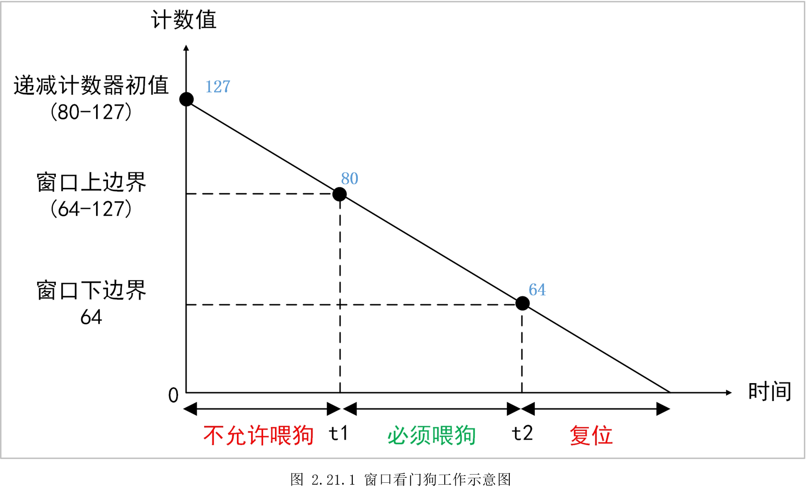
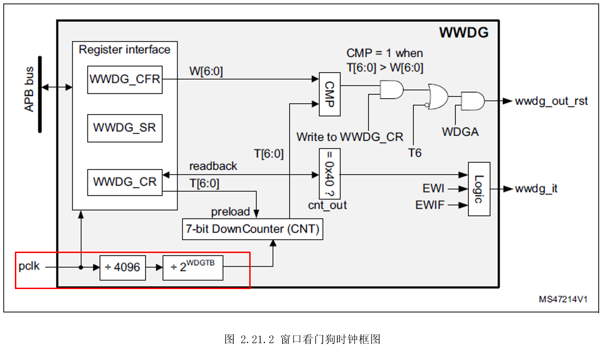
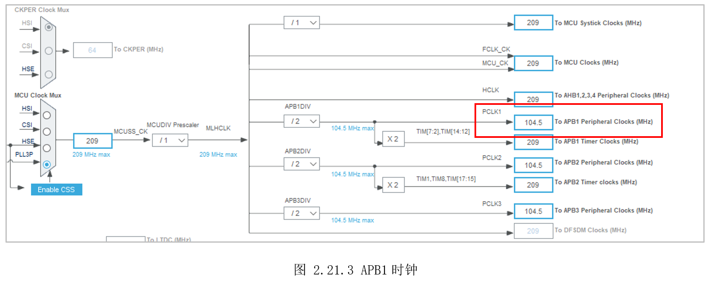
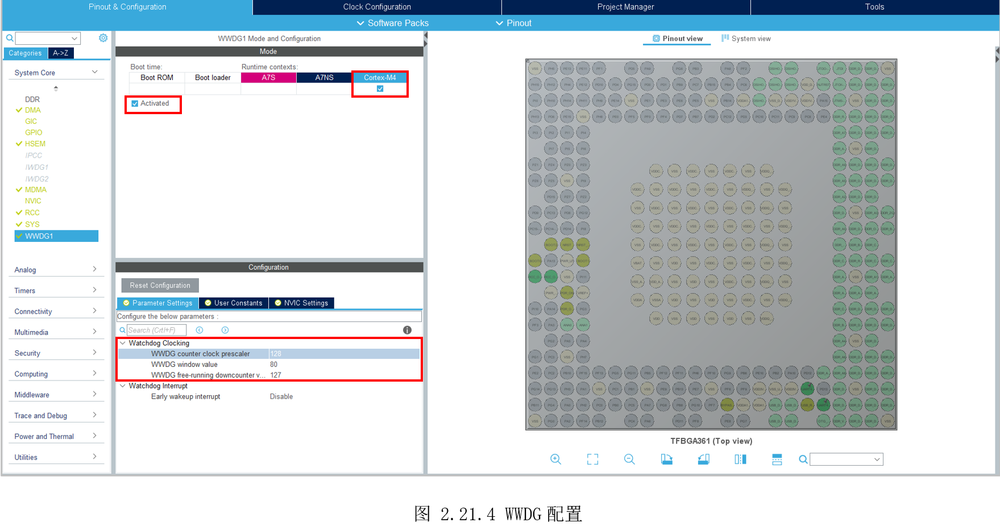
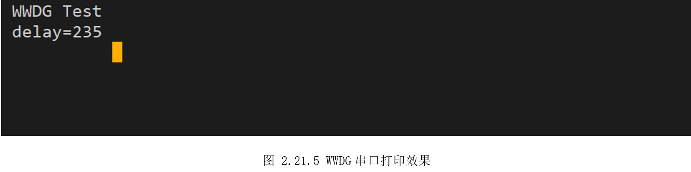

# 2.21 WWDG—窗口看门狗

* 设计需求

这里假设需求为使用窗口看门狗，展示“喂狗”和“不喂狗”的效果。

## 2.21.1 基础知识

MCU可能工作在一些复杂环境，受到某些干扰可能出现程序跑飞导致死循环，看门狗的作用就是为了避免这种情况。看门狗启动后，需要在一定时间内(通过定时器计数)再给它一个信号，俗称“喂狗”，如果按时没有“喂狗”，说明MCU可能处于非正常状态，这时看门狗就向MCU发送个复位信号，使整个系统重启，进入正常的工作状态。

STM32MP157有三个看门狗，两个独立看门狗IWDG，只能A7使用，一个窗口看门狗，只能M4使用，因此本结使用窗口看门狗WWDG实验。

独立看门狗，需要在0-t之间喂狗，而窗口看门狗，需要在t1-t2之间喂狗，也就是说喂狗时间在一个上下限范围之内，不能过早，也不能过晚。

窗口看门狗是一个7位的递减计数器，规定它的范围为80-127。如图2.21.1所示，假设设置这个递减计数器初值为127，随着时间的递增，它的值将逐渐减少。我们还需要定一个窗口上边界，这个上边界位于下边界和递减计数器初值之间，假设为80。那么计数器从127递减到80这个时间段，是不允许喂狗的，一旦喂狗将复位重启；80递减到64这个时间段，必须喂狗；64这个下边界是固定的，一旦递减计数器小于这个值，系统将复位。可以看到，整个过程，我们需要定义两个值，一个是递减计数器初值，一个是窗口上边界值。



计数器递减的速度由看门狗时钟决定，时钟越快，计数递减就越快，时钟越慢，计数递减就越慢。由前面图
2.3.4可知，WWDG挂在APB1总线上，APB时钟给WWDG后，还要4096分频和2WDGTB分频，如图2.21.2所示。



## 2.21.2 硬件设计

不涉及电路设计。

## 2.21.3 MX设置

先设置好MCU系统时钟和串口。此时APB1时钟为104.5MHz,如图 2.21.3所示。



然后切到WWDG1标签，勾选给M4，勾选“Activated”激活。在下面先是设置WWDG时钟分频，也就是前面提到的2WDGTB分频，这里设置为128分频，则此时WWDG实际时钟为104.5MHz/4096/128≈199.3Hz，也就是每秒计数199个数，每个计数花费5毫秒。

接着是设置窗口上边界数值，这里设置为80，最后是递减计数器初值为127，如图2.21.4所示。此时（127-80）\*5ms=235ms，这个时间段不能喂狗；（80-64）\*5ms=80ms，这个时间段必须喂狗。



## 2.21.4 代码设计

创建“DemoDriver”目录，在里面新建“driver_wwdg.c”,调用HAL库的“HAL_WWDG_Refresh()”刷新WWDG的值，也就是喂狗。

```c
/*
 *  函数名：void ClearIWDG(void)
 *  输入参数：无
 *  输出参数：无
 *  返回值：无
 *  函数作用：刷新独立看门狗的计数器，俗称"喂狗"
*/
void ClearWWDG(void)
{
    if (HAL_WWDG_Refresh(&hwwdg1) != HAL_OK)
    {
        Error_Handler();
    }
}

```


再实现一个计算窗口上边界时间的函数，验证前面的理论计算。

```C
uint32_t TimeoutCalculation(uint32_t timevalue)
{
  uint32_t timeoutvalue = 0;
  uint32_t pclk1 = 0;
  uint32_t wdgtb = 0;

  /* considering APB divider is still 1, use HCLK value */
  pclk1 = HAL_RCC_GetPCLK1Freq();

  /* get prescaler */
  wdgtb = (1 << ((hwwdg1.Init.Prescaler) >> WWDG_CFR_WDGTB_Pos)); /* 2^WDGTB[1:0] */

  /* calculate timeout */
  timeoutvalue = ((4096 * wdgtb * timevalue) / (pclk1 / 1000));

  return timeoutvalue;
}

```

最后，主函数先获取窗口上边界时间，然后延时该段时间不喂狗，再之后喂狗。

```c
  /* USER CODE BEGIN 2 */
  printf("\r WWDG Test\n");
  delay = TimeoutCalculation(hwwdg1.Init.Counter-hwwdg1.Init.Window); // 获取窗口上边界时间
  printf("\r delay=%ld \n", delay);
  /* USER CODE END 2 */

  /* Infinite loop */
  /* USER CODE BEGIN WHILE */
  while (1)
  {
    /* USER CODE END WHILE */

    /* USER CODE BEGIN 3 */
   HAL_Delay(delay); // 不允许喂狗
   HAL_Delay(1); // 之后的80ms内必须喂狗

   ClearWWDG(); //喂狗,重新计数
  }
 /* USER CODE END 3 */

```

## 2.21.5 实验效果

调试运行，串口打印如图2.21.5所示，显示窗口上边界时间为235，和前面理论计算一致。此外，读者可以尝试再小于235ms内喂狗，或者235+80ms后喂狗，测试系统是否会复位。



