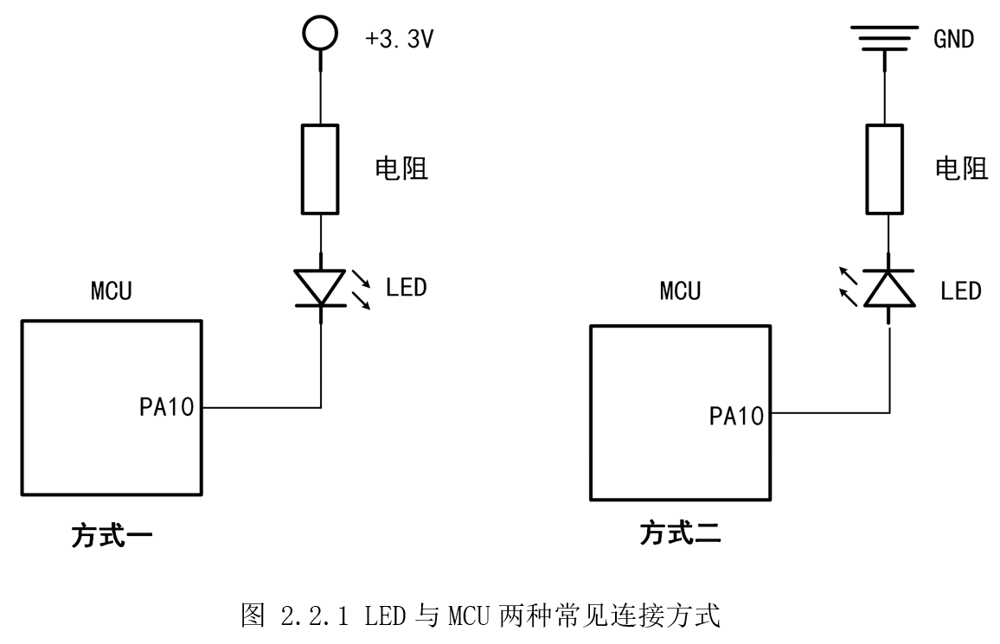
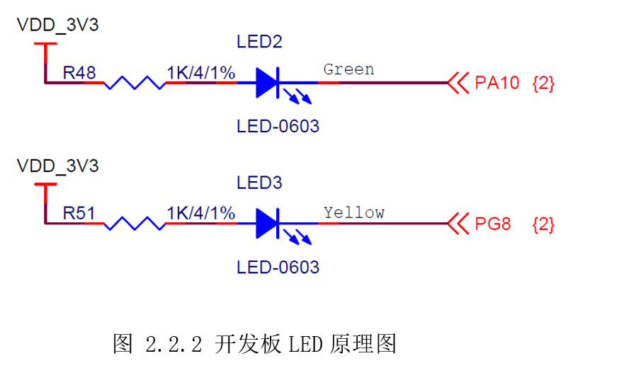
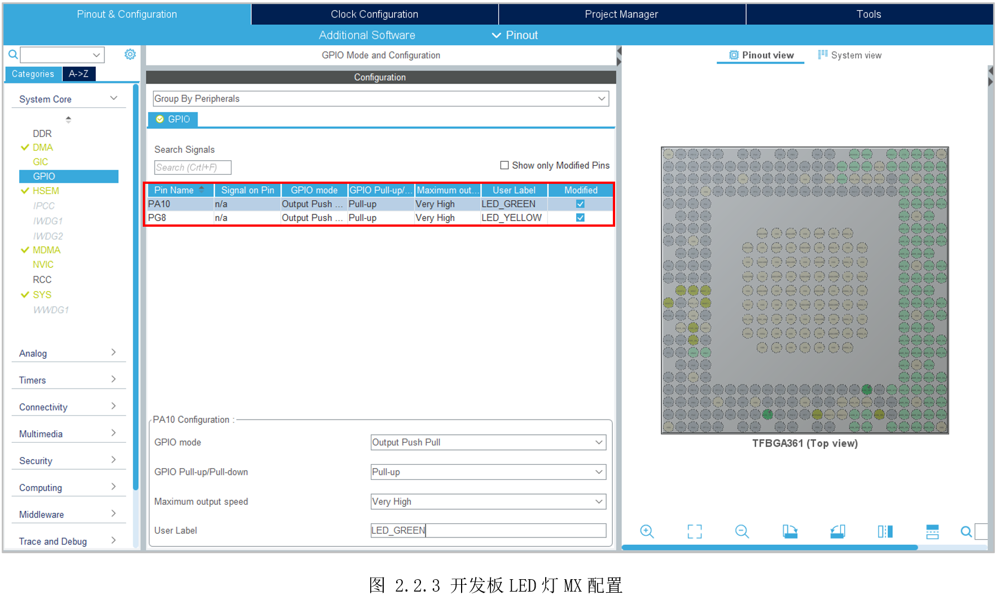
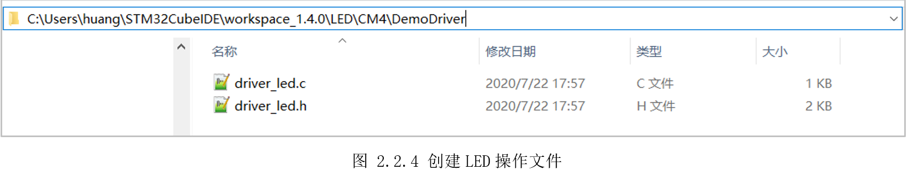
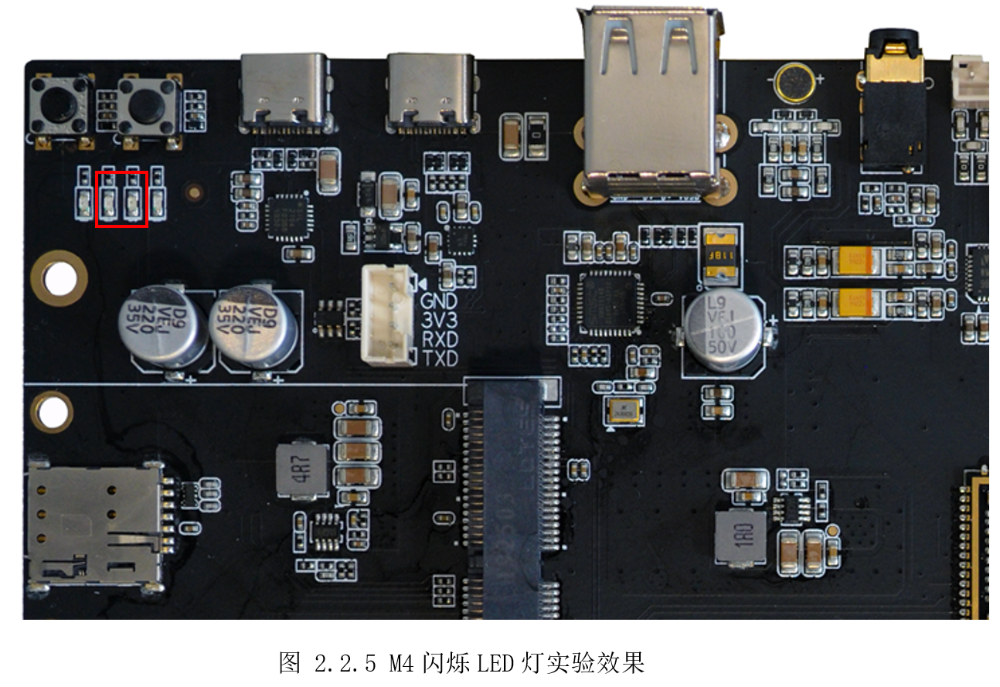

# 2.2 闪烁LED灯

* 设计需求

前面一节，以LED为例熟悉了开发流程，本小节将从实际开发的角度示例LED灯。

这里假设需求为间隔1秒，交替点亮、熄灭两个LED灯。

## 2.2.1基础知识

LED(light-emittingdiode)，即发光二极管，俗称LED灯。LED灯作为二极管，具有单向导通性，需要正极端电压高于负极端约3V才能导通，亮度则由通过的电流大小决定，一般5-10mA即可。

MCU有很多引脚，大部分引脚都可以供用户使用。引脚可以作为功能引脚或GPIO，功能引脚就是作为特殊功能的引脚，比如用于串口传输引脚；GPIO就是输出高低电平或者获取外部输入的电平高低。如果将LED灯与引脚相连，然后设置引脚为GPIO功能，并输出高低电平就可以控制亮灭LED灯了。

通常LED灯与MCU引脚的方式有如图2.2.1所示的两种方式。方式一的LED灯正极与电源正极连接，LED灯负极与MCU的GPIO连接，此时LED灯正极将一直为高电平，灯的亮灭将由LED负极所连的GPIO电平决定。GPIO输出高电平，LED灯两端都为高电平，灯熄灭。GPIO输出低电平，LED灯正级端电压高于负极端电压约3.3V，LED灯将点亮。理解方式一后，再看方式二，LED负极端连的电源地，将一直为低电平，LED灯的亮灭将由正级端所连接的GPIO决定，GPIO为高时LED灯将点亮，反之则熄灭。



由此，可以看出，LED的亮灭可以由GPIO输出的电平高低决定，但是输出高电平点亮LED还是熄灭LED灯，需要看原理图是如何设计的。此外，还需要看原理图LED所接在哪个引脚，从而控制对应引脚的电平。

## 2.2.2硬件设计

打开配套资料里底板的原理图文件《100ASK_STM32MP157_PRO_V11.pdf》，LED原理图部分如图
2.2.2所示。



可以看到，这里采用的是前面的介绍的方式一连接方式。由原理图，可以得到两个重要信息：

1) LED使用哪个引脚：

LED Green接在PA10上，LED Yellow接在PG8上。

2) 怎么控制引脚才能点亮/熄灭LED：

两个灯都采用方式一连接，GPIO输出高电平时，灯熄灭；GPIO输出低电平时，灯点亮。

## 2.2.3MX设置

参考前面开发流程里的创建模板，使用STM32CubeIDE里的STM32CubeMX创建工程代码，前面图
1.5.21STM32CubeMX配置引脚详细参数图里，有好几个选项，这里依次介绍每个选项的含义。

* GPIO mode：用于设置输出模式。可选有“Output Push Pull”(推挽输出)、“Output Open
Drain”(开漏输出)。在不考虑上拉电阻的情况下，需要较强驱动能力的场合，选择推挽输出，需要电平转换、线与功能的场合，选择开漏输出。

* GPIO
Pull-up/Pull-down：用于设置IO口上下拉模式。可选有“Pull-up”(上拉)、“Pull-dwon”(下拉)、“No
pull-ip and no
pull-down”(没有上下拉)。上/下拉的主要目的是将GPIO信号在不确定状态有个确定的电平。

* Maximum output
speed：用于设置GPIO高低切换的速度。可选有“Low”(低速)、“Medium”(中速)、“High”(高速)、“Very
High”(超高速)。切换速度越高,性能越好，但功耗越大。

* User
Label：用来设置GPIO的别名，体现在代码里就是宏。比如这里设置为“LED_GREEN”,在代码里可以用“LED_GREEN”代替“GPIO_PIN_10”，用“LED_GREEN_GPIO_Port”代替“GPIOA”，让代码有更强的可读性。

两个LED灯配置如图 2.2.3所示。



## 2.2.4代码设计

参考前面工程结构分析，在在“CM4”目录里，新建一个“DemoDriver”目录，同时创建“driver_led.c”和“driver_led.h”,如图2.2.4所示。


前面示例使用的“HAL_GPIO_WritePin()”来操作GPIO，现在可以在自定义添加的文件里，再简化一点，使用宏定义代替函数操作“driver_led.h”内容如下：

```c
#include "main.h"
#include "stm32mp1xx_hal.h"

/********  LED硬件相关宏定义 ********/
#define LED_GREEN_ON()      HAL_GPIO_WritePin(LED_GREEN_GPIO_Port, LED_GREEN_Pin, GPIO_PIN_RESET)
#define LED_GREEN_OFF()     HAL_GPIO_WritePin(LED_GREEN_GPIO_Port, LED_GREEN_Pin, GPIO_PIN_SET)

#define LED_YELLOW_ON()     HAL_GPIO_WritePin(LED_YELLOW_GPIO_Port, LED_YELLOW_Pin, GPIO_PIN_RESET)
#define LED_YELLOW_OFF()    HAL_GPIO_WritePin(LED_YELLOW_GPIO_Port, LED_YELLOW_Pin, GPIO_PIN_SET)

/********  LED函数声明 ********/
extern void DemoLedInit(void);

#endif

```


“driver_led.c”可以实现一些控制逻辑，主函数只需要调用即可，“driver_led.c”代码如下：

```c
#include "driver_led.h"

void DemoLedInit(void)
{
  /* LED对应的引脚的初始化,已经由STM32CubeMX在main.c自动生成 */

  /* 两个灯初始化状态为亮 */
  LED_GREEN_ON();
  LED_YELLOW_ON();
}

void LedBlinking(void)
{
  /* LED2(GREEN)和LED3(YELLOW)间隔1S闪烁  */
  LED_GREEN_ON();
  LED_YELLOW_ON();
  HAL_Delay(1000);

  LED_GREEN_OFF();
  LED_YELLOW_OFF();
  HAL_Delay(1000);
}

```

在“driver_led.c”实现需要的控制效果后，“main.c”调用即可：

```c
  /* Initialize all configured peripherals */
  MX_GPIO_Init();
  /* USER CODE BEGIN 2 */
  DemoLedInit(); // 自定义引脚初始化
  /* USER CODE END 2 */

  /* Infinite loop */
  /* USER CODE BEGIN WHILE */
  while (1)
  {
    /* USER CODE END WHILE */

    /* USER CODE BEGIN 3 */
LedBlinking(); // LED闪烁
  }
  /* USER CODE END 3 */

```


## 2.2.5实验效果

因为GPIO是共享IP，可以同时A7和M4同时访问，因此无需替换设备树。且使用工程模式调试，无需Linux运行，如图2.2.5所示效果。



