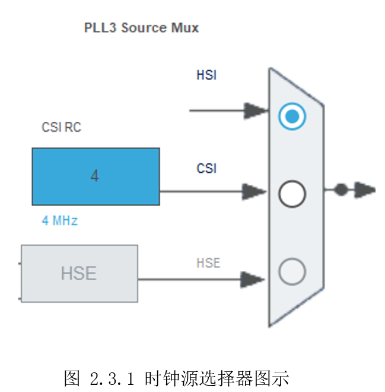
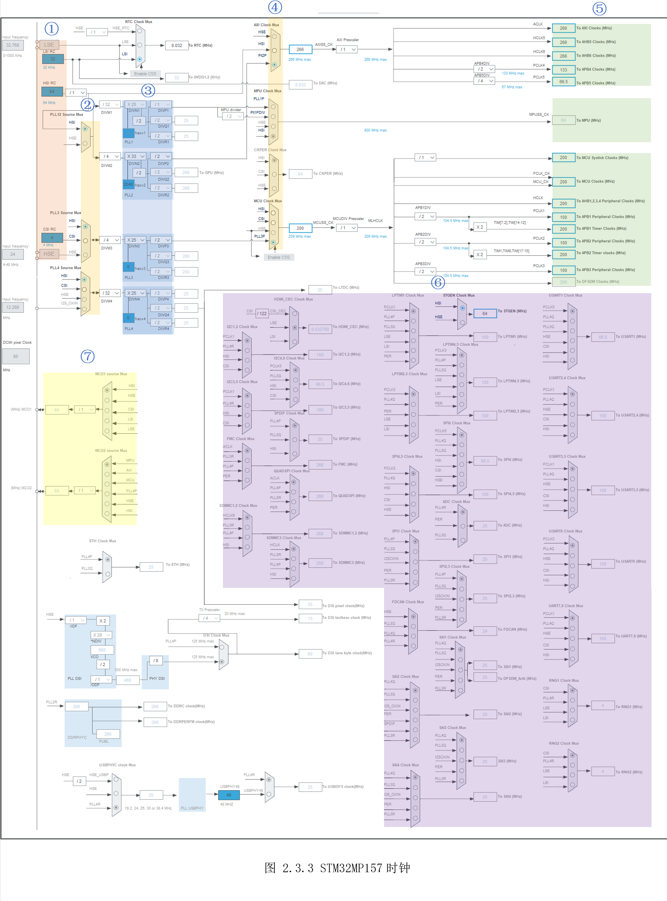
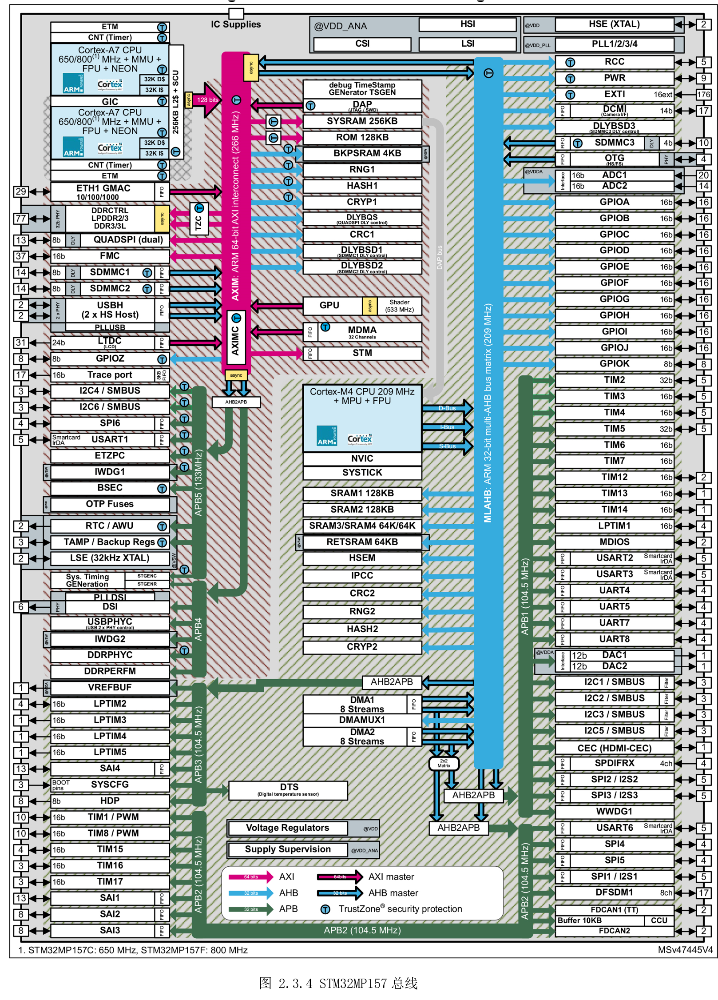
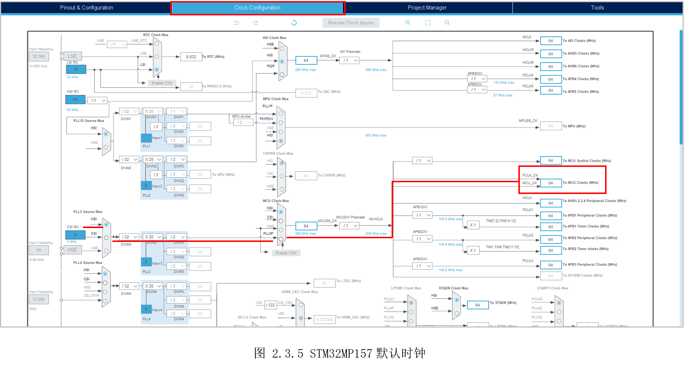
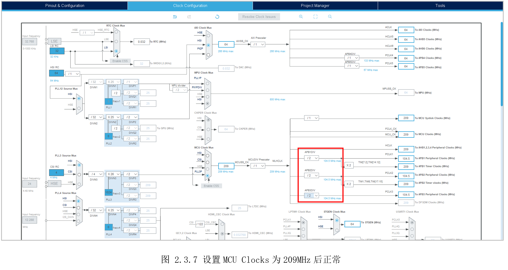
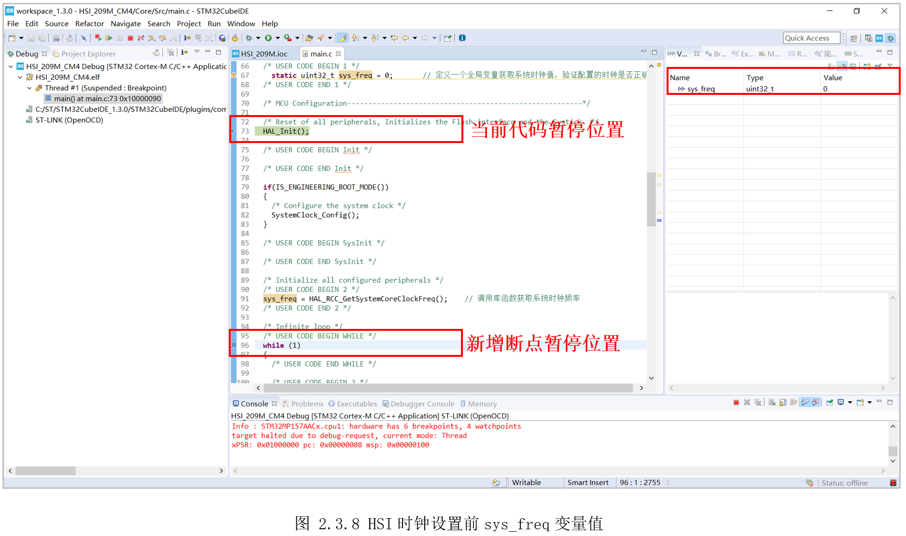
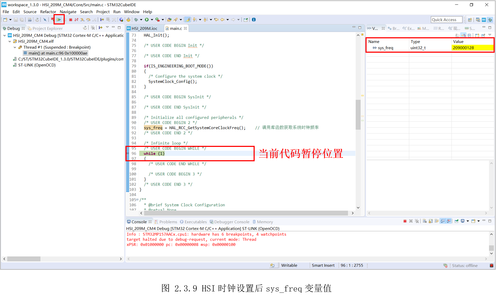

# 2.3 系统时钟—HSI

* 设计需求

这里假设需求为使用内部时钟HSI，让STM32MP157的M4全速运行在最高209MHz。

## 2.3.1基础知识

时钟是处理器运行的基础，时钟信号推动芯片内部各部分执行相应的指令。时钟如同人体内部的心脏一样，心脏跳动一下，血液就流动一下。时钟产生一次，推动处理器就执行一下指令。除了CPU，芯片上所有的外设都需要时钟(GPIO、I2C、SPI等)，由此可见时钟的重要性。

在芯片运行的时钟频率里，频率越高，芯片处理的速度越快，但同时功耗也越高。为了功耗和性能兼顾，微处理器一般有多个时钟源，同时还将时钟分频为多个大小，适配不同需求的外设。

STM32MP157的M4，拥有五个时钟源：

* HSI(High-speed internal oscillator)：

HIS是内部的高速RC振荡器，频率64MHz。因为是内部提供，可以降低成本，缺点是精度较差。

* HSE(High-speed external oscillator):

HSE是外部的高速振荡器，需要外部电路晶振，输入频率范围要求为4-48MHz。因为需要外部电路提供，成本会增加，但精度较好。

* LSI(Low-speed internal oscillator)：

LSI是内部的低速RC振荡器，频率32KHz。一般用于看门狗、RTC实时时钟、DAC等。

* LSE(Low-speed external oscillator):

LSE是外部的低速振荡器，需要外部电路晶振，输入频率范围要求为0-1000KHz，常使用32.768KHz。一般用于RTC实时时钟。

* CSI(Low-power internal oscillator):

CSI是内部的低功耗RC振荡器，频率4MHz。主要用于低功耗，需要低功耗时代替64MHz的HSI。

有了多个时钟源后，需要经过选择器选择使用其中哪个时钟源，选择器（MUX）的示意图如图2.3.1所示。可以看到有三个时钟源可选:HSI、CSI、HSE，最终只会选择其中一个，比如这里选择的HSI。



M4最高频率达209MHz，前面提到的任一时钟源，都没有这么高。因此芯片里面还会有一个PLL(锁相环)用来倍频，是频率翻倍到指定值。锁相环倍频器示意图如图2.3.2所示，图中左下角有“PLL1”注释，且有“X25”字样，说明会倍频25倍。此外，里面还有“/2”字样，表示二分频，将频率减半。


有了这前面的知识，就可以看懂STM32CubeMX里面的时钟设置了，STM32MP157的时钟如所示。



STM32MP157的时钟图，看起比较复杂，实际主要的就图中示意的几块，下面分别介绍。

**① 五个时钟源**

三个内部时钟源：HIS、LSI、CSI；

两个外部时钟源：HSE、LSE；

**② 四个PLL锁相环**

PLL12 Source Mux是选择哪个时钟源提供给PLL1和PLL2；

PLL3 Source Mux是选择哪个时钟源提供给PLL3；

PLL4 Source Mux是选择哪个时钟源提供给入PLL4；

**③ 三个锁相环时钟源选择器**

PLL1为MPU Clock Mux输入时钟；

PLL2为AXI Clock Mux输入时钟；

PLL3为MCU Clock Mux输入时钟；

PLL4为DSI等外设提供时钟；

**④ 三个锁相环时钟源选择器**

AXI Clock Mux选择哪路时钟提供给AXI、AHB5、AHB6、APB4、APB5；

MPU Clock Mux选择哪路时钟提供给MPU(A7最高800MHz)；

CKPER Clock Mux选择哪路时钟提供给CKPER；

MCU Clock Mux选择哪路时钟提供给MCU(M4最高209MHz)以及AHB1-4、APB1-3等；

**⑤ AXI、AHB、APB、MPU、MCU时钟**

该部分可以分成三部分：

上面的AXI、AHB5、AHB6、APB4、APB5提供给A7外设使用;

中间的MPU Clock提供给A7核心使用;

下面的MCU Clock提供给M4核心使用，以及AHB1-4、APB1-3提供给M4外设使用，

AXI、AHB、APB和外设的关系，在后面介绍。

**⑥ 各个外设时钟选择器**

这部分包含STM32MP157所有外设时钟选择，只要在STM32CubeMX使能了外设，对应部分的时钟就会由灰色变成蓝色。

**⑦ 时钟输出两个选择器**

两个时钟输出信号选择器，用于选择把哪个时钟源输出供外部使用。

经过图中①至⑥这几步，就将时钟源传到了各个外设。其中第⑤-⑥的关系，参考图2.3.4所示。



图中红色为AXI(Advanced eXtensible Interface)高级可拓展接口，蓝色为AHB(AdvancedHigh-performance Bus)高级高性能总线，绿色为APB(Advanced PeripheralBus)高级外围总线。

红色的AXI这里就先不用关心，它主要是给A7外设使用。图中右半部分是M4的总线结构，可以看到蓝色的AHB总线(Max209MHz)上，连接有GPIO、ADC这些高速外设等。三条绿色的APB总线（Max104.5Mhz），连接有I2C、SPI、USART等低速外设，比如窗口看门狗WWDG1，就挂在APP1上。

## 2.3.2硬件设计

本实验实验内部时钟，不涉及硬件设计。

## 2.3.3 MX设置

使用STM32CubeIDE创建新工程，打开STM32CubeMX,切换到时钟配置界面，如图 2.3.5所示。



①是MCU的时钟频率，默认是64MHz，我们需求为209MHz；

②处为一个分频器，默认为一分频，可以看作没有该分频器；

③处为MCU时钟选择器，默认为HSI输入，有前面可知，系统默认的HSI为64MHz，这里直接使用HIS是达不到209MHz的。第二个CSI为4MHz，也是不够的。第三个HSE，因为外部时钟还没使能，这里还是灰色的，不能选择。第四个PLL3P，有前面PLL3倍频得到，可能满足需求；

④处为PLL锁相环，可以将输入的时钟倍频；

⑤处为PLL3的输入时钟选择器，可选的有HIS、CSI、HSE，这里实验为使用内部RC振荡器，因此选择默认的HIS即可。

分析完后，可以发现③处是需要修改的，需要选择PLL3P作为输入，同时希望得到209MHz。因此修改③的选择输入为PLL3P，同时在后面的框中输入209，按下回车，稍等一会，STM32CubeMX会自动计算④处的参数，使得③处得到209MHz，得到如图2.3.6所示。


软件计算完成后，可以看到MCUClocks成功变为209MHz，但同时也多了三个酒红色提示。那是因为酒红色部分超过了最高允许的频率。酒红色部分全为209MHz，而前面红框处的蓝色提示显示最大频率为104.5MHz，因此需要将前面的分频器设置为“/2”即可，如图2.3.7所示。



最后，参考前面示例生成初始化工程。

## 2.3.4代码设计

HAL库中有个获取系统核心时钟的函数，通过此函数获取系统时钟与我们设置的时钟对比，即可验证设置是否正确。首先定义一个全局变量保存系统时钟值，方便调试时查看，然后在“SystemClock_Config()”函数之后，调用“HAL_RCC_GetSystemCoreClockFreq()”获取设置后的新系统时钟。

```c
/**
  * @brief  The application entry point.
  * @retval int
  */
int main(void)
{
  /* USER CODE BEGIN 1 */
  static uint32_t sys_freq = 0; // 定义一个全局变量获取系统时钟值，验证配置的时钟是否正确
  /* USER CODE END 1 */

  /* MCU Configuration--------------------------------------------------------*/

  /* Reset of all peripherals, Initializes the Flash interface and the Systick. */
  HAL_Init();

  /* USER CODE BEGIN Init */

  /* USER CODE END Init */

  if(IS_ENGINEERING_BOOT_MODE())
  {
    /* Configure the system clock */
    SystemClock_Config();
  }

  /* USER CODE BEGIN SysInit */

  /* USER CODE END SysInit */

  /* Initialize all configured peripherals */
  /* USER CODE BEGIN 2 */
  sys_freq = HAL_RCC_GetSystemCoreClockFreq(); // 调用库函数获取系统时钟频率
  /* USER CODE END 2 */

  /* Infinite loop */
  /* USER CODE BEGIN WHILE */
  while (1)
  {
    /* USER CODE END WHILE */

    /* USER CODE BEGIN 3 */
  }
  /* USER CODE END 3 */
}

```


## 2.3.5实验效果

由于现在还没实现串口打印，因此只能在调试窗口查看变量值。开始调试时，程序自动卡在“HAL_Init()”，此时右边变量窗口显示“sys_freq”的值为0，然后在获取系统时钟后的位置设置断点，以查看变量变化，如图2.3.8所示。



随后点击继续运行按钮，将会在断点位置暂停，此时右边sys_freq值已经变为“209000128”,即209MHz，说明设置正确，如图2.3.9所示。



