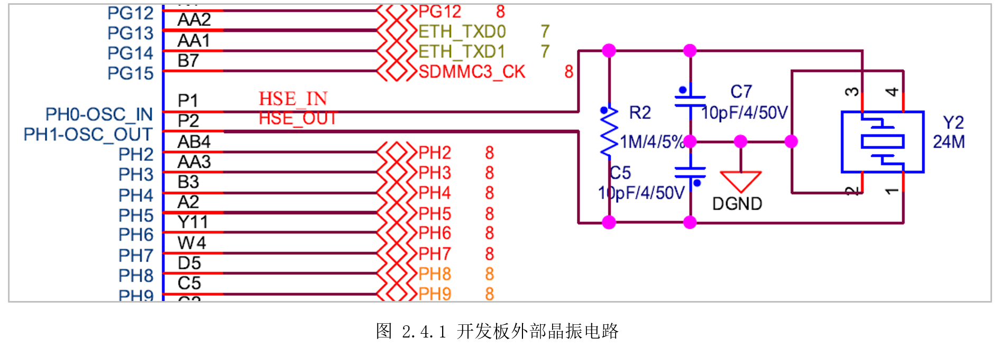
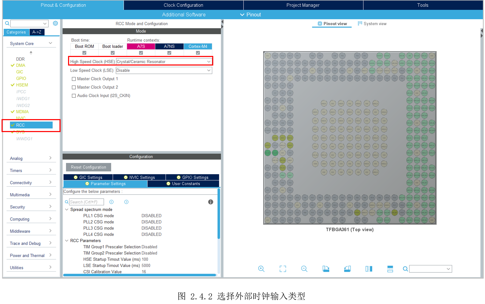
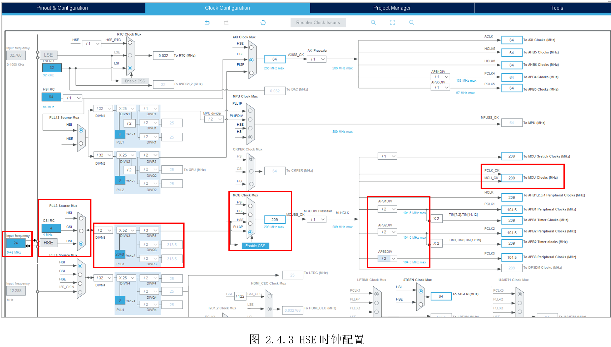
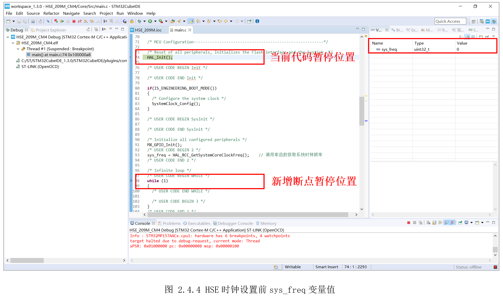
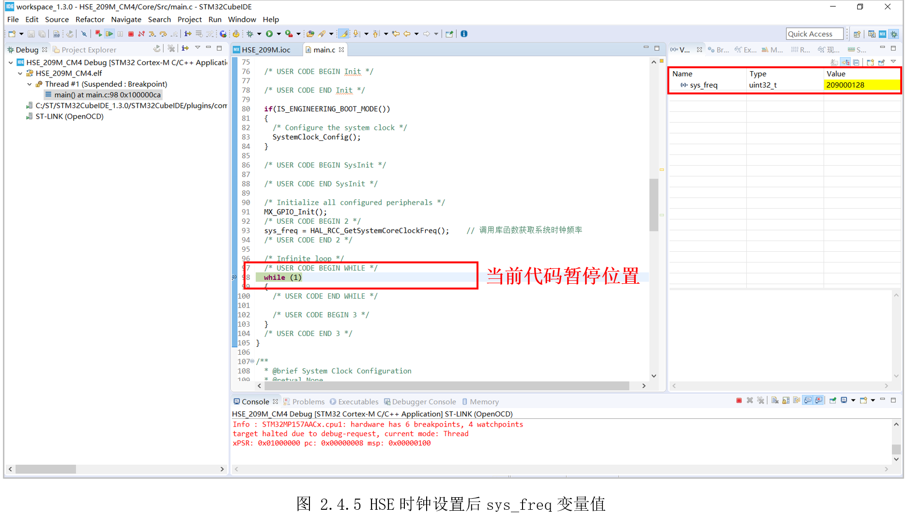

# 2.4 系统时钟—HSE

* 设计需求

这里假设需求为使用外部时钟HSE，让STM32MP157的M4全速运行在最高209MHz。

## 2.4.1基础知识

参考上一实验。

## 2.4.2硬件设计

打开开发板核心板原理图第2页，可以看到外部晶振输入为24MHz，外部晶振电路如图2.4.1所示。



## 2.4.3 MX设置

新建STM32CubeIDE工程，随后打开STM32CubeMX，点击“RCC”，在“High SpeedClock(HSE)”的复选框选择“Crystal/CeramicResonator”，也就是晶体/陶瓷晶振类型，如图 2.4.2所示。



随后切换到“Clock Configuration”，设置如图 2.4.3所示。



①为外部晶振输入，有原理图可知，输入晶振频率为24HMz；

②为PLL3的选择器，因为使用HSE作为时钟源，这里选中HSE；

③为PLL3锁相环，里面参数暂时无需设置，可以后面软件自动计算生成；

④为MCU时钟选择器，这里选择PLL3P，然后在后面输入需要的209MHz，按下回车，即可自动计算③中的参数值。注意选择器下方有个蓝色的“EnableCSS”,表示使能CSS(Clock SecuritySystem)时钟安全系统功能，即一旦检测到HSE时钟故障，则就会切换到内部RC振荡器作为时钟信号输入；

⑤为分频器，设置为“/2”防止超过外设最大时钟限制；

⑥为MCU系统时钟，已显示为209MHz；

## 2.4.4代码设计

同上一个实验一样，调用“HAL_RCC_GetSystemCoreClockFreq()”获取设置后的新系统时钟。

```c
/**
  * @brief  The application entry point.
  * @retval int
  */
int main(void)
{
  /* USER CODE BEGIN 1 */
  static uint32_t sys_freq = 0; // 定义一个全局变量获取系统时钟值，验证配置的时钟是否正确
  /* USER CODE END 1 */

  /* MCU Configuration--------------------------------------------------------*/

  /* Reset of all peripherals, Initializes the Flash interface and the Systick. */
  HAL_Init();

  /* USER CODE BEGIN Init */

  /* USER CODE END Init */

  if(IS_ENGINEERING_BOOT_MODE())
  {
    /* Configure the system clock */
    SystemClock_Config();
  }

  /* USER CODE BEGIN SysInit */

  /* USER CODE END SysInit */

  /* Initialize all configured peripherals */
  MX_GPIO_Init();
  /* USER CODE BEGIN 2 */
  sys_freq = HAL_RCC_GetSystemCoreClockFreq(); // 调用库函数获取系统时钟频率
  /* USER CODE END 2 */

  /* Infinite loop */
  /* USER CODE BEGIN WHILE */
  while (1)
  {
    /* USER CODE END WHILE */

    /* USER CODE BEGIN 3 */
  }
  /* USER CODE END 3 */
}

```


## 2.4.5实验效果

同上一实验方法一样，通过调试发现HSE时钟设置前，sys_freq变量初始值为0，如图2.4.4所示。



待系统时钟配置完成后，发现sys_freq值已经变为“209000128”,即209MHz，说明设置正确，如图2.4.5所示。



此外，读者也可尝试将CSI作为系统时钟，让M4运行在209MHz。

