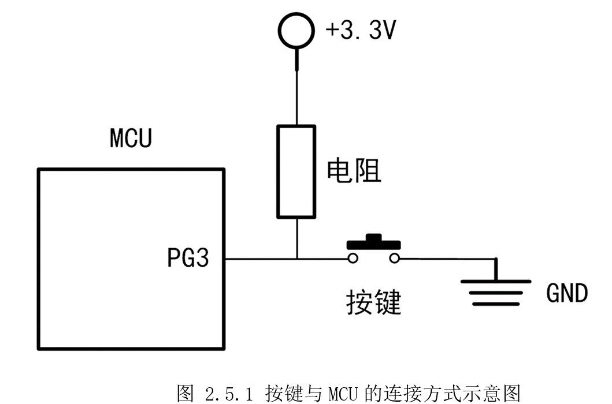
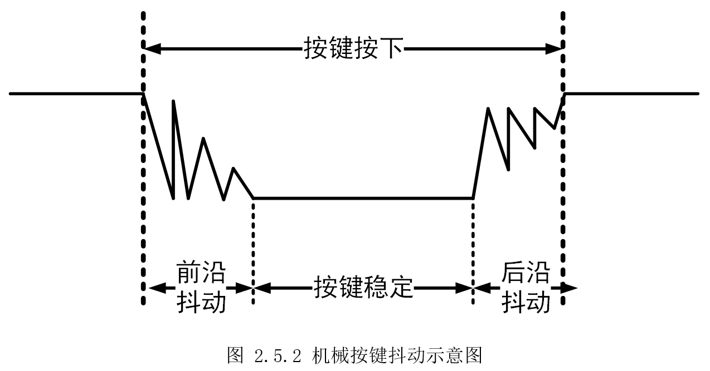
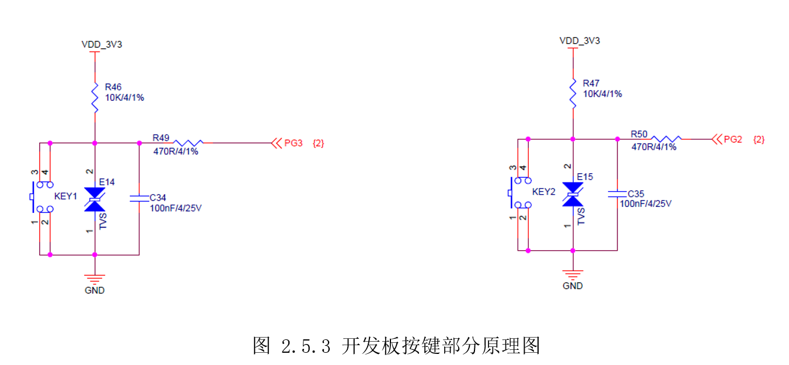
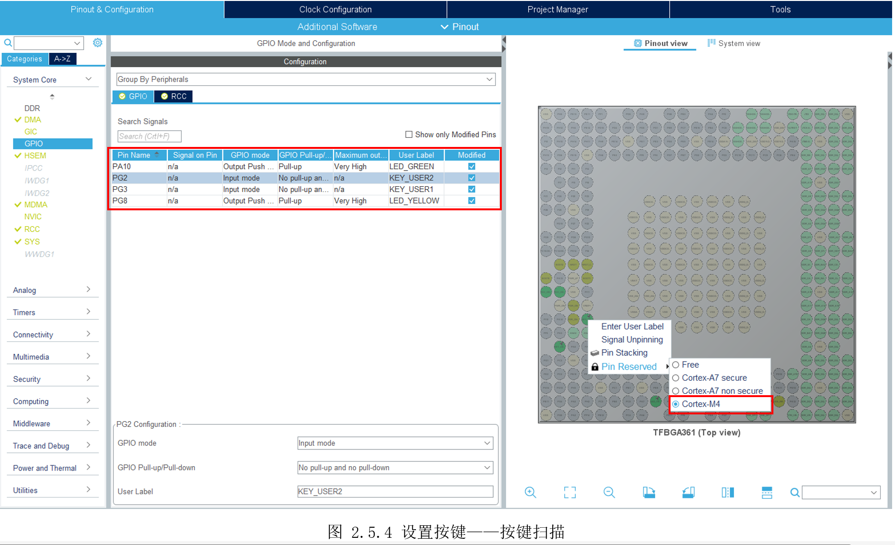

# 2.5 按键扫描

* 设计需求

这里假设需求为通过按键扫描的方式实现，按下KEY_USER1（KEY1）按键，点亮LED_GREEN，再次按下熄灭LED\_GREEN；按下KEY_USER2（KEY2）按键，点亮LED_YELLOW，再次按下熄灭LED_YELLOW。

## 2.5.1基础知识

前面LED灯是控制GPIO输出，而按键则是读取GPIO电平，从而获知用户是否按下按键。

按键监测一般有两种：按键扫描和按键中断。按键扫描是间隔很短时间反复查询GPIO状态，从而的值是否有按键动作，这种方式代码简单，但比较耗资源。按键中断而是通过按键产生中断信号，从而实现按键的检测，这种方式需要使用到中断机制，需要对MCU了解深入一点，效果是最好的。

本节先介绍按键扫描，理解按键的基本原理，下一节再介绍按键中断，同时了解M4的中断机制。

按键一般占用一个GPIO口，通过监测该GPIO的电平变化得知按键操作，典型的电路如图2.5.1所示。当所需按键比较多时，则可以采用矩阵按键减少GPIO的占用。矩阵按键需要通过编程扫描等方式实现对多个按键的监控，这里以最简单的独立按键为基础进行介绍。



可以看到，在没有按下按键时，电源3.3V通过电阻连接到MCU的PG3脚上，此时MCU读取PG3的电平就是3.3V的高电平。在按键按下时，电源3.3V经过电阻，再经过按键连接到了地，此时PG3连接到接地的一端，读到的电平就是0V的低电平。由此，MCU就可用过读取对应引脚的电平值，得知按键的变化。

常用的按键都是机械触点式按键，机械式按键在按下或释放的过程中，由于机械弹性作用的影响，会伴随机械抖动，如图2.3.6所示。



抖动的时长与机械开关特性相关，一般为5-10ms。在这抖动过程中，会产生多次高低电平，导致被识别为多次按键操作。为了避免机械触点按键检测误判，必须消抖处理。按键消抖可以硬件上处理，即在按键旁并联电容，吸收抖动的电平。也可以软件处理，即通过延时，避开抖动。

由此，首先获取对应引脚的电平得知按键状态，再硬件或软件消除抖动。

## 2.5.2硬件设计

打开配套资料里开发板底板原理图文件，按键原理图部分如所示。



开发板上有四个按键，其中两个是唤醒按键、复位按键，不在本次介绍范围内。另外两个为用户按键如上图所示，按键KEY1接在了MCU的PG3引脚上，同时并联了一个电容C34用于硬件去抖，软件上可以根据实际效果再决定是否软件去抖，还并联了一个TVS二极管防静电。同理,KEY2接在了PG2上。

## 2.5.3 MX设置

创建一个新工程，参考前面LED灯工程，设置两个LED灯，参考前面设置任一时钟源作为系统时钟。然后添加PG3、PG2，设置为输入模式“GPIO_Input”。注意按键输入引脚也要设置“PinReserved”-\>“Cortex-M4”，如图 2.5.4所示。



## 2.5.4代码设计

参考前面LED工程，在“DemoDriver”目录创建“driver_key.c”和“driver_key.h”。“driver_key.h”里定义引脚状态和读取函数，方便使用。

```c
/*********************
 * 按键引脚状态定义
**********************/
#define PUSH_DOWN                       GPIO_PIN_RESET
#define SPRING_UP                       GPIO_PIN_SET

/*********************
 * 引脚宏定义
**********************/

/*********************
 * 按键状态读取函数宏定义
**********************/
#define READ_KEY1                       HAL_GPIO_ReadPin(KEY_USER1_GPIO_Port, KEY_USER1_Pin)
#define READ_KEY2                       HAL_GPIO_ReadPin(KEY_USER2_GPIO_Port, KEY_USER2_Pin)

```


“driver_key.c”创建实现函数，读取按键GPIO状态和控制LED灯。

```c
/*
 *  函数名：void Key1Polling(void)
 *  输入参数：无
 *  输出参数：无
 *  返回值：无
 *  函数作用：使用轮询方式查询键是否按下，通过按下控制灯亮灭
*/
static bool key1_flag = false;
void Key1Polling(void)
{
    if(READ_KEY1 == PUSH_DOWN)     // 如果检测到键被按下
    {
        HAL_Delay();               //延时5ms防按键抖动
        if(READ_KEY1 == PUSH_DOWN) // 如果防抖动后按键依然是处于被按下的状态，就认为按键被按下过
        {
            key1_flag = !key1_flag; // 用一个标志位来判断按键被按下次数
            if(key1_flag)
            {
                LED_GREEN_ON();
            }
            else
            {
                LED_GREEN_OFF();
            }
        }
    }
}

/*
 *  函数名：void Key2Polling(void)
 *  输入参数：无
 *  输出参数：无
 *  返回值：无
 *  函数作用：使用轮询方式查询键是否按下，通过按下控制灯亮灭
*/
static bool key2_flag = false;
void Key2Polling(void)
{
    if(READ_KEY2 == PUSH_DOWN)     // 如果检测到键被按下
    {
        HAL_Delay(5);              // 延时5ms防按键抖动
        if(READ_KEY2 == PUSH_DOWN) // 如果防抖动后按键依然是处于被按下的状态，就认为按键被按下过
        {
            key2_flag = !key2_flag; // 用一个标志位来判断按键被按下次数
            if(key2_flag)
            {
                LED_YELLOW_ON();
            }
            else
            {
                LED_YELLOW_OFF();
            }
        }
    }
}

```


以“Key1Polling()”为例，宏READ_KEY1实质是使用HAL函数“HAL_GPIO_ReadPin()”读取按键引脚状态，如果是按下状态PUSH_DOWN，延时5ms去抖动，再次检测，如果防抖动后按键依然是处于被按下的状态，则本次按键有效。使用key1_flag标志位来判断按键被按下次数，每次取反，使LED点亮、熄灭交替。

最后在主函数的循环里，一直执行“Key1Polling()”和“Key2Polling()”，以检测按键是否按下。

## 2.5.5实验效果

编译程序，然后进入工程模式调试，按下KEY_USER1（KEY1）按键，点亮LED_GREEN，再次按下熄灭LED\_GREEN；按下KEY_USER2（KEY2）按键，点亮LED_YELLOW，再次按下熄灭LED_YELLOW。

