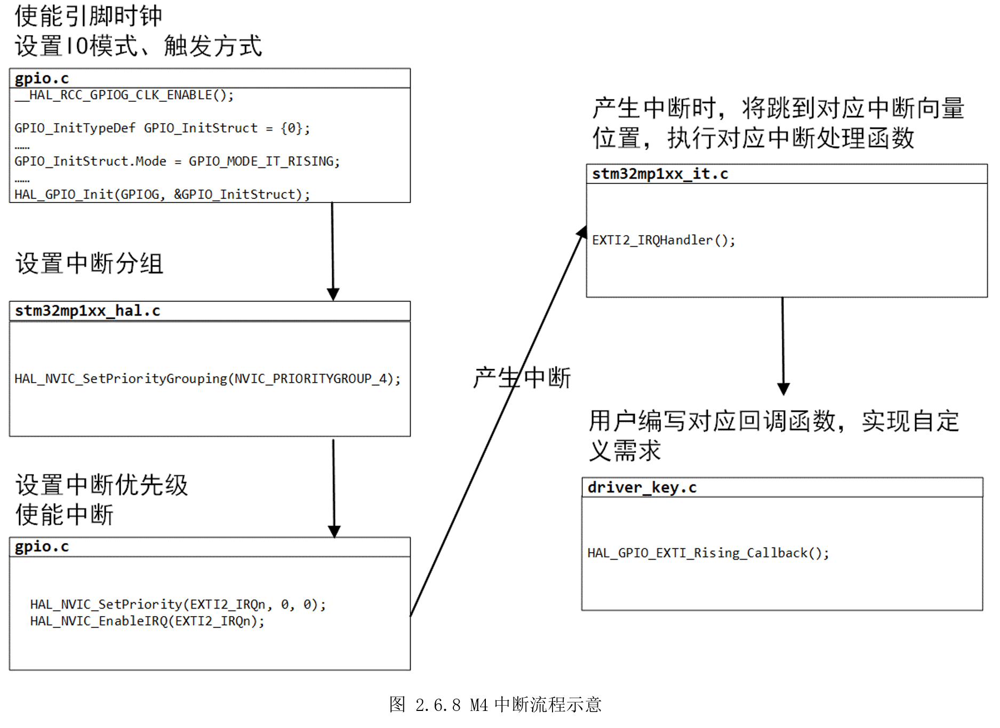

# 2.6 按键中断

* 设计需求

这里假设需求为通过按键中断的方式实现，按下KEY_USER1（KEY1）按键，点亮LED_GREEN，再次按下熄灭LED\_GREEN；按下KEY_USER2（KEY2）按键，点亮LED_YELLOW，再次按下熄灭LED_YELLOW。

## 2.6.1基础知识

* 中断的基本概念

正常情况下，微处理器根据代码内容，按顺序执行指令。执行过程中，如果遇到其它紧急的事件需要处理，则先暂停当前任务，执行紧急事件，待紧急事件处理完后，再恢复到刚才暂停的地方继续执行。这个产生的紧急事件就叫做中断，如图2.6.1所示。


* 中断的分类

CPU在执行指令时，检测到非法指令，比如除零、地址访问越界等，会产生中断，这种中断属于内部中断，也叫系统异常。由CPU外部设备引起的外部事件，比如GPIO中断、USART中断等，属于外部中断。

ARM
CM4内核可以支持256个中断，包括16个内部中断和240个外部中断。对于STM32MP157的M4,没有用到CM4内核的所有资源，只是用到了一部分，只有10个内部中断和150个外部中断，总计160个中断。如图2.6.2所示，上半部分是10个内部中断，下半部分是150个外部中断(中间部分省略)，一般用到的都是外部中断。


* 中断的优先级

M4拥有160个中断，这就引入了一些新问题。比如两个中断同时发生，应该先执行哪个中断任务？又比如一个中断发生了，又来了一个更紧急的中断，是该继续执行原来的中断，还是执行新的紧急中断？

针对这些问题，STM32的每个中断源都需要被指定抢占优先级（pre-emption
priority）级别和子优先级（subpriority）级别。

假设中断A的抢占优先级比中断B的抢占优先级高，两个中断同时发生，那么中断A优先执行。

假设中断A的抢占优先级和中断B的抢占优先级一样，两个中断同时发生，那么子优先级高的中断优先执行。

假设中断A的抢占优先级比中断B的抢占优先级高，中断B先发生，随后A也发生，那么将暂停中断B，先执行中断A，A执行完后，再回来执行中断B，最后执行主程序，这种效果即中断嵌套。

假设中断A的抢占优先级比中断B的抢占优先级一样，中断A的子优先级比中断B的子优先级高，中断B先发生，随后A也发生，那么中断A将等待中断B执行完后，才会执行中断A，即子优先级不能中断嵌套。

假设中断A的抢占优先级和中断B的抢占优先级一样，且子优先级也一样，两个中断同时发生，那么根据前面图2.6.2中断列表顺序，排在前面的先执行。

总结中断是否会优先执行依据：首先是抢占先式优先级等级，其次是子优先级等级，只有抢占先式优先级才才可能出现中断嵌套;

前面图2.6.2中蓝色框部分为“Fixed”，表示这几个中断优先级是固定的，不可软件编程调整，剩下的156个中断都是可以编程调整优先级。ARMCM4内核原本设计了一个8位寄存器来控制优先级，STM32没用到那么多，提供了一个NVIC（Nestedvectored interruptcontroller），即嵌套向量中断控制器来设置中断的优先级，只使用其高四位。

* 中断优先级的分组

现在问题又来了，前面提到一个中断由抢占优先级和子优先级组成。不同的场合有不同的需求，有些时候需要抢占优先级的等级多一点，有时候又需要子优先级的等级多一点，那如何满足不同的需求呢？STM32又提供一个新概念，中断优先级分组，如表2.6.1所示。


有了中断优先级分组后，用户就可以根据自己实际需求设置分组，从而得到不同效果。比如一个项目需要子优先级分级比较多，即可考虑设置为NVIC_PriorityGroup_0，这样就有16个等级的子优先级可设置。注意等级的值越小，优先级越高。

* GPIO的中断

STM32MP157有PA-PI、PZ共10组GPIO，每组GPIO又有0-15共16个GPIO。数字编号相同的GPIO(PA0、PB0、PC0……PI0、PZ0)，共享一个中断源，如图2.6.3所示。由EXTI（Extended interrupt and event
controller）来决定是哪个GPIO接入中断，检测哪一种类型（上升沿、下降沿、双边沿）事件产生中断。


## 2.6.2硬件设计

同前面按键扫描部分。

## 2.6.3 MX设置

新建STM32CubeIDE工程，打开STM32CubeMX，参考前面配置好LED灯和时钟。选择PG3,选择引脚复用功能为“GPIO_EXTI3”，如图2.6.4所示。


然后记得设置“Pin Reserved”给“Cortex-M4”，在下方“PG3 Configuration”的“GPIOmode”设置“External Interrupt Mode with Rising edge triggerdetection”，同理设置PG2，最终如图 2.6.5所示。


这里选择的是上升沿检测，即电平发生上升时，产生中断。参考前面图2.5.2可知，按键按下是由高电平变低的过程，松开按键才是低电平变高的过程。这里效果则是按下按键、松开按键时，才产生中断，得知有按键操作。另外，“ExternalInterrupt Mode……”用在中断方式编程，才能够触发中断，而“External Event
Mode……”用在查询方式，只设置中断标志位，不产生中断。

接着切到NVIC标签，使能中断，如图 2.6.6所示。


如果还需调整中断优先级，需进入NVIC控制器设置界面，先选择分组，然后设置抢占优先级和子优先级。这里用到的是PG2、PG3引脚，对应的中断线就是EXIT2和EXIT3。如果对中断优先级没什么特殊需求，如图2.6.7所示默认中断优先级即可。


## 2.6.4代码设计

前面设置STM32CubeMX时，设置哪个脚用于中断，检测哪种类型（上升沿）、中断分组、中断优先级、中断使能，这些都在自动生成的“gpio.c”里有体现，代码的编写就可以跳过了。

```c
/** Configure pins as 
        * Analog 
        * Input 
        * Output
        * EVENT_OUT
        * EXTI
*/
void MX_GPIO_Init(void)
{

  GPIO_InitTypeDef GPIO_InitStruct = {0};

  /* GPIO Ports Clock Enable */
  __HAL_RCC_GPIOH_CLK_ENABLE();
  __HAL_RCC_GPIOA_CLK_ENABLE();

  /*Configure GPIO pins : PGPin PGPin */
  GPIO_InitStruct.Pin = KEY_USER1_Pin|KEY_USER2_Pin;
  GPIO_InitStruct.Mode = GPIO_MODE_IT_RISING; // 设置上升沿触发中断
  GPIO_InitStruct.Pull = GPIO_NOPULL;
  HAL_GPIO_Init(GPIOG, &GPIO_InitStruct);

  /* 省略LED灯部分 */

  /* EXTI interrupt init*/
  HAL_NVIC_SetPriority(EXTI2_IRQn, 0, 0);    // 设置中断线抢占优先级和子优先级
  HAL_NVIC_EnableIRQ(EXTI2_IRQn);            // 使能中断

  HAL_NVIC_SetPriority(EXTI3_IRQn, 0, 0);
  HAL_NVIC_EnableIRQ(EXTI3_IRQn);

}

```


而中断分组设置则在“HAL_Init()”里面。

```c
HAL_StatusTypeDef HAL_Init(void)
{
  /* Set Interrupt Group Priority */
#if defined (CORE_CM4)
  HAL_NVIC_SetPriorityGrouping(NVIC_PRIORITYGROUP_4);
#endif
……
}

```


真正用户需要编写的代码是实现GPIO外部中断上升沿回调函数“HAL_GPIO_EXTI_Rising_Callback()”，在“driver_gpio.c”中实现该函数。

```c
/*
 *  函数名：void HAL_GPIO_EXTI_Callback(void)
 *  输入参数：无
 *  输出参数：无
 *  返回值：无
 *  函数作用：外部中断处理函数的回调函数，用以处理不同引脚触发的中断服务最终函数
*/
static volatile bool key1_flag = false;           // 定义一个全局静态标志，用以判断按键按下的次数
static volatile bool key2_flag = false;
void HAL_GPIO_EXTI_Rising_Callback(uint16_t GPIO_Pin)
{
  switch(GPIO_Pin)
  {
    case KEY_USER1_Pin:
    {
      key1_flag = !key1_flag;
      if(key1_flag)
      {
        LED_GREEN_ON();
      }
      else
      {
        LED_GREEN_OFF();
      }
      break;
    }

    case KEY_USER2_Pin:
    {
      key2_flag = !key2_flag;
      if(key2_flag)
      {
        LED_YELLOW_ON();
      }
      else
      {
        LED_YELLOW_OFF();
      }
      break;
    }
    default:break;
  }
}

```


当GPIO发生上升沿的外部中断时，就会最终调用到“HAL_GPIO_EXTI_Rising_Callback()”，根据传入的引脚，得知是哪个引脚发生了该中断，从而控制对应的LED灯，实现需求。我们主函数，这次无需添加任何代码。

M4的一般外部中断实现流程如图2.6.8所示，前面三步都是通过配置STM32CubeMX修改，最后只需编写回调函数，即可使用中断。



## 2.6.5实验效果

编译程序，然后进入工程模式调试，按下KEY_USER1（KEY1）按键，点亮LED_GREEN，再次按下熄灭LED\_GREEN；按下KEY_USER2（KEY2）按键，点亮LED_YELLOW，再次按下熄灭LED_YELLOW。

