# 2.7 串行通信—串口打印

* 设计需求

使用串口打印调试信息。

## 2.7.1基础知识

在嵌入式中，通信将主控芯片与传感器、存储芯片、外围控制芯片等连接了起来，使得功能不再受限于主控本身。主控既从其它设备获取信息，也将自己的信息传递给其它设备。如果通信没处理好，将直接影响整个系统的功能，由此可见通信技术的重要性。

常见的通信协议有UART、I2C、SPI、1-Wire等，这里先简单介绍一些通信的基本概念。

* **串行/并行**

按照数据传输的方式，通信可以分为串行通信和并行通信。串行通信简单的说就是数据依次传输，比如要传输0x11111111，一位一位的发送，需要发送8次。并行通信则是几个数据一起传输，同样是0x11111111，如果8位一起发送，只需要发送1次，如图2.7.1所示。

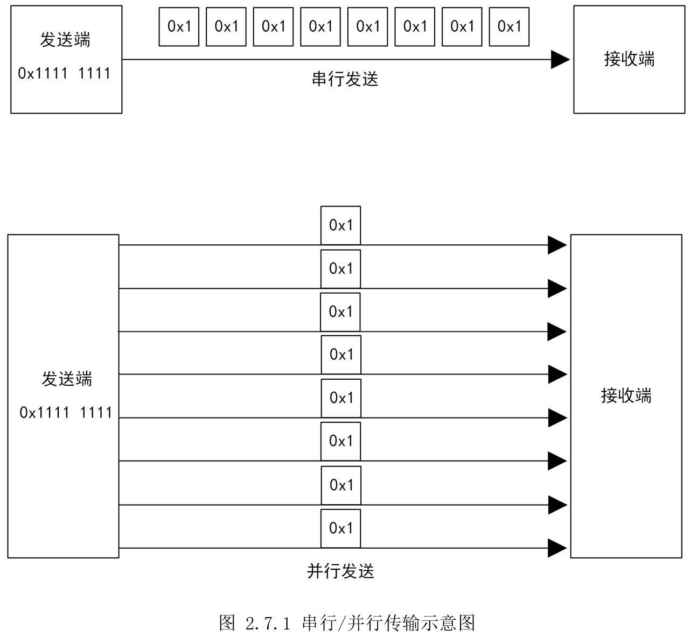

由此可见，串行传输占用的通信线更少，成本低，通信速度相对较慢；并行传输占用的通信线多，成本高，通信速度相对更快。但随着对传输速度要求越来越高，并行传输开始出现信号之间的干扰，串行通信受干扰影响较小，之后又发展出差分传输等技术，极大的提高了串行传输速率，使得串行通信速度可能比并行通信速度更快。

串行通信就像单车道，行驶的车辆需要依次行驶。并行通信就像多车道，同时多辆汽车并排行驶。但当车速很快的时候，多车道上并列行驶的汽车之间会形成“气流”相互干扰，单车道则受影响较小，速度能够进一步提升。

* **全双工/半双工/单工**

按照数据传输的方向，通信可以分为全双工、半双工和单工。全双工指双方都可以同时收发信息；半双工双方都可以收发信息，但同一时刻只能一方发送信息；单工指只能一方发信息，一方接受信息，通信是单向的。

全双工就像双向车道，来往车辆互不影响；半双工就像乡间狭窄小道，同一时刻只能一方行驶；单工就像单向车道，从头到尾就只有向一个方向行驶，如图2.7.2所示。


* **同步/异步**

按数据同步的方式，通信可以分为同步通信和异步通信。数据在双方之间传输时，需要制定规则保证数据传输的准确。同步通信的做法是加一个时钟信号，发送方和接收方在这个时钟的节拍下传输数据，比如常见的SPI、I2C。而异步通信的做法是对数据进行封装，在数据开头加上起始信号，在数据结尾加上终止信号，双方就按这个规则传输数据，比如UART、1-Wire。

因此，可以通过是否有时钟信号，初步判断是何种数据同步方式。

* **通信速率**

对于同步通信，通信速率由时钟信号决定，时钟信号越快，传输速度就越快。

对于异步通信，需要收发双方提前统一通信速率，这也就是我们串口调试时，波特率不对显示乱码的原因。

时钟对通信的重要性，这里再举个例子：假设发送端时钟频率为1Mhz，对应时钟周期则为1us,
接收端时钟频率为10Mhz，对应时钟周期则为0.1us。现在发送端发送一个数据0x1，就会产生一个持续时间为1us高电平，接收端接收到这个1us的高电平时，会当作是10个0.1us的高电平，认为收到了10个0x1。这时双方数据就乱套了，因此需要一个统一的时钟标准。

* **电平标准**

说到串口，经常提到TTL、RS232、RS422、RS485，简单的说，就是为了适应不同的环境条件，使用了不同的电平标准。假如微处理器和板载的蓝牙透传模块通信时，一般就使用TTL电平，引脚直接连接即可。假如微处理器在工业现场，需要连接一个几十米外的装置，则应该考虑将TTL电平转为RS232、RS422、RS485。

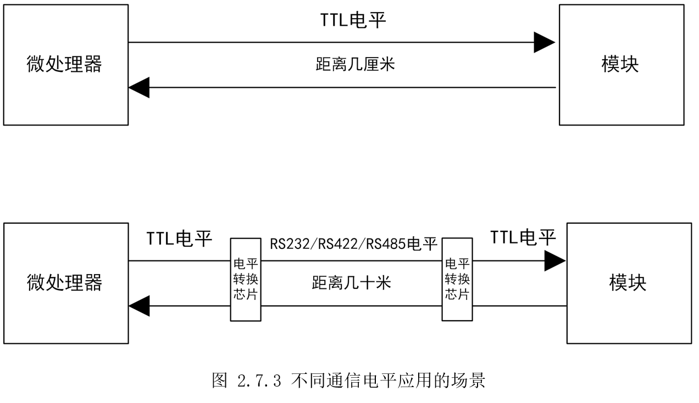

如下表2.7.1是几个通信接口标准总结。可以发现为了加大传输距离，人们依次尝试了增加电压、差分传输等方式。

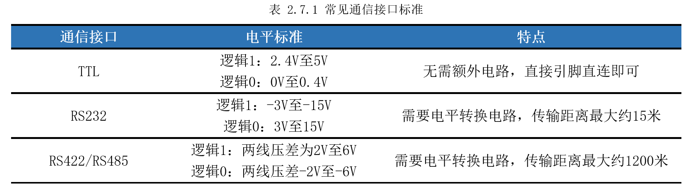

回到100ASK_STM32MP157开发板，由前面图2.1.1可知，STM32MP157有8个串口，其中USART1是A7独享；USART（Universal synchronousasynchronous receivertransmitter）通用同步异步收发器有三个,可以分给A7或M4；UART（Universalasynchronous receivertransmitter）通用异步收发器有四个，也可以分给A7或M4。USART和UART的区别，USART支持同步通信，可以主动提供时钟，常用的还是UART。

有了前面的知识，现在就知道STM32MP157的UART，是串行全双工传输，常用的是异步通信方式，需要设置好数据封装和通信速率，电平标准需要看电路图。

## 2.7.2硬件设计

100ASK_STM32MP157开发板主要用的了两个串口，一个用于调试，一个引出供用户使用。

如图2.7.4所示，UART4_RX（PA11）和UART4_TX（PA12）经过缓冲器（U5）接到了串口转USB芯片（U6），得到的USB信号通过Type-C（J5）连接电脑。

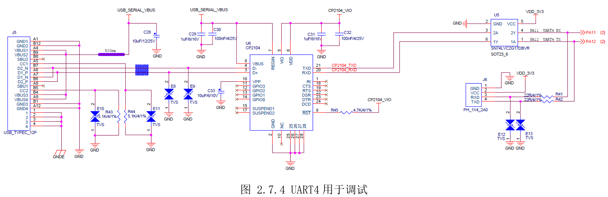

如图 2.7.5所示，提供了UART8_TX（PE1）和UART8_RX（PE0）供用户使用。

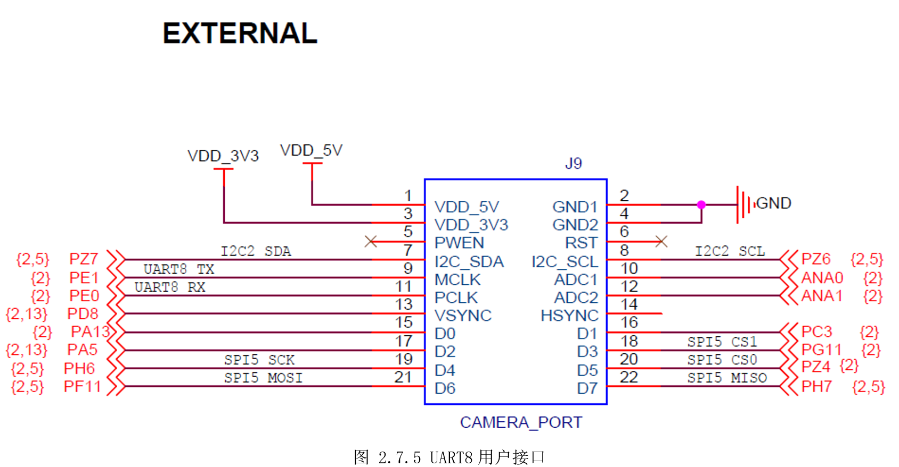

正常开发时，UART4默认用于A7的Linux信息输出，因此用户只能将UART8分给M4，用于M4外接模块或者外接TTL转USB设备。但本结主要是介绍如何让M4串口打印，因此直接使用UART4，后续高级开发的核之间通信里，会分别使用两个串口。

## 2.7.3 MX设置

将PA11、PA12分别设置为UART4_RX和UART4_TX，如图 2.7.6所示。

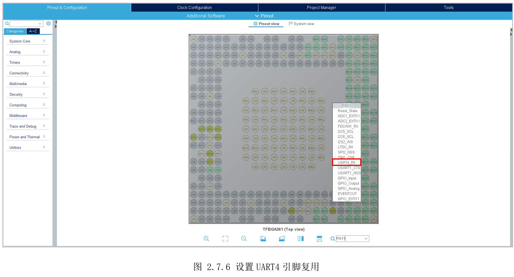

然后切换到“Connectivity”选中“UART4”，在“Boottime”勾选给“Cortex-M4”,在“Mode”下拉栏选择异步“Aynchronous”。再选中下面的“ParameterSettings”标签，可以看到波特率设置、数据长度设置、极性设置、停止位设置等，如所示。也就是前面介绍提到的异步通信需要提前制定好规则，后面电脑端的串口设置也要设置一样，才能正常通信。

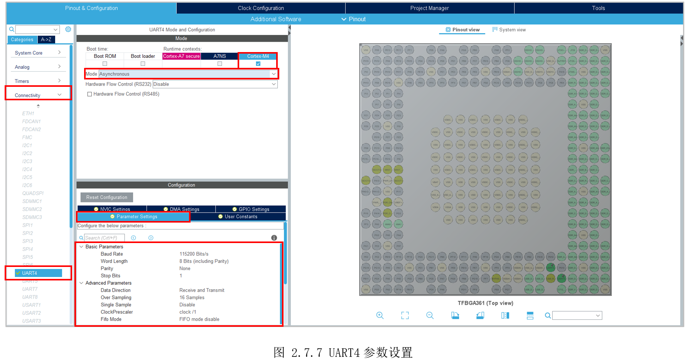

然后参考前面的系统章节，先设置为RCC选择外部时钟输入。然后切换到“ClockConfiguration”，将整个时钟配置为如图2.7.8所示。可以看到系统时钟工作在209MHz，然后二分频为104.5MHz给PCLK1，最后UART4选择这个PCLK1作为时钟源，工作在104.5MHz。

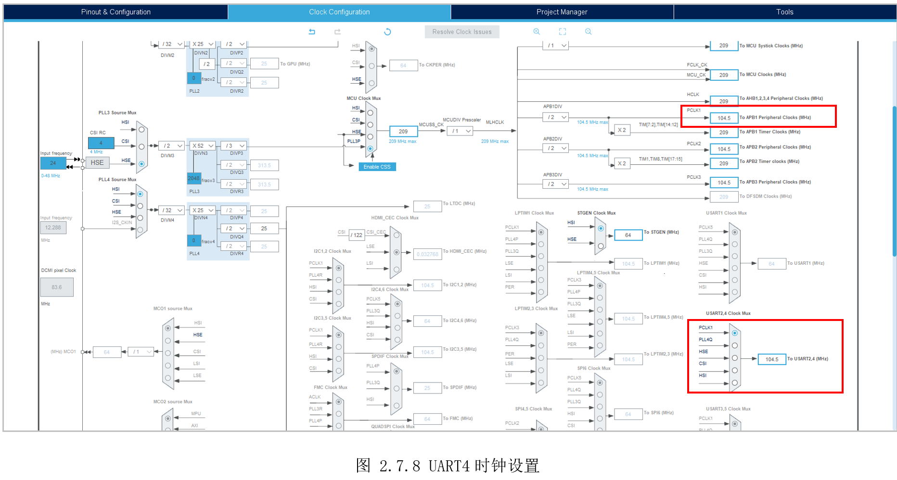

STM32CubeMX生成代码后，进入STM32CubeIDE，选择菜单栏的“Project”，选择“Properties”。为了后面串口打印时能够打印float类型，这里需要勾选上“Usefloat with printf from newlib-nano(-u \_printf_float)”和“Use float with scanffrom newlib-nano(-u \_printf_float)”，如图 2.7.9所示。

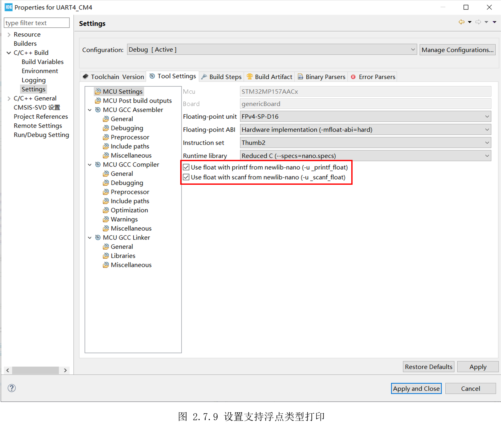

## 2.7.4代码设计

前面在STM32CubeMX配置UART4的要点，STM32CubeMX在“usart.c”文件里自动生成了代码，这里对重要部分进行了注释，供读者参考。

```c
UART_HandleTypeDef huart4;

/* UART4 init function */
void MX_UART4_Init(void)
{

  huart4.Instance = UART4;                         // 选择串口
  huart4.Init.BaudRate = 115200;                   // 设置波特率
  huart4.Init.WordLength = UART_WORDLENGTH_8B;     // 选择数据长度
  huart4.Init.StopBits = UART_STOPBITS_1;          // 选择停止位
  huart4.Init.Parity = UART_PARITY_NONE;           // 选择校验位
  huart4.Init.Mode = UART_MODE_TX_RX;              // 选择收发方向
  huart4.Init.HwFlowCtl = UART_HWCONTROL_NONE;     // 硬件流控制
  huart4.Init.OverSampling = UART_OVERSAMPLING_16; // 过采样位数
  huart4.Init.OneBitSampling = UART_ONE_BIT_SAMPLE_DISABLE; // 过采样不使能
  huart4.Init.ClockPrescaler = UART_PRESCALER_DIV1;// 时钟分频
  huart4.AdvancedInit.AdvFeatureInit = UART_ADVFEATURE_NO_INIT;
  if (HAL_UART_Init(&huart4) != HAL_OK)
  {
    Error_Handler();
  }

  // 设置发送FIFO缓存长度
  if (HAL_UARTEx_SetTxFifoThreshold(&huart4, UART_TXFIFO_THRESHOLD_1_8) != HAL_OK)
  {
    Error_Handler();
  }

  // 设置接收FIFO缓存长度
  if (HAL_UARTEx_SetRxFifoThreshold(&huart4, UART_RXFIFO_THRESHOLD_1_8) != HAL_OK)
  {
    Error_Handler();
  }

  // 不使能FIFO模式
  if (HAL_UARTEx_DisableFifoMode(&huart4) != HAL_OK)
  {
    Error_Handler();
  }

}

```


为了能支持printf打印，还需将uart4和printf绑定，在“usart.c”的“USER CODE BEGIN1”后添加如下代码。

```c
/* USER CODE BEGIN 1 */
// 加上此段才可以使用printf()函数
#ifdef __GNUC__

#define PUTCHAR_PROTOTYPE int __io_putchar(int ch)

PUTCHAR_PROTOTYPE
{

  HAL_UART_Transmit(&huart4, (uint8_t*)&ch, 1, HAL_MAX_DELAY);
  return ch;
}
#endif
/* USER CODE END 1 */

```


其作用就是使用我们定义的“HAL_UART_Transmit(&huart4, (uint8_t\*)&ch, 1,
HAL_MAX_DELAY);”代替系统的“__io_putchar(int ch)”编译。

最后，在主函数添加常用的测试打印语句，验证打印是否可用。

```c
  /* Infinite loop */
  /* USER CODE BEGIN WHILE */
  while (1)
  {
    /* USER CODE END WHILE */

    /* USER CODE BEGIN 3 */
      printf("=========This is printf test=========\n\r");
      printf("test char            = %c,%c\n\r", 'H', 'c');
      printf("test string1         = %s\n\r", "www.100ask.net");
      //中文打印需要将文件编码改为UTF-8,但会导致注释乱码
      //printf("test string2         = %s\n\r", "深圳百问网科技有限公司");
      printf("test decimal1 number = %d\n\r", 123456);
      printf("test decimal2 number = %d\n\r", -123456);
      printf("test hex1     number = 0x%x\n\r", 0x123456);
      printf("test hex2     number = 0x%08x\n\r", 0x123456);
      printf("test float           = %.5f\n\r", 3.1415);
      printf("test double          = %.10lf\n\r", 3.141592653);

      HAL_Delay(2000);
  }
  /* USER CODE END 3 */
}

```


## 2.7.5实验效果

将Type-C线一端连接到板子调试串口位置，一端连接电脑USB，如图 2.7.10所示。

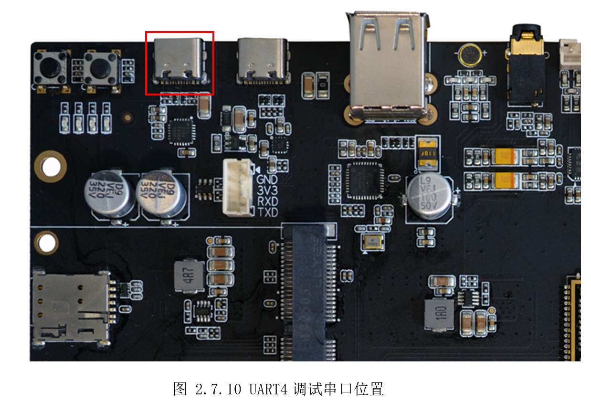

打开MobaXterm之类的串口工具，选择对应端口，设置好波特率115200、8位数据位、1位停止位、无极性、无流控，如图2.7.11所示。

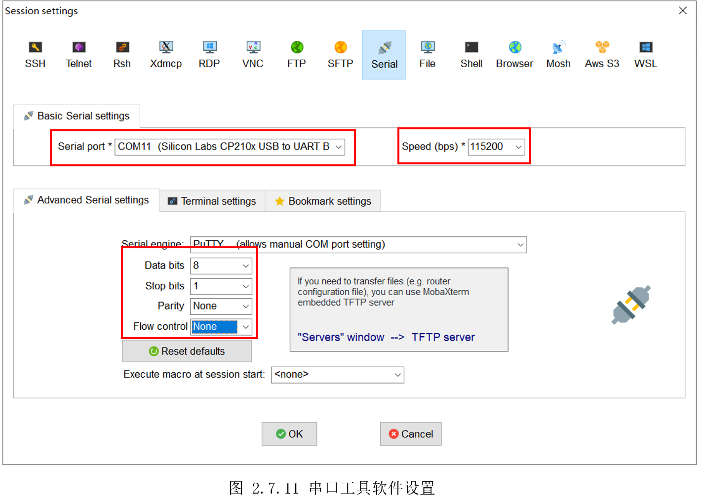

串口打印如图 2.7.12，打印数据正常。

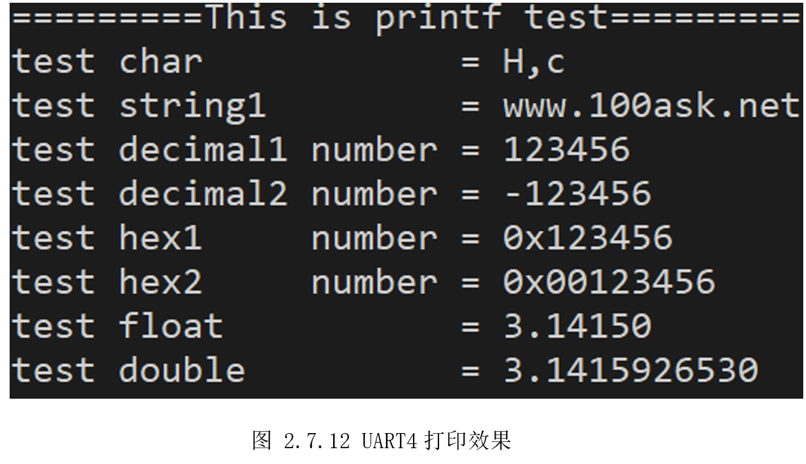

