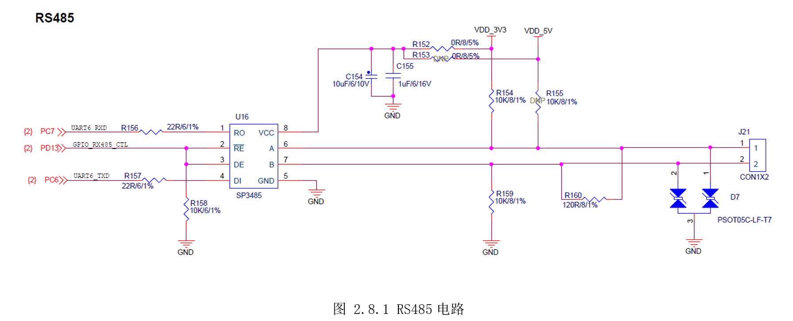
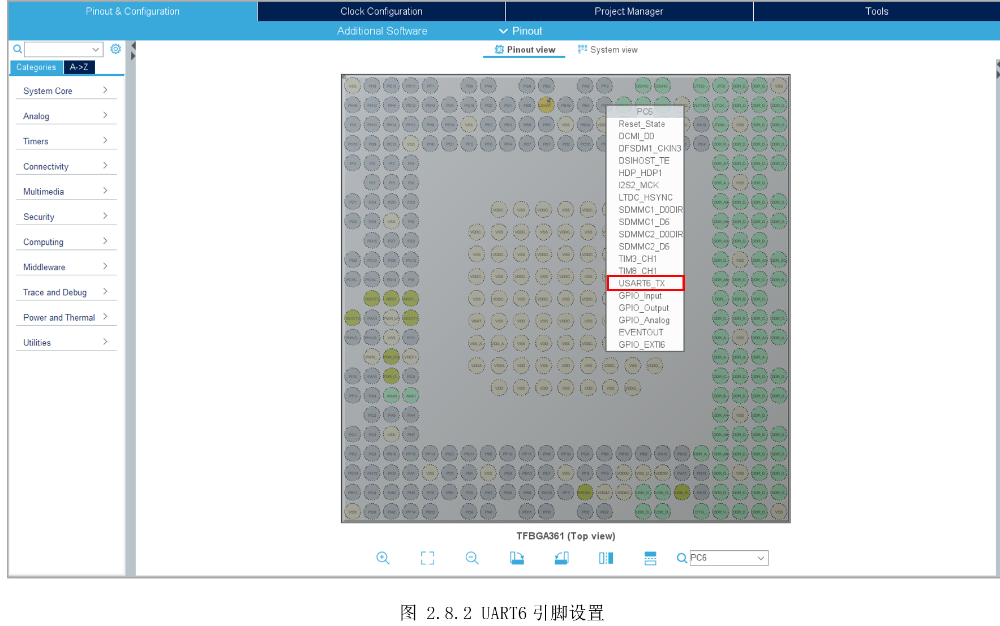
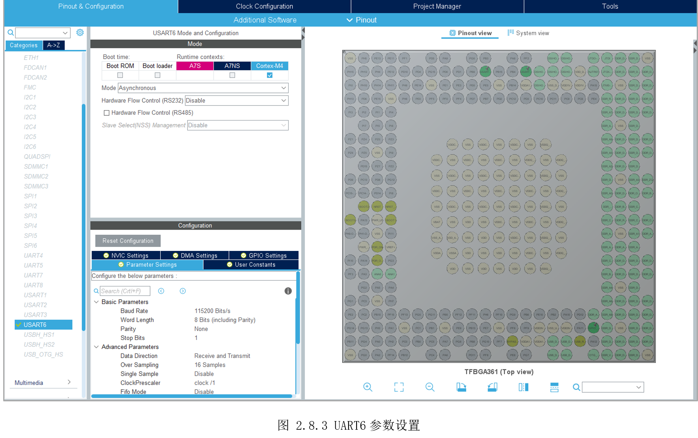
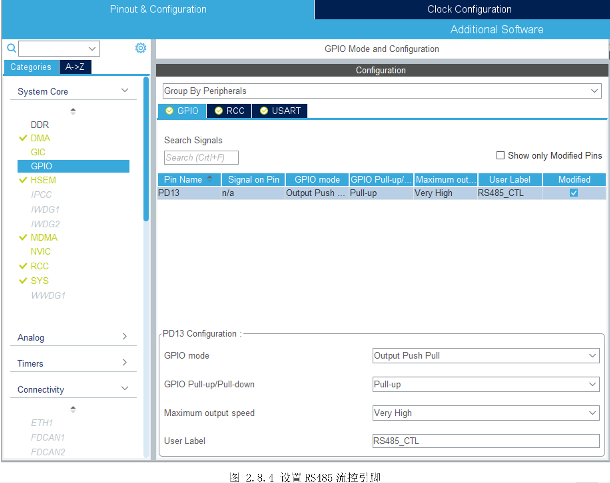
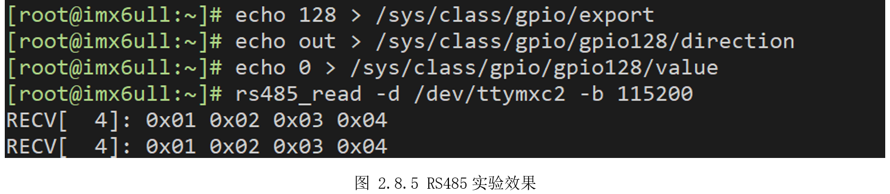

# 2.8 串行通信—RS485

* 设计需求

使用RS485与另一块开发板的RS485通信。

## 2.8.1 基础知识

RS485的本质还是串口，参考上一实验的介绍。

## 2.8.2 硬件设计

RS485的电路如下，使用的UART6_RX（PC7）和UART6_TX（PC6），相对前面的实验多了一个收发控制引脚PD13。RS485是差分信号，无论是发送还是接收工都需要A、B同时进行，且同一时刻只能发或收，因此它是半双工。

RE和DE端分别为接收和发送的使能端，当RE为逻辑0时，U16处于接收状态；当DE为逻辑1时，U16处于发送状态。



## 2.8.3 MX设置

STM32CubeMX的设置和前面操作完全一致，只是这次改为了UART6，如图 2.8.2所示。



UART4的设置也和前面一样，注意这里有个“Hardware FlowControl(RS485)”不用勾选，因为硬件上没有使用RS485_RE引脚来控制流控，使用的是其它GPIO。



与前面不同的是，这里需要设置PD13为普通GPIO输出，如图 2.8.4所示。



最后就是参考前面设置对应时钟即可。

## 2.8.4 代码设计

代码部分主要就是注意下流控控制，然后调用HAL库函数发送数据即可。创建“driver_rs485.h”，定义流控引脚。

```c
#define DE_TX() HAL_GPIO_WritePin(RS485_CTL_GPIO_Port, RS485_CTL_Pin, GPIO_PIN_SET)
#define DE_RX() HAL_GPIO_WritePin(RS485_CTL_GPIO_Port, RS485_CTL_Pin, GPIO_PIN_RESET)
```


主函数控制流控，调用“HAL_UART_Transmit()”发送数据，“HAL_UART_Receive()”接收数据。

```c
/**
  * @brief  The application entry point.
  * @retval int
  */
int main(void)
{
  /* USER CODE BEGIN 1 */
    uint8_t txdata[4] = {1, 2, 3, 4};
  /* USER CODE END 1 */

  /* MCU Configuration--------------------------------------------------------*/

  /* Reset of all peripherals, Initializes the Flash interface and the Systick. */
  HAL_Init();

  /* USER CODE BEGIN Init */

  /* USER CODE END Init */

  if(IS_ENGINEERING_BOOT_MODE())
  {
    /* Configure the system clock */
    SystemClock_Config();
  }

  /* USER CODE BEGIN SysInit */

  /* USER CODE END SysInit */

  /* Initialize all configured peripherals */
  MX_GPIO_Init();
  MX_USART6_UART_Init();
  /* USER CODE BEGIN 2 */

  /* USER CODE END 2 */

  /* Infinite loop */
  /* USER CODE BEGIN WHILE */
  while (1)
  {
    /* USER CODE END WHILE */

    /* USER CODE BEGIN 3 */
      DE_TX();
      HAL_UART_Transmit(&huart6, (uint8_t*)&txdata, sizeof(txdata), HAL_MAX_DELAY);
      DE_RX();

      HAL_Delay(2000);
  }
  /* USER CODE END 3 */
}

```


## 2.8.5 实验效果

这里使用运行Linux的IMX6ULL作为RS485的接收对象，读者可以自行选择其它RS485接口设备。将100ASK_STM32MP157的A、B对应接到IMX6ULL的A、B。启动IMX6ULL并运行RS485读取程序，同时M4启动，可以看到IMX6ULL收到RS485发过来的数据，如所示。



