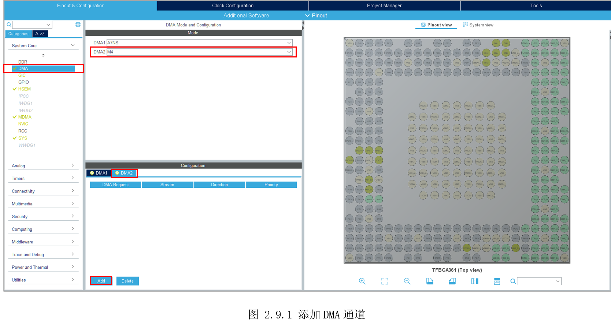
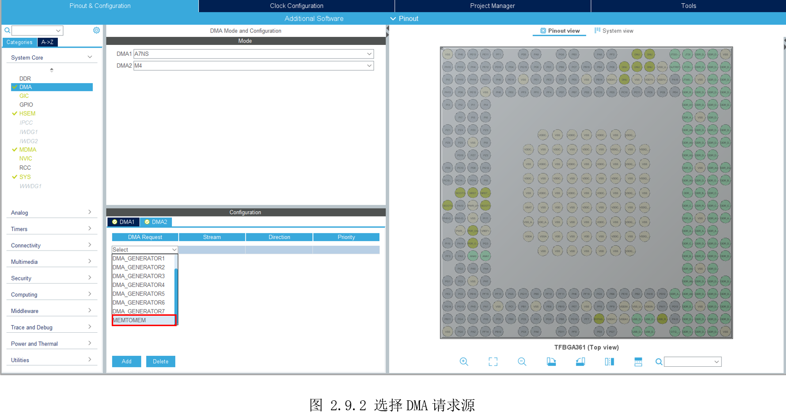
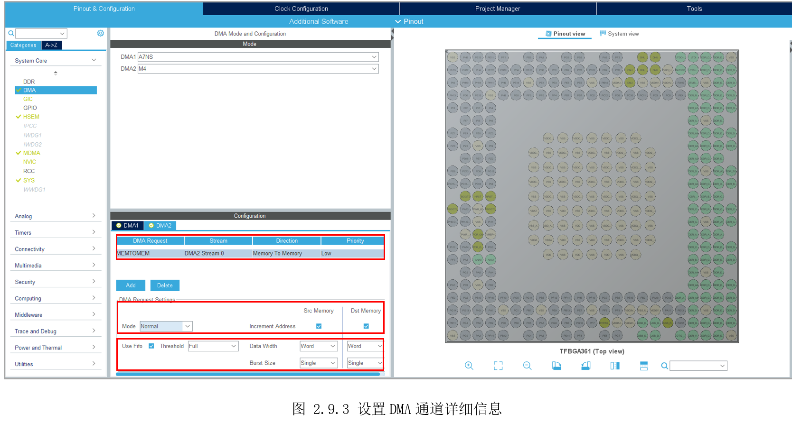
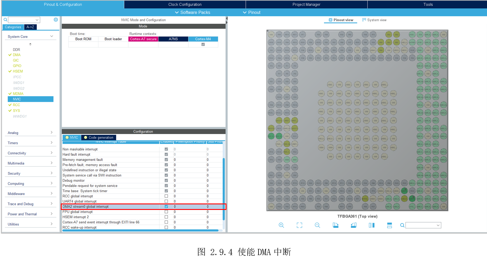
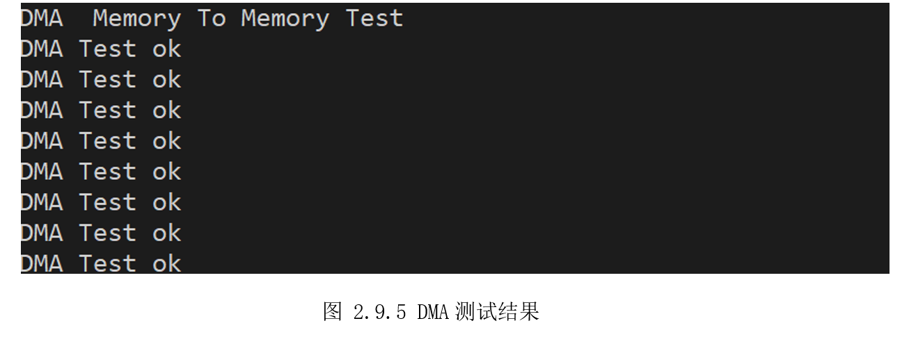

# 2.9 DMA—MemoryToMemory

* 设计需求

使用DMA将内存A处数据搬运到内存B处。

## 2.9.1 基础知识

DMA(Direct MemoryAccess)直接内存访问，可以大大减轻CPU工作量。CPU根据代码内容执行指令，这些众多指令中，有用于计算、有控制程序、有转移数据等。其中转移数据的指令，尤其是转移大量数据，会占用大量CPU。如果是把外设A的数据，传给外设B，这种情况不需要CPU一直参与，只需在A、B之间创建个通道，让它们自己传输即可。这就是DMA设计的目的，减少大量数据转移指令消耗CPU，DMA专注数据转移，CPU专注计算、控制。

DMA主要实现将A处的数据直接搬运到B处，这里的A、B可以是内存，也可以是外设，因此所有的场景如如下四种：

* 内存到外设

* 外设到内存

* 内存到内存

* 外设到外设

无论是以上何种方式，都是先设置好DMA的数据源地址、数据目标地址、数据长度。设置好后，启动DMA就可以自动的把数据从源地址依次传输到目标地址。

由前面图2.1.1可以看到，STM32MP157有四个DMA，其中DMA1和MDMA是A7独享，DMAMUX需要指定分配给A7或M4，DMA2是M4独享。

这里使用DMA2，演示如何设置DMA搬运数据，后续在其它外设章节，还会使用到DMA。

## 2.9.2 硬件设计

不涉及电路设计。

## 2.9.3 MX设置

参考图 2.9.1为DMA2添加通道。



如图 2.9.2为新增DMA通道选择请求源。



接着会自动出现图2.9.3所示的DMA通道详细信息，可以大致分为三部分。第一部分是DMA请求类型，选择的通道(默认通道0，可选1-7，共8个通道)，DMA通道描述、优先级，全都默认即可。接着是DMA请求的一些设置，这里“Mode”选择默认的“Normal”，即不循环传输，勾选上源内存和目标内存地址自动递增。第三部分是FIFO相关，默认使用FIFO，且搬运的数据宽度为Word，每次搬运一个。



在最后DMA搬运完后，还需要产生中断告知搬运完成，因此这里还需要使能DMA中断，如图2.9.4所示。



## 2.9.4 代码设计

配置完STM32CubeMX，自动生成的DMA初始化和中断设置，都在“dma.c”里。接着还需要注册DMA传输完成和DMA传输错误回调函数，在回调函数里修改标志位，就可以得知传输是否完成或出错。新建“DemoDriver”文件夹创建“driver_dma.c”文件，内容如下：

```c
__IO uint32_t transferErrorDetected;
__IO uint32_t transferCompleteDetected;

static void TransferComplete(DMA_HandleTypeDef *DmaHandle);
static void TransferError(DMA_HandleTypeDef *DmaHandle);

/*
 *  函数名：void RegisterCallbackFunction(void)
 *  输入参数：无
 *  输出参数：无
 *  返回值：无
 *  函数作用：注册回调函数
*/
void RegisterCallbackFunction(void)
{
      // 注册传输完成和传输错误回调函数
      HAL_DMA_RegisterCallback(&hdma_memtomem_dma2_stream0, HAL_DMA_XFER_CPLT_CB_ID, TransferComplete);
      HAL_DMA_RegisterCallback(&hdma_memtomem_dma2_stream0, HAL_DMA_XFER_ERROR_CB_ID, TransferError);

      // 配置DMA的中断优先级及其使能(在dma.c的MX_DMA_Init里自动生成)
      // HAL_NVIC_SetPriority(DMA2_Stream0_IRQn, 0, 0);
      // HAL_NVIC_EnableIRQ(DMA2_Stream0_IRQn);
}

/*
 *  函数名：void TransferComplete(DMA_HandleTypeDef *DmaHandle)
 *  输入参数：DmaHandle-DMA句柄
 *  输出参数：无
 *  返回值：无
 *  函数作用：如果DMA传输完成且不发生错误，则在此函数将传输完成标志置一
*/
static void TransferComplete(DMA_HandleTypeDef *DmaHandle)
{
  transferCompleteDetected = 1;
}

/*
 *  函数名：void TransferError(DMA_HandleTypeDef *DmaHandle)
 *  输入参数：DmaHandle-DMA句柄
 *  输出参数：无
 *  返回值：无
 *  函数作用：如果DMA传输过程中发生错误，则在此函数中将传输错误标志置一
*/
static void TransferError(DMA_HandleTypeDef *DmaHandle)
{
  transferErrorDetected = 1;
}

```


最后，还需要调用HAL的API“HAL_DMA_Start_IT()”启动DMA，封装如下：

```c
/*
 *  函数名：void DMA_M2M_Start(uint32_t *srcAddr, uint32_t *dstAddr, uint16_t bufsz
 *  输入参数：srcAddr-数据原地址
 *            dstAddr-DMA搬移的目的地址
 *            bufsz-DMA搬移的数据大小，单位是初始化的时候选择的：byte,half-word,word
 *  输出参数：无
 *  返回值：无
 *  函数作用：初始化DMA_Channel1，配置为内存-内存模式，每次搬移一个word即4bytes
*/
void DMA_M2M_Start(uint32_t *srcAddr, uint32_t *dstAddr, uint16_t bufsz)
{
    if (HAL_DMA_Start_IT(&hdma_memtomem_dma2_stream0, (uint32_t)srcAddr, (uint32_t)dstAddr, bufsz) != HAL_OK)
    {
        Error_Handler();
    }
}

```


现在就可以在主函数，调用“DMA_M2M_Start()”，启动DMA传输数据。在主函数“main.c”里，先定义两个数据，用于存放DMA传输测试数据。

```c
/* USER CODE BEGIN PV */
/*
 * 定义全局变量
*/
// 这两个数组是DMA测试使用
static uint32_t srcBuffer[20] =
{
    0x1234, 0x5678, 0x9876, 0x4586, 0xABCD,
    0x5678, 0xABCD, 0x4586, 0x4586, 0xABCD,
    0xABCD, 0x5678, 0x4586, 0x9876, 0x1234,
    0x1234, 0xABCD, 0x9876, 0x5678, 0xABCD,
};

static uint32_t dstBuffer[20] = {0};
/* USER CODE END PV */

```

然后设置传输完成标志、传输错误标志初值为0，再启动DMA传输。

```c
  /* USER CODE BEGIN 2 */
  printf("\rDMA  Memory To Memory Test\n");
  RegisterCallbackFunction();
  transferCompleteDetected = 0;
  transferErrorDetected = 0;
  DMA_M2M_Start(srcBuffer, dstBuffer, 20); // 启动DMA开始搬运数据
  /* USER CODE END 2 */

```


在主循环里，根据标志位的情况，得知DMA传输结果，并对传输结果的数据进行对比验证。

```c
  /* Infinite loop */
  /* USER CODE BEGIN WHILE */
  while (1)
  {
    /* USER CODE END WHILE */

    /* USER CODE BEGIN 3 */
    if(transferCompleteDetected==1) // 判断前面DMA搬运是否完成(标志在回调函数被修改)
    {
      transferCompleteDetected = 0; // 重新将传输完成标志清零
      for(i=0;i<20;i++)
      {
        if(dstBuffer[i] != srcBuffer[i]) // 挨个对比源数据和目标数据是否有差异
        {
          printf("\rDMA Data Error\n");
        }
      }
      if(i==20) // 没有差异则表示本次传输正常完成，再次启动传输测试
      {
        DMA_M2M_Start(srcBuffer, dstBuffer, 20);
        printf("\rDMA Test ok\n");
      }
    }
    else if(transferErrorDetected==1) // 判断DMA搬运是否出错
    {
      transferErrorDetected = 0;
       printf("\rDMA Tshezransmission Error\n");
    }
    HAL_Delay(1000);
  }
  /* USER CODE END 3 */
}

```


## 2.9.5 实验效果

编译代码，在工程模式运行，可以看到串口打印如图2.9.5，表示使用DMA将数据从内存搬运到内存，实验成功。



