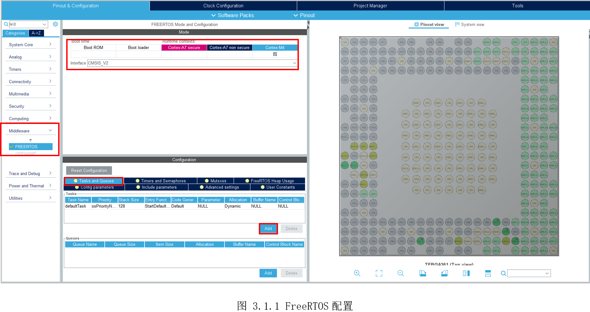
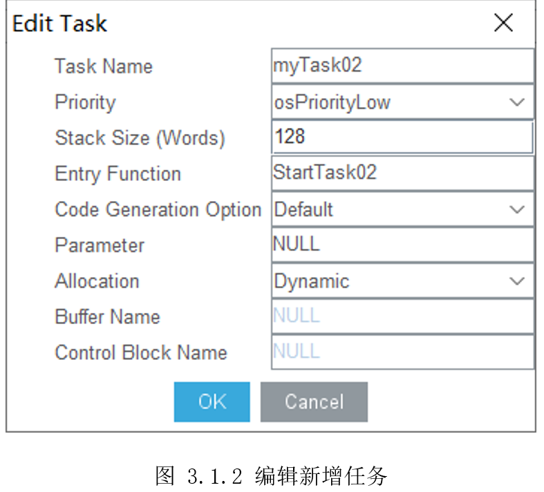
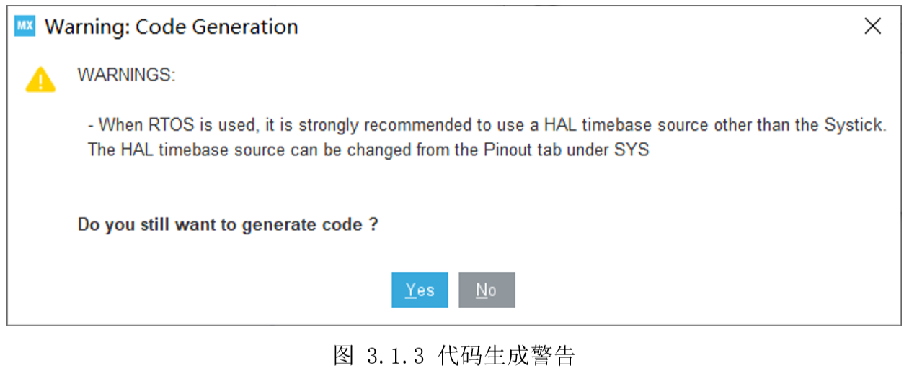
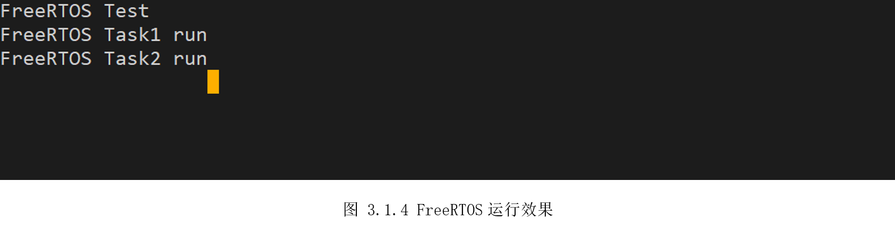

# 3.1 FreeRTOS

* 设计需求

这里假设需求为M4运行FreeRTOS，执行两个闪烁LED任务，互不干扰。

## 3.1.1 基础知识

在嵌入式领域，操作系统分两类：实时操作系统(Real Time OperatingSystem，RTOS)和通用操作系统(General Purpose Operating System)。

常见的实时操作系统有VxWorks、QNX、uCOS、FreeRTOS、RT-Thread、LiteOS等，实时操作系统最大的特点就是**给定任务(Task)可以在给定的时间(Deadline)内完成**，在一些场景，比如汽车安全气囊、军工航天，对任务完成时间都有明确要求，没按时完成就会导致严重后果。

常见的通用操作系统有Linux、Windows、macOS等，作为通用操作系统将延时降低到一个用户可以接受的范围，提供更丰富的功能。比如日常使用电脑，当电脑运行程序比较多的时候，鼠标卡顿一下，用户是可以接受的，而实时操作系统不允许出现这种情况，也就限制了实时操作系统的应用场景。

FreeRTOS是一个小巧简易的实时操作系统内核，整个核心代码只有3到4个C文件，但它却实现了多线程（threads）、多任务（task）、互斥锁（mutex）、信号量（semaphore）和软件定时器（software
timer）等。FreeRTOS操作系统是完全免费的操作系统，具有源码公开、可移植、可裁减、调度策略灵活的特点，可以方便地移植到各种MCU上运行。

STM32CubeMX已经移植好了FreeRTOS，现在只需要在软件里勾选上，即可运行FreeRTOS。

## 3.1.2 硬件设计

FreeRTOS不涉及硬件，为了展示效果，会用到开发板的外部时钟HSE、UART4以及两个LED灯，相关硬件电路参考前面实验。

## 3.1.3 MX设置

配置好MCU时钟、UART4、LED灯后，切换到中间件“Middleware”的“FREERTOS”，默认自动勾选给M4了，然后接口“Interface”选择“CMSIS_V2”。初次接触，下面的参数大部分默认即可，为了运行其它任务，这里需要切换到“TasksandQueues”标签，可以看到默认有个“defaultTask”任务，我们再点击“Add”再新增一个任务，如所示。



随后弹出编辑任务界面，如图3.1.2所示，默认任务名字为“myTask02”,优先级默认低，栈大小128字节，进入的函数名为“StartTask02”,代码生成选项等后面全默认即可。



随后生成初始化代码，会弹出Systick被FreeRTOS占用，建议HAL库时钟基准源换成其它，如图3.1.3所示。



## 3.1.4 代码设计

生成代码后，找到“main.c”，结尾部分会有两个任务函数，分别是“StartDefaultTask()”和“StartTask02()”。两个任务宏观看同时、独立运行，互不干扰，这里在两个任务里加入打印和加入不同时间间隔的闪烁灯。

```c
/* USER CODE BEGIN Header_StartDefaultTask */
/**
  * @brief  Function implementing the defaultTask thread.
  * @param  argument: Not used
  * @retval None
  */
/* USER CODE END Header_StartDefaultTask */
void StartDefaultTask(void *argument)
{
  /* USER CODE BEGIN 5 */
    printf("\rFreeRTOS Task1 run\n");
  /* Infinite loop */
  for(;;)
  {
    LED_GREEN_ON();
    osDelay(1000);
    LED_GREEN_OFF();
    osDelay(1000);
  }
  /* USER CODE END 5 */
}

/* USER CODE BEGIN Header_StartTask02 */
/**
* @brief Function implementing the myTask02 thread.
* @param argument: Not used
* @retval None
*/
/* USER CODE END Header_StartTask02 */
void StartTask02(void *argument)
{
  /* USER CODE BEGIN StartTask02 */
    printf("\rFreeRTOS Task2 run\n");
  /* Infinite loop */
  for(;;)
  {
    LED_YELLOW_ON();
    osDelay(2000);
    LED_YELLOW_OFF();
    osDelay(2000);
  }
  /* USER CODE END StartTask02 */
}

```


## 3.1.5 实验效果

调试运行，串口打印如图3.1.4所示。串口同时打印了两个任务信息，同时开发板两个LED灯，闪烁速度不一致，可以看出它们各自独立运行。



