# 3.2 A7_M4用户态通信

* 设计需求

这里假设需求为A7和M4同时运行，然后A7控制M4操作LED灯，A7和M4的相互唤醒。

## 3.2.1 基础知识

开放式非对称多处理（Open AsymmetricMulti-Processing，OpenAMP）是一种通用的抽象框架，提供一系列API，实现了构成系统的异构处理器之间上电、加载固件、断电及共享信息（通信）。

OpenAMP 包含了两个关键组件：

* Remoteproc（Remote Processor Framework）：管理框架；

* RPMsg（Remote Processor Messaging Framework）：消息传递框架；

Remoteproc主要作用就是对远程处理器的生命周期进行管理（life cyclemanagement，LCM），即启动、停止远程处理器。前面加载运行M4固件已经体验过了，Cortex-A内核先启动，然后使用LinuxRemoteProc框架进行加载Cortex-M4固件，启动M4内核。STM32MP1的Remoteproc框架如图3.2.1所示。

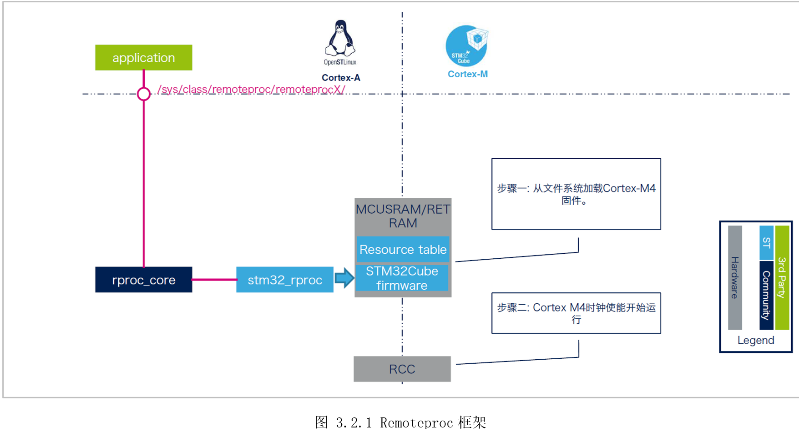

ST官方提供的内核已经默认配置了Remoteproc驱动，进入系统后，首先将要运行的M4固件放在“/lib/firmware/”目录下，然后将固件名字写到“/sys/class/remoteproc/remoteproc0/firmware”，再操作“/sys/class/remoteproc/remoteproc0/state”启动、停止M4处理器。

```c

[root@100ask:~]$ ls /lib/firmware/  //elf固件存放目录   
DEMO_LED_CM4.elf  
[root@100ask:~]$ echo GPIO_LED_CM4.elf > /sys/class/remoteproc/remoteproc0/firmware  //加载固件
[root@100ask:~]# cat /sys/class/remoteproc/remoteproc0/state  //查看固件状态
Offline  //固件离线状态
[root@100ask:~]# echo start > /sys/class/remoteproc/remoteproc0/state  //启动M4
[22683.222322] remoteproc remoteproc0: powering up m4
[22683.229097] remoteproc remoteproc0: Booting fw image GPIO_LED_CM4.elf, size 1899976
[22683.235549] remoteproc remoteproc0: header-less resource table
[22683.241235] remoteproc remoteproc0: not resource table found for this firmware
[22683.248749] remoteproc remoteproc0: header-less resource table
[22683.254414] remoteproc remoteproc0: remote processor m4 is now up  //远程M4已启动
[root@100ask:~]# echo stop > /sys/class/remoteproc/remoteproc0/state  //停止M4
[22709.281733] remoteproc remoteproc0: warning: remote FW shutdown without ack
[22709.287325] remoteproc remoteproc0: stopped remote processor m4  //远程M4已停止

```


除了在Linux的用户态控制M4内核的生命周期，还能在Linux内核态使用API控制(参考linux-origin_master/Documentation/remoteproc.txt)，甚至U-boot中控制。

RPMsg是处理器间的消息传输总线，其中每个处理器都是总线上的器件。它允许内核驱动程序与系统上的远程处理器进行通信，同时，驱动程序可以根据需要公开适当的用户空间接口(参考linux-origin_master/Documentation/rpmsg.txt)。RPMsg使用虚拟I/O（Virtio）组件，Virtio可提供虚拟I/O服务，以支持主处理器与远程处理器之间的通信。

STM32MP1多核通信框架如图3.2.2所示。一边是运行Linux的A7，基于RPMsg服务面向Linux用户空间提供“/dev/ttyRPMSG”串口节点收发数据；另一边是运行裸机或RTOS的M4，基于OpenAMP库调用虚拟串口函数“virtual_hal_uart()”收发数据。从两边应用角度来看，如同串口透传，类似A7和M4通过串口连接；从两边硬件角度来看，信号通知(Mailbox)服务基于内部IPCC(Inter-Processorcommunication controller)，数据传输基于共享内存。

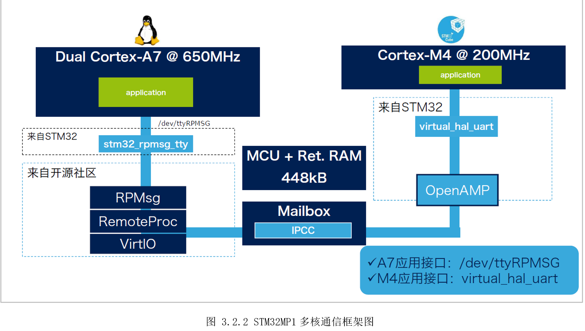

## 3.2.2 硬件设计

硬件外设需要用到一个LED灯给M4，A7使用UART4，M4使用UART8。UART是开发板默认调试串口，有串口转USB芯片，用户可以直接通过Type-C连接电脑，UART8是在扩展接口，对外提供的是TTL电平，需要用户自行准备TTL转USB模块连接电脑。

## 3.2.3 MX设置

首先配置MCU系统时钟为209MHz，然后配置LED_YELLOW给M4，如图 3.2.3所示配置。

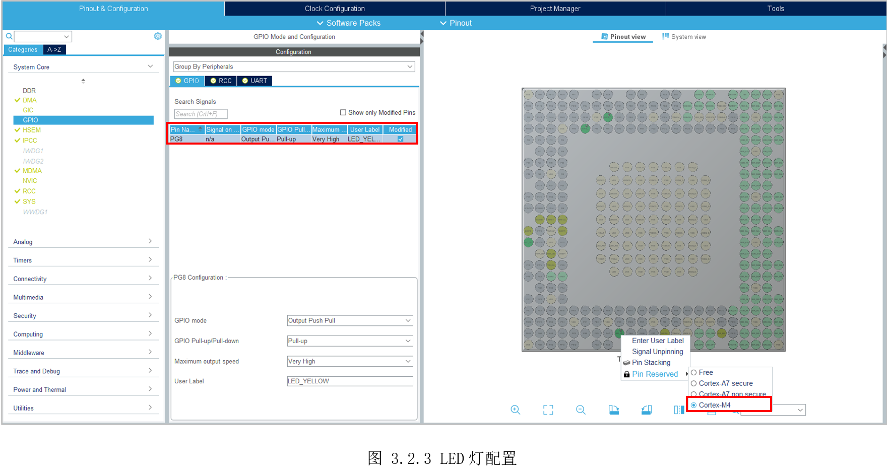

然后将UART8(PE0、PE1)分配给M4，用于M4打印，如图 3.2.4所示。

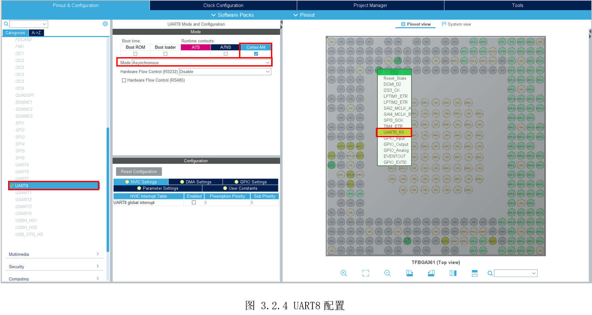

然后配置IPPC，同时给A7和M4，并且使能中断，如图 3.2.5所示。

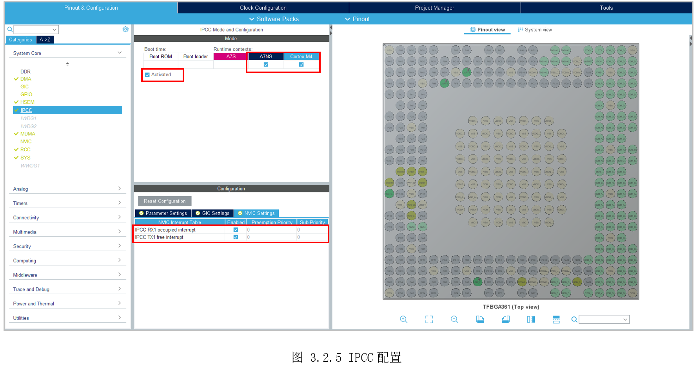

最后，勾选OPENAMP给M4，如图 3.2.6所示。

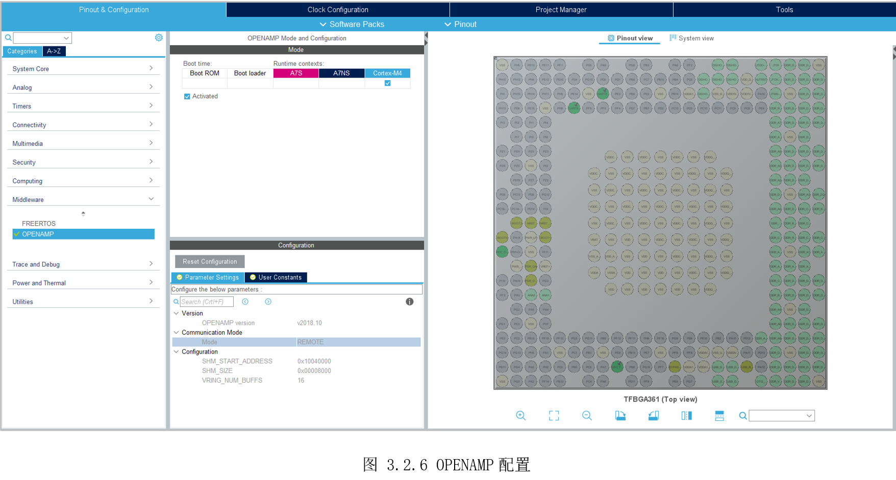

## 3.2.4 代码设计

生成初始化代码后，在主函数末尾附近，找到“USER CODE BEGIN 4”和“USER CODE END4”，在之间添加printf的重定向函数，让UART8与printf绑定。

```c

/* USER CODE BEGIN 4 */
#ifdef __GNUC__

#define PUTCHAR_PROTOTYPE int __io_putchar(int ch)

PUTCHAR_PROTOTYPE
{

  HAL_UART_Transmit(&huart8, (uint8_t*)&ch, 1, HAL_MAX_DELAY);
  return ch;
}
#endif/* USER CODE END 4 */

```


* Setp 1: 初始化两个RPMsg tty虚拟串口

```c
   if (VIRT_UART_Init(&huart0) != VIRT_UART_OK) {
      printf("VIRT_UART_Init UART0 failed.\r\n");
     Error_Handler();
   }
   if (VIRT_UART_Init(&huart1) != VIRT_UART_OK) {
      printf("VIRT_UART_Init UART1 failed.\r\n");
     Error_Handler();
```


* Setp 2: 注册回调函数以按通道接收消息

```c
   if(VIRT_UART_RegisterCallback(&huart0, VIRT_UART_RXCPLT_CB_ID, VIRT_UART0_RxCpltCallback) != VIRT_UART_OK)
   {
    Error_Handler();
   }
   if(VIRT_UART_RegisterCallback(&huart1, VIRT_UART_RXCPLT_CB_ID, VIRT_UART1_RxCpltCallback) != VIRT_UART_OK)
   {
    Error_Handler();
}
```


* Setp 3: 编写虚拟串口回调函数

当RPMsg收到数据后，将调用该回调函数。在此函数里，需要将接收的数据复制到用户内存，并修改接收标志位，通知用户完成数据接收。

```c

void VIRT_UART0_RxCpltCallback(VIRT_UART_HandleTypeDef *huart)
{
    printf("Msg received on VIRTUAL UART0 channel:  %s \r\n", (char *) huart->pRxBuffPtr);
    /* copy received msg in a variable to sent it back to master processor in main infinite loop*/
    VirtUart0ChannelRxSize = huart->RxXferSize < MAX_BUFFER_SIZE? huart->RxXferSize : MAX_BUFFER_SIZE-1;
    memcpy(VirtUart0ChannelBuffRx, huart->pRxBuffPtr, VirtUart0ChannelRxSize);
    VirtUart0RxMsg = SET;
}
void VIRT_UART1_RxCpltCallback(VIRT_UART_HandleTypeDef *huart)
{
    printf("Msg received on VIRTUAL UART1 channel:  %s \r\n", (char *) huart->pRxBuffPtr);
    /* copy received msg in a variable to sent it back to master processor in main infinite loop*/
    VirtUart1ChannelRxSize = huart->RxXferSize < MAX_BUFFER_SIZE? huart->RxXferSize : MAX_BUFFER_SIZE-1;
    memcpy(VirtUart1ChannelBuffRx, huart->pRxBuffPtr, VirtUart1ChannelRxSize);
    VirtUart1RxMsg = SET;
}

```


* Setp 4: 主函数轮询RPMsg消息

“OPENAMP_check_for_message()”查询MailBox状态。

当收到数据时，“VIRT_UARTx_RxCpltCallback()”会保存好收到数据，然后修改VirtUartxRxMsg标志位。主函数里发现VirtUartxRxMsg标志位发生变化时，即可获取接收的数据。

```c
while (1)
{
   OPENAMP_check_for_message();
  /* USER CODE END WHILE */
  /* USER CODE BEGIN 3 */
  if (VirtUart0RxMsg)
  {
    VirtUart0RxMsg = RESET;
    /*VirUART0收到数据*/
  }
  if (VirtUart1RxMsg)
  {
    VirtUart1RxMsg = RESET;
    /*VirUART1收到数据*/
  }
}
```


* Setp 5: VirUART0接收控制LED指令

每次VirtUart0RxMsg发生变化，说明VirUART0收到了数据,然后比较收到的数据内容，执行对应的操作。

这里，M4收到“MSG_LED_ON(\*led_on)”则打开LED灯，并发送消息给A7；M4收到“MSG_LED_OFF(\*led_off)”则关闭LED灯，并发送消息给A7。

```c
    if (VirtUart0RxMsg)
    {
      VirtUart0RxMsg = RESET;
      if (!strncmp((char *)VirtUart0ChannelBuffRx, MSG_LED_ON, strlen(MSG_LED_ON)))
      {
          strcpy((char *)BuffTx, "m4:led on\n");
          printf("%s\r", BuffTx);
          VIRT_UART_Transmit(&huart0, BuffTx, strlen((const char *)BuffTx));
          HAL_GPIO_WritePin(LED_YELLOW_GPIO_Port, LED_YELLOW_Pin, GPIO_PIN_RESET);
      }
      if (!strncmp((char *)VirtUart0ChannelBuffRx, MSG_LED_OFF, strlen(MSG_LED_OFF)))
      {
          strcpy((char *)BuffTx, "m4:led off\n");
          printf("%s\r", BuffTx);
          VIRT_UART_Transmit(&huart0, BuffTx, strlen((const char *)BuffTx));
          HAL_GPIO_WritePin(LED_YELLOW_GPIO_Port, LED_YELLOW_Pin, GPIO_PIN_SET);
      }
      memset(VirtUart0ChannelBuffRx, 0 ,VirtUart0ChannelRxSize);
      memset(BuffTx, 0 ,strlen((const char *)BuffTx));
}
```


* Setp 6：VirUART1接收休眠唤醒指令

每次VirtUart1RxMsg发生变化，说明VirUART1收到了数据，然后比较收到的数据内容，执行对应的操作。

这里，M4收到“MSG_STOP(\*stop)”则进入CStop模式，中途A7再发任意数据给M4，由于IPCC也可设置为中断唤醒源，将M4唤醒；M4收到“MSG_DELAY(\*delay)”则等待20S后发数据给A7，在这20S内，将A7先休眠，随后将被M4唤醒。

```c

if (VirtUart1RxMsg)
    {
      VirtUart1RxMsg = RESET;
      if (!strncmp((char *)VirtUart1ChannelBuffRx, MSG_STOP, strlen(MSG_STOP)))
      {
          strcpy((char *)BuffTx, "m4:stop\n");
          printf("%s\r", BuffTx);
          VIRT_UART_Transmit(&huart1, BuffTx, strlen((const char *)BuffTx));
          //RCC_backupClocks();
          /* Clear the MCU flags before going into CSTOP */
          SET_BIT(PWR->MCUCR, PWR_MCUCR_CSSF);
          printf("Going to CStop mode\r\n");
          /* (C)STOP protection mechanism
           * Only the IT with the highest priority (0 value) can interrupt.
           * RCC_WAKEUP_IRQn IT is intended to have the highest priority and to be the
           * only one IT having this value
           * RCC_WAKEUP_IRQn is generated only when RCC is completely resumed from
           * CSTOP */
           __set_BASEPRI(1 << (8 - __NVIC_PRIO_BITS));
           HAL_PWR_EnterSTOPMode(PWR_MAINREGULATOR_ON, PWR_STOPENTRY_WFI);
           /* To allow Systick to increment after CSTOP (Eg.: to not block during
            * TIMEOUT routines), TICK_INT_PRIORITY < BASEPRI
            * For this example as TICK_INT_PRIORITY = 1, BASEPRI should be 2  */
           __set_BASEPRI(2 << (8 - __NVIC_PRIO_BITS));
           printf("Leaving CStop mode\r\n");
           /* Test if system was on STOP mode */
           if( (PWR->MCUCR & PWR_MCUCR_STOPF) == PWR_MCUCR_STOPF)
           {
              printf("System was on STOP mode\r\n");
              /* Clear the MCU flags */
              SET_BIT(PWR->MCUCR, PWR_MCUCR_CSSF);
              /* Restore clocks */
              /*
              if (RCC_restoreClocks() == HAL_OK)
              {
                  printf("CM4 restored clocks successfully\r\n");
              }
              */
            }
            /* All level of ITs can interrupt */
            __set_BASEPRI(0U);
      }
      if (!strncmp((char *)VirtUart1ChannelBuffRx, MSG_DELAY, strlen(MSG_DELAY)))
      {
          printf("Waiting 20 secs before sending the answer message\r\n");
          HAL_Delay(20 *1000);
          strcpy((char *)BuffTx, "m4:wakeup A7\n");
          printf("%s\r", BuffTx);
          VIRT_UART_Transmit(&huart1, BuffTx, strlen((const char *)BuffTx));
      }
      memset(VirtUart1ChannelBuffRx, 0 ,VirtUart1ChannelRxSize);
      memset(BuffTx, 0 ,strlen((const char *)BuffTx));

```

为了A7能发消息将M4唤醒，还需要IPCC作为M4的中断唤醒源。

```c

 EXTI_ConfigTypeDef EXTI_ConfigStructure;
   EXTI_HandleTypeDef hexti62;
   /*
    * Set configuration of Exti line 62 (IPCC interrupt CPU2). It could be used to wakeup the
    * M4 from CStop mode when RPMsg received from Cortex-A7
    */
   EXTI_ConfigStructure.Line = EXTI_LINE_62;
   EXTI_ConfigStructure.Mode = EXTI_MODE_C2_INTERRUPT;
   //PERIPH_LOCK(EXTI);
   HAL_EXTI_SetConfigLine(&hexti62, &EXTI_ConfigStructure);
   //PERIPH_UNLOCK(EXTI);
   /*
    *     Enable RCC_IT_WKUP to exit M4 from CStop mode.
    *     Indeed, due to SOC issue, M4 firmware shall make sure
    *     RCC_WAKEUP interrupt is the first one used to exit M4 from CStop mode.
    *     Therefore, M4 masks all NVIC interrupts with priority higher than 0
    *     before entering CStop mode and unmasks them when moving from WFI.
    *     (in HAL_PWR_EnterSTOPMode function)
    *     Note: All other NVIC interrupts shall be set to a different value
    *     from 0 to make sure that this workaround works well.
    */
    __HAL_RCC_ENABLE_IT(RCC_IT_WKUP);
```


## 3.2.5 实验效果

编译程序，如图 3.2.7所示连接开发板。

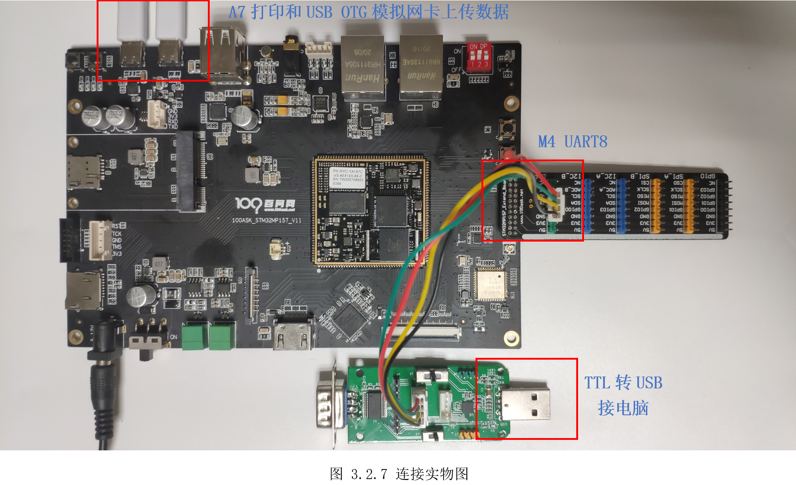

然后将前面生成“rpmsg_user_CM4.elf”，拖动上传到开发板Linux系统里，并执行“cprpmsg_user_CM4.elf /lib/firmware/”复制到“/lib/firmware/”目录里，如图 3.2.8所示。

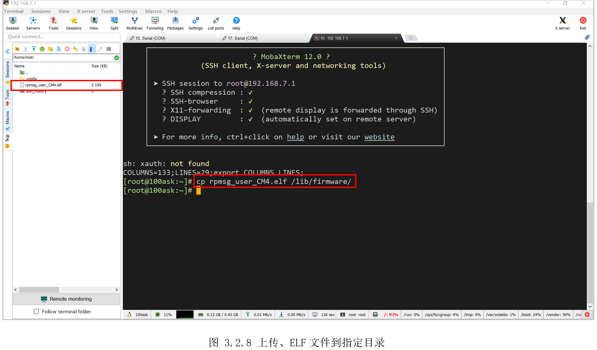

然后再打开M4对应的串口，为了方便同时查看A7和M4的打印信息，在MobaXterm上方选择2分屏显示，如图3.2.9所示。

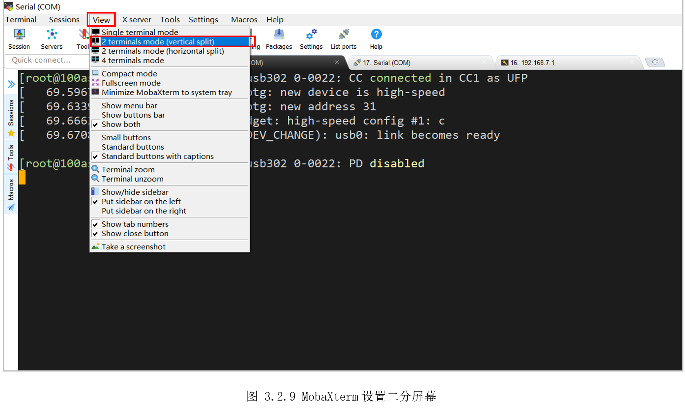

效果如图 3.2.10所示，左边是Linux的串口终端，右边是M4对应的UART8调试串口。

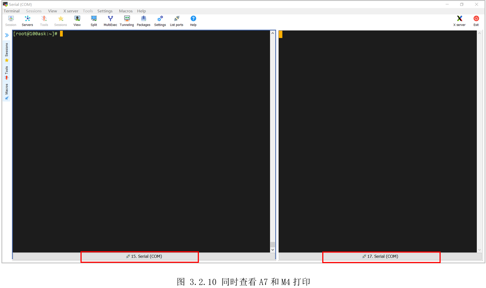

执行以下命令加载M4：

```c
[root@100ask:~]$ echo rpmsg_user_CM4.elf > /sys/class/remoteproc/remoteproc0/firmware  
[root@100ask:~]$ echo start > /sys/class/remoteproc/remoteproc0/state  

```


随后打印可以看到启动了M4，并创建两个虚拟串口通道，生成了新节点“/dev/ttyRPMSG0”和“/dev/ttyRPMSG1”，右边M4也打印了启动信息，如图3.2.11所示。

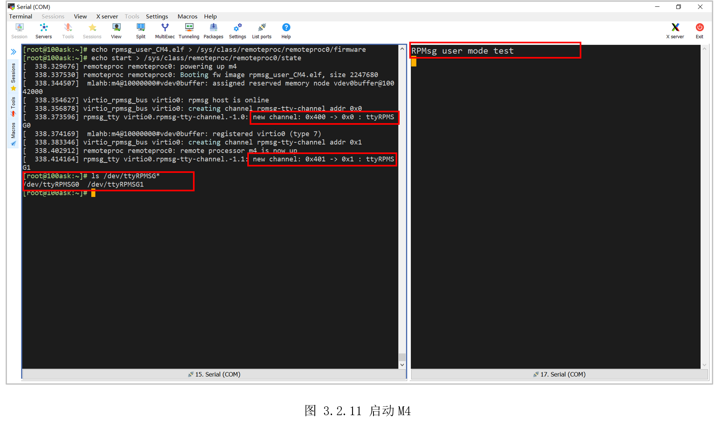

接着需要输入以下两个命令设置下生成的虚拟串口“/dev/ttyRPMSG0”。

```c
[root@100ask:\~]\$ stty -onlcr -echo -F /dev/ttyRPMSG0

[root@100ask:\~]\$ cat /dev/ttyRPMSG0 &
```

第一条命令里的“-onlcr”是不将NL字符映射为CR-NL字符，就是说发送给M4的数据，不会自动加上回车，不然这里发送“led_on”，M4收到的为“led_on\\n\\r”，“-echo”是禁止回显，以方便查看接收的字符。

第二条命令是后台运行查看“/dev/ttyRPMSG0”，一旦“/dev/ttyRPMSG0”收到数据，将立刻打印到当前终端。

接着是向“/dev/ttyRPMSG0”写入预定义的指令，M4收到指令便会控制LED灯，并发送执行结果给A7，如图3.2.12所示。

```c
[root@100ask:~]$ echo "*led_on" > /dev/ttyRPMSG0
[root@100ask:~]$ echo "*led_off" > /dev/ttyRPMSG0 
```

执行以上两个命令，观察开发板LED，可以看到对应LED亮灭。

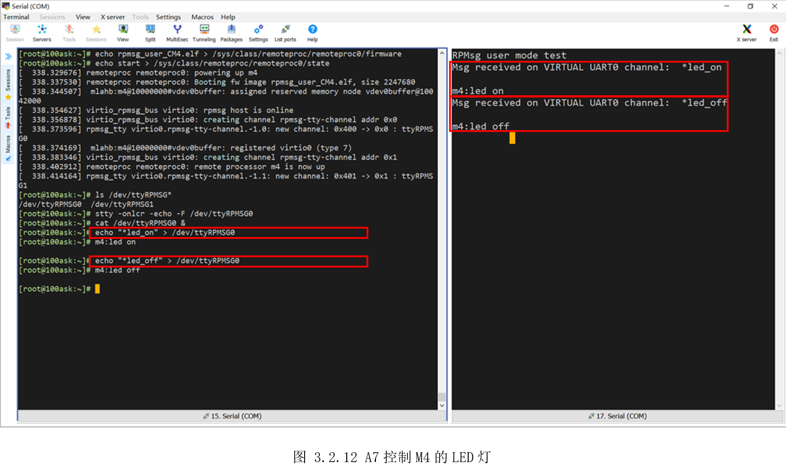

然后再测试A7和M4相互唤醒，先设置“/dev/ttyRPMSG1”。

```c
[root@100ask:~]$ stty -onlcr -echo -F /dev/ttyRPMSG1 
[root@100ask:~]$ cat /dev/ttyRPMSG1 &  

```

然后向“/dev/ttyRPMSG1”写入“\*stop”，M4随后卡在打印“Going to CStopmode”后，接着向“/dev/ttyRPMSG1”写入：“wakeup”(任意字符即可)，M4随后打印“LeavingCStop mode”，即实现了A7控制M4的休眠和唤醒，效果如图 3.2.13所示。

```c
[root@100ask:~]$ echo "*stop" > /dev/ttyRPMSG1
[root@100ask:~]$ echo "wakeup" >/dev/ttyRPMSG1 

```

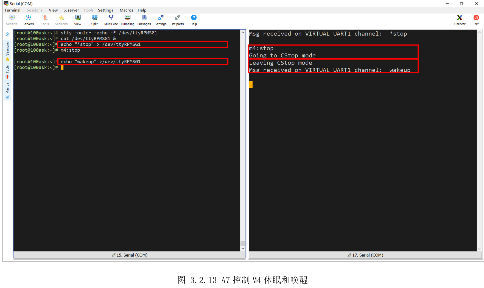

再测试M4唤醒A7。先使能A7唤醒，然后向“/dev/ttyRPMSG1”写入“\*delay”，M4收到指令后，20S后会向A7发数据，从而唤醒A7。此时控制A7进入休眠状态，20S后，A7被唤醒。

```c
[root@100ask:~]$ echo enabled > /sys/devices/platform/soc/4c001000.mailbox/power/wakeup //使能唤醒
[root@100ask:~]$ echo "*delay" > /dev/ttyRPMSG1  //通知M4一会唤醒自己
[root@100ask:~]$ echo mem > /sys/power/state  //A7进入休眠

```


注意，由于当前Linux休眠唤醒驱动bug，A7唤醒会复位重启，这里后期解决后，用户可再进行本实验，但这不影响本小节主题，A7和M4通信完成。

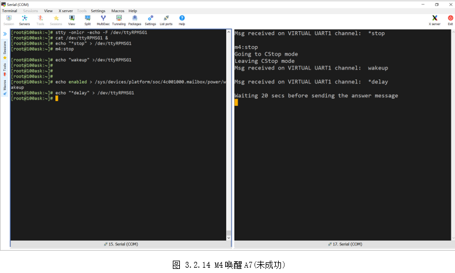

