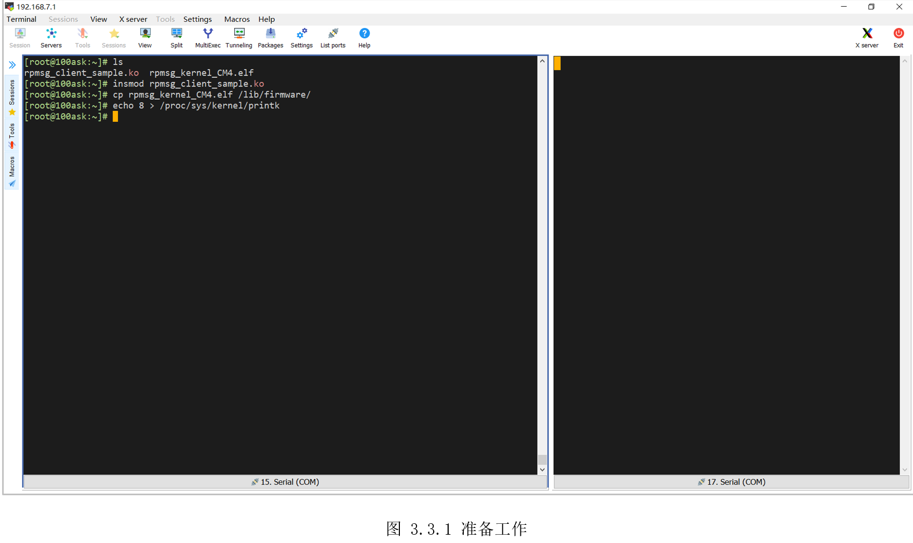
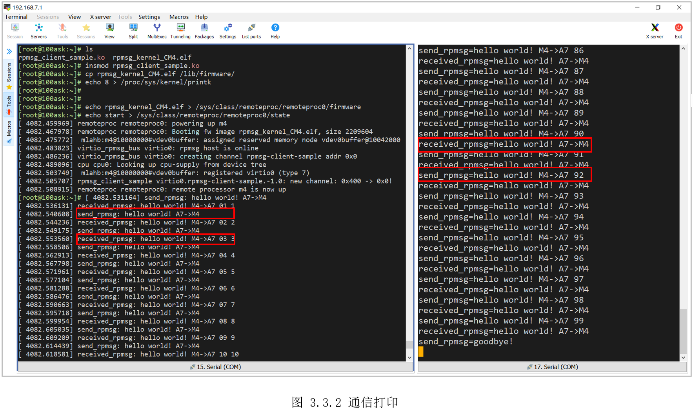

# 3.3 A7_M4内核态通信

* 设计需求

这里假设需求为A7和M4直接发送大量数据。

## 3.3.1 基础知识

前面将A7和M4通信，封装成了虚拟串口。如果需要传输大量数据，且对性能有一定要求，可尝试本节示例，在Linux驱动层和M4数据传输。

## 3.3.2 硬件设计

和上一小节一致。

## 3.3.3 MX设置

参考前面的示例，依次在STM32CubeMX配置UART8、IPCC和OPENAMP，然后生成初始化代码。

## 3.3.4 代码设计

Linux内核提供了一个驱动示例“linux-origin_master/samples/rpmsg/rpmsg_client_sample.c”,在此驱动上简单修改了打印内容，方便查看。

```c

/*
 * Remote processor messaging - sample client driver
 *
 * Copyright (C) 2011 Texas Instruments, Inc.
 * Copyright (C) 2011 Google, Inc.
 *
 * Ohad Ben-Cohen <ohad@wizery.com>
 * Brian Swetland <swetland@google.com>
 *
 * This software is licensed under the terms of the GNU General Public
 * License version 2, as published by the Free Software Foundation, and
 * may be copied, distributed, and modified under those terms.
 *
 * This program is distributed in the hope that it will be useful,
 * but WITHOUT ANY WARRANTY; without even the implied warranty of
 * MERCHANTABILITY or FITNESS FOR A PARTICULAR PURPOSE.  See the
 * GNU General Public License for more details.
 */

#include <linux/kernel.h>
#include <linux/module.h>
#include <linux/rpmsg.h>

#define MSG     "hello world! A7->M4"
#define MSG_LIMIT   100

struct instance_data {
    int rx_count;
};

static int rpmsg_sample_cb(struct rpmsg_device *rpdev, void *data, int len,
                        void *priv, u32 src)
{
    int ret;
    struct instance_data *idata = dev_get_drvdata(&rpdev->dev);

    //dev_info(&rpdev->dev, "incoming msg %d (src: 0x%x)\n", ++idata->rx_count, src);
    //print_hex_dump(KERN_DEBUG, __func__, DUMP_PREFIX_NONE, 16, 1, data, len,  true);
    
    printk(KERN_DEBUG "received_rpmsg: %p %d \n", data, ++idata->rx_count);

    /* samples should not live forever */
    if (idata->rx_count >= MSG_LIMIT) {
        //dev_info(&rpdev->dev, "goodbye!\n");
        return 0;
    }

    /* send a new message now */
    ret = rpmsg_send(rpdev->ept, MSG, strlen(MSG));
    if (ret)
        dev_err(&rpdev->dev, "rpmsg_send failed: %d\n", ret);
    else
        printk(KERN_DEBUG "send_rpmsg: %s \n", MSG);

    return 0;
}

static int rpmsg_sample_probe(struct rpmsg_device *rpdev)
{
    int ret;
    struct instance_data *idata;

    dev_info(&rpdev->dev, "new channel: 0x%x -> 0x%x!\n",
                    rpdev->src, rpdev->dst);

    idata = devm_kzalloc(&rpdev->dev, sizeof(*idata), GFP_KERNEL);
    if (!idata)
        return -ENOMEM;

    dev_set_drvdata(&rpdev->dev, idata);

    /* send a message to our remote processor */
    ret = rpmsg_send(rpdev->ept, MSG, strlen(MSG));
    if (ret) {
        dev_err(&rpdev->dev, "rpmsg_send failed: %d\n", ret);
        return ret;
    }
    else
        printk(KERN_DEBUG "send_rpmsg: %s \n", MSG);
        

    return 0;
}

static void rpmsg_sample_remove(struct rpmsg_device *rpdev)
{
    dev_info(&rpdev->dev, "rpmsg sample client driver is removed\n");
}

static struct rpmsg_device_id rpmsg_driver_sample_id_table[] = {
    { .name = "rpmsg-client-sample" },
    { },
};
MODULE_DEVICE_TABLE(rpmsg, rpmsg_driver_sample_id_table);

static struct rpmsg_driver rpmsg_sample_client = {
    .drv.name   = KBUILD_MODNAME,
    .id_table   = rpmsg_driver_sample_id_table,
    .probe      = rpmsg_sample_probe,
    .callback   = rpmsg_sample_cb,
    .remove     = rpmsg_sample_remove,
};
module_rpmsg_driver(rpmsg_sample_client);

MODULE_DESCRIPTION("Remote processor messaging sample client driver");
MODULE_LICENSE("GPL v2");

```

驱动比较简单，核心是“rpmsg_sample_cb()“，rpmsg收到数据后将回调该函数。从“data”获得M4发来的数据，通过“rpmsg_send()”将数据发给M4。

将该驱动和Makefile上传到Linux主机，根据内核源码路径，修改Makefile，编译即可得到“rpmsg_client_sample.ko”，驱动的开发流程参考Linux开发手册，这里不再赘述。同时，本示例也提供“rpmsg_client_sample.ko”文件，用户可以直接使用。

使用STM32CubeMX生成初始化代码后，下面将编写程序从A7接收数据，并发送数据。

* Step 1: 建一个rpmsg通道

```c
 /* Create an rpmsg channel to communicate with the Master processor CPU1(CA7) */
  OPENAMP_create_endpoint(&resmgr_ept, RPMSG_SERVICE_NAME, RPMSG_ADDR_ANY, rx_callback, NULL);

```

注意这里的“RPMSG_SERVICE_NAME”和驱动里“rpmsg_device_id”结构体的“.name”的名字一样。之后，一旦rpmsg通道数据，将回调rx_callback()函数。

* Step 2: 编写接收回调函数

此函数里，需要将接收的数据复制到用户内存，并修改接收标志位。

```c
static int rx_callback(struct rpmsg_endpoint *rp_chnl, void *data, size_t len, uint32_t src, void *priv)
{
  /* copy received msg, and raise a flag  */
  memcpy(received_rpmsg, data, len > sizeof(received_rpmsg) ? sizeof(received_rpmsg) : len);
  printf("received_rpmsg=%s\r\n", received_rpmsg);
  rx_status = SET;
  return 0;
}

```

* Step 3:主函数轮询RPMsg消息

“OPENAMP_check_for_message()”查询MailBox状态。当收到数据时，“rx_callback()”会保存好收到数据，然后修改“rx_status”标志位。主函数里发现“rx_status”标志位发生变化时，即可获取接收的数据。

```c

 while (1)
 {
    OPENAMP_check_for_message();
    /* USER CODE END WHILE */
    if (rx_status == SET)
    {
    /* Message received: send back a message anwser */
    rx_status = RESET;
    /*rpmsg收到数据*/
    }
    /* 

```


* Step 3:向M4发送数据

使用“OPENAMP_send()”向A7发送数据。

```c
if (rx_status == SET)
    {
      /* Message received: send back a message anwser */
      rx_status = RESET;
      if (++count < 100)
        sprintf((char *)msg, "hello world! M4->A7 %02ld", count);
      else
        strcpy((char *)msg, "goodbye!");
      if (OPENAMP_send(&resmgr_ept, msg, strlen((char *)msg) + 1) < 0)
      {
        printf("Failed to send message\r\n");
        Error_Handler();
      }
      else
        printf("send_rpmsg=%s\r\n", msg);
  }


```


## 3.3.5 实验效果

硬件连接和上一实验保持不变。编译得到“rpmsg_kernel_CM4.elf”，将它和驱动“rpmsg_client_sample.ko”一起上传到开发板Linux。然后加载驱动，将“rpmsg_kernel_CM4.elf”复制到“/lib/firmware/”目录，为了查看驱动的打印信息，这里还要修改内核的打印等级，设置如所示。

```c

[root@100ask:~]$ insmod rpmsg_client_sample.ko 
[root@100ask:~]$ cp rpmsg_kernel_CM4.elf /lib/firmware/
[root@100ask:~]$ echo 8 > /proc/sys/kernel/printk

```




接着启动固件，可以看到如图 3.3.2所示打印。可以看到启动M4后，A7向M4发送“helloworld! A7-\>M4”，同时收到M4发过来的“hello world!

M4-\>A7”。M4收到A7发过来的“hello world! A7-\>M4”，同时向A7发送“hello world!

M4-\>A7”，在极短时间里相互之间发送了100次。


